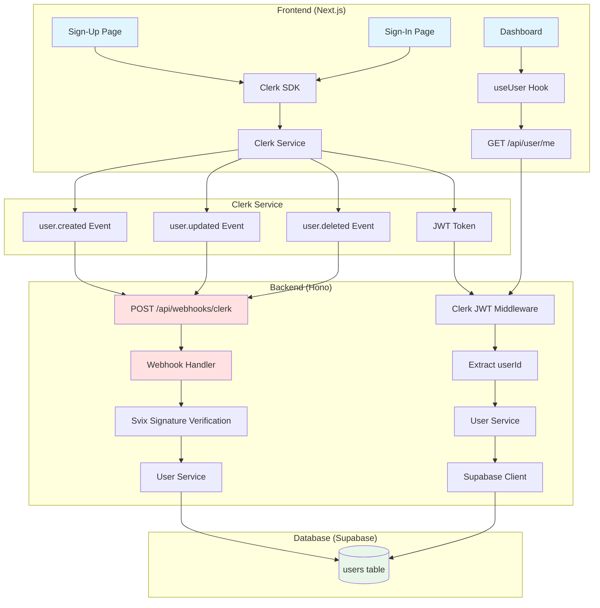

# [AUTH] 회원가입 및 로그인 - 구현 계획

## 개요

Clerk SDK를 활용한 사용자 인증 및 회원가입 처리 기능 구현. Clerk에서 발생하는 Webhook 이벤트를 처리하여 Supabase DB에 사용자 정보를 동기화하고, Hono 백엔드에서 JWT 인증을 통해 보호된 API를 제공합니다.

### 주요 기능
- Clerk 기본 UI를 사용한 회원가입/로그인 페이지
- Google OAuth 연동
- Clerk Webhook을 통한 사용자 정보 동기화 (Supabase)
- Hono 백엔드에서 Clerk JWT 인증 미들웨어
- 신규 가입 시 무료 체험 3회 자동 부여

### 기술 스택
- 인증: Clerk SDK (`@clerk/nextjs`, `@hono/clerk-auth`)
- Webhook 검증: `svix`
- 데이터베이스: Supabase PostgreSQL
- API: Hono Framework
- 유효성 검사: Zod

---

## 모듈 구조

### 1. Frontend (Next.js)

| 파일 경로 | 역할 |
|---------|------|
| `src/app/sign-in/[[...sign-in]]/page.tsx` | 로그인 페이지 (Clerk UI) |
| `src/app/sign-up/[[...sign-up]]/page.tsx` | 회원가입 페이지 (Clerk UI) |
| `src/app/layout.tsx` | ClerkProvider 설정 |
| `middleware.ts` | Clerk 인증 미들웨어 (보호 라우트 설정) |
| `src/features/auth/hooks/useUser.ts` | 사용자 정보 조회 훅 (React Query) |
| `src/features/auth/components/UserProfile.tsx` | 사용자 프로필 표시 컴포넌트 |

### 2. Backend (Hono)

| 파일 경로 | 역할 |
|---------|------|
| `src/app/api/webhooks/clerk/route.ts` | Clerk Webhook 수신 엔드포인트 (Next.js Route Handler) |
| `src/backend/middleware/withClerk.ts` | Clerk JWT 인증 미들웨어 |
| `src/features/auth/backend/route.ts` | 사용자 정보 조회 API 라우터 |
| `src/features/auth/backend/service.ts` | 사용자 CRUD 비즈니스 로직 |
| `src/features/auth/backend/schema.ts` | Zod 스키마 정의 (Webhook, User) |
| `src/features/auth/backend/error.ts` | 에러 코드 정의 |
| `src/features/auth/lib/dto.ts` | 클라이언트용 DTO 재노출 |

### 3. Database

| 파일 경로 | 역할 |
|---------|------|
| `supabase/migrations/0001_create_users_table.sql` | users 테이블 생성 마이그레이션 |
| `supabase/migrations/0002_create_update_trigger.sql` | updated_at 자동 업데이트 트리거 |

### 4. Configuration

| 파일 경로 | 역할 |
|---------|------|
| `.env.local` | Clerk API Keys 및 환경 변수 |
| `src/backend/hono/context.ts` | AppEnv 타입에 userId 추가 |
| `src/backend/hono/app.ts` | withClerk 미들웨어 적용 |

---

## Diagram



---

## Implementation Plan

### Phase 1: 환경 설정 및 패키지 설치

#### 1.1 패키지 설치

**Task**: Clerk 및 관련 패키지 설치

```bash
npm install @clerk/nextjs @hono/clerk-auth svix
```

#### 1.2 환경 변수 설정

**File**: `.env.local`

```env
# Clerk Authentication
NEXT_PUBLIC_CLERK_PUBLISHABLE_KEY=pk_test_xxxxxxxxxxxx
CLERK_SECRET_KEY=sk_test_xxxxxxxxxxxx
CLERK_WEBHOOK_SECRET=whsec_xxxxxxxxxxxx

# Supabase (기존 설정 유지)
NEXT_PUBLIC_SUPABASE_URL=https://xxx.supabase.co
NEXT_PUBLIC_SUPABASE_ANON_KEY=xxx
SUPABASE_SERVICE_ROLE_KEY=xxx
```

**QA Sheet**:
- [ ] Clerk Dashboard에서 API Keys를 정확히 복사했는가?
- [ ] `.env.local` 파일이 `.gitignore`에 포함되어 있는가?
- [ ] 환경 변수가 Next.js에서 올바르게 로드되는가? (`console.log(process.env.NEXT_PUBLIC_CLERK_PUBLISHABLE_KEY)`)

---

### Phase 2: Database 마이그레이션

#### 2.1 users 테이블 생성

**File**: `supabase/migrations/0001_create_users_table.sql`

```sql
-- Users 테이블 생성
CREATE TABLE IF NOT EXISTS public.users (
  id TEXT PRIMARY KEY,                          -- Clerk User ID (예: user_xxxxxxxxxxxxx)
  email TEXT NOT NULL UNIQUE,
  name TEXT,
  profile_image_url TEXT,
  subscription_tier TEXT DEFAULT 'free' CHECK (subscription_tier IN ('free', 'pro')),
  remaining_tests INTEGER DEFAULT 3,
  created_at TIMESTAMP WITH TIME ZONE DEFAULT NOW(),
  updated_at TIMESTAMP WITH TIME ZONE DEFAULT NOW()
);

-- 인덱스 생성
CREATE INDEX IF NOT EXISTS idx_users_email ON public.users(email);
CREATE INDEX IF NOT EXISTS idx_users_subscription_tier ON public.users(subscription_tier);

-- 코멘트 추가
COMMENT ON TABLE public.users IS '사용자 정보 및 구독 상태 (Clerk 동기화)';
COMMENT ON COLUMN public.users.id IS 'Clerk User ID';
COMMENT ON COLUMN public.users.subscription_tier IS '구독 등급 (free: 초기 3회, pro: 월 10회)';
COMMENT ON COLUMN public.users.remaining_tests IS '잔여 검사 횟수';
```

**Unit Test (SQL)**:
```sql
-- 테이블 생성 확인
SELECT EXISTS (
  SELECT FROM information_schema.tables
  WHERE table_schema = 'public'
  AND table_name = 'users'
);

-- 제약조건 확인
SELECT constraint_name, constraint_type
FROM information_schema.table_constraints
WHERE table_name = 'users';

-- 인덱스 확인
SELECT indexname FROM pg_indexes WHERE tablename = 'users';
```

#### 2.2 updated_at 자동 업데이트 트리거 생성

**File**: `supabase/migrations/0002_create_update_trigger.sql`

```sql
-- updated_at 자동 업데이트 함수 생성 (이미 존재하면 스킵)
CREATE OR REPLACE FUNCTION update_updated_at_column()
RETURNS TRIGGER AS $$
BEGIN
  NEW.updated_at = NOW();
  RETURN NEW;
END;
$$ LANGUAGE plpgsql;

-- users 테이블 트리거 생성
DROP TRIGGER IF EXISTS update_users_updated_at ON public.users;

CREATE TRIGGER update_users_updated_at
  BEFORE UPDATE ON public.users
  FOR EACH ROW
  EXECUTE FUNCTION update_updated_at_column();

COMMENT ON FUNCTION update_updated_at_column() IS '모든 테이블의 updated_at 컬럼을 자동으로 업데이트';
```

**QA Sheet**:
- [ ] Supabase Dashboard에서 마이그레이션이 정상적으로 실행되었는가?
- [ ] users 테이블에 id, email, subscription_tier, remaining_tests 컬럼이 존재하는가?
- [ ] email 컬럼에 UNIQUE 제약이 걸려있는가?
- [ ] subscription_tier의 기본값이 'free'인가?
- [ ] remaining_tests의 기본값이 3인가?
- [ ] updated_at 트리거가 UPDATE 시 자동으로 동작하는가?

---

### Phase 3: Backend - Clerk 미들웨어 설정

#### 3.1 Clerk 인증 미들웨어 추가

**File**: `src/backend/middleware/withClerk.ts`

```typescript
import { clerkMiddleware, getAuth } from '@hono/clerk-auth';
import type { MiddlewareHandler } from 'hono';
import type { AppEnv } from '@/backend/hono/context';

/**
 * Clerk JWT 검증 미들웨어
 * - Hono 컨텍스트에 Clerk 인증 정보 주입
 */
export const withClerk = (): MiddlewareHandler<AppEnv> => {
  return clerkMiddleware();
};

/**
 * 인증 필수 미들웨어
 * - 로그인하지 않은 사용자 차단 (401 반환)
 */
export const requireAuth = (): MiddlewareHandler<AppEnv> => {
  return async (c, next) => {
    const auth = getAuth(c);

    if (!auth?.userId) {
      return c.json(
        {
          error: {
            code: 'UNAUTHORIZED',
            message: '로그인이 필요합니다.',
          },
        },
        401,
      );
    }

    // Context에 userId 저장
    c.set('userId', auth.userId);
    await next();
  };
};
```

**Unit Test**:
```typescript
// src/backend/middleware/__tests__/withClerk.test.ts
import { describe, it, expect, vi } from 'vitest';
import { Hono } from 'hono';
import { requireAuth } from '../withClerk';

describe('requireAuth middleware', () => {
  it('should return 401 when userId is missing', async () => {
    const app = new Hono();
    app.use('*', requireAuth());
    app.get('/protected', (c) => c.json({ message: 'success' }));

    const res = await app.request('/protected');
    expect(res.status).toBe(401);

    const body = await res.json();
    expect(body.error.code).toBe('UNAUTHORIZED');
  });

  it('should pass when userId exists', async () => {
    // Mock getAuth to return userId
    vi.mock('@hono/clerk-auth', () => ({
      getAuth: () => ({ userId: 'user_test123' }),
      clerkMiddleware: () => async (c, next) => next(),
    }));

    const app = new Hono();
    app.use('*', requireAuth());
    app.get('/protected', (c) => c.json({ message: 'success' }));

    const res = await app.request('/protected');
    expect(res.status).toBe(200);
  });
});
```

#### 3.2 AppContext에 userId 추가

**File**: `src/backend/hono/context.ts`

```typescript
import type { Context } from 'hono';
import type { SupabaseClient } from '@supabase/supabase-js';

export type AppLogger = Pick<Console, 'info' | 'error' | 'warn' | 'debug'>;

export type AppConfig = {
  supabase: {
    url: string;
    serviceRoleKey: string;
  };
  clerk: {
    secretKey: string;
    publishableKey: string;
  };
};

export type AppVariables = {
  supabase: SupabaseClient;
  logger: AppLogger;
  config: AppConfig;
  userId?: string; // Clerk User ID 추가
};

export type AppEnv = {
  Variables: AppVariables;
};

export type AppContext = Context<AppEnv>;

export const contextKeys = {
  supabase: 'supabase',
  logger: 'logger',
  config: 'config',
  userId: 'userId',
} as const satisfies Record<keyof AppVariables, keyof AppVariables>;

export const getSupabase = (c: AppContext) =>
  c.get(contextKeys.supabase) as SupabaseClient;

export const getLogger = (c: AppContext) =>
  c.get(contextKeys.logger) as AppLogger;

export const getConfig = (c: AppContext) =>
  c.get(contextKeys.config) as AppConfig;

export const getUserId = (c: AppContext) =>
  c.get(contextKeys.userId) as string | undefined;
```

#### 3.3 Hono App에 미들웨어 적용

**File**: `src/backend/hono/app.ts`

```typescript
import { Hono } from 'hono';
import { errorBoundary } from '@/backend/middleware/error';
import { withAppContext } from '@/backend/middleware/context';
import { withClerk } from '@/backend/middleware/withClerk';
import { withSupabase } from '@/backend/middleware/supabase';
import { registerExampleRoutes } from '@/features/example/backend/route';
import { registerAuthRoutes } from '@/features/auth/backend/route';
import type { AppEnv } from '@/backend/hono/context';

let singletonApp: Hono<AppEnv> | null = null;

export const createHonoApp = () => {
  if (singletonApp) {
    return singletonApp;
  }

  const app = new Hono<AppEnv>();

  // 1. 에러 바운더리
  app.use('*', errorBoundary());

  // 2. 앱 컨텍스트 (logger, config)
  app.use('*', withAppContext());

  // 3. Clerk 인증 미들웨어 추가
  app.use('*', withClerk());

  // 4. Supabase 클라이언트
  app.use('*', withSupabase());

  // 5. 라우터 등록
  registerExampleRoutes(app);
  registerAuthRoutes(app);

  singletonApp = app;

  return app;
};
```

**QA Sheet**:
- [ ] withClerk 미들웨어가 에러 없이 로드되는가?
- [ ] requireAuth 미들웨어가 인증되지 않은 요청을 401로 차단하는가?
- [ ] AppContext에 userId가 정상적으로 저장되는가?
- [ ] getUserId 헬퍼 함수가 정상적으로 동작하는가?

---

### Phase 4: Backend - Auth Feature 모듈

#### 4.1 Zod 스키마 정의

**File**: `src/features/auth/backend/schema.ts`

```typescript
import { z } from 'zod';

// Clerk Webhook 이벤트 스키마
export const ClerkWebhookEventSchema = z.object({
  type: z.enum(['user.created', 'user.updated', 'user.deleted']),
  data: z.object({
    id: z.string(),
    email_addresses: z
      .array(
        z.object({
          email_address: z.string().email(),
        }),
      )
      .optional(),
    first_name: z.string().nullable().optional(),
    last_name: z.string().nullable().optional(),
    image_url: z.string().url().nullable().optional(),
  }),
});

export type ClerkWebhookEvent = z.infer<typeof ClerkWebhookEventSchema>;

// User 테이블 Row 스키마
export const UserTableRowSchema = z.object({
  id: z.string(),
  email: z.string().email(),
  name: z.string().nullable(),
  profile_image_url: z.string().url().nullable(),
  subscription_tier: z.enum(['free', 'pro']),
  remaining_tests: z.number().int().min(0),
  created_at: z.string().datetime(),
  updated_at: z.string().datetime(),
});

export type UserRow = z.infer<typeof UserTableRowSchema>;

// User 응답 스키마
export const UserResponseSchema = z.object({
  id: z.string(),
  email: z.string().email(),
  name: z.string().nullable(),
  profileImageUrl: z.string().url().nullable(),
  subscriptionTier: z.enum(['free', 'pro']),
  remainingTests: z.number().int().min(0),
  createdAt: z.string().datetime(),
  updatedAt: z.string().datetime(),
});

export type UserResponse = z.infer<typeof UserResponseSchema>;
```

#### 4.2 에러 코드 정의

**File**: `src/features/auth/backend/error.ts`

```typescript
export const authErrorCodes = {
  notFound: 'USER_NOT_FOUND',
  fetchError: 'USER_FETCH_ERROR',
  createError: 'USER_CREATE_ERROR',
  updateError: 'USER_UPDATE_ERROR',
  deleteError: 'USER_DELETE_ERROR',
  validationError: 'USER_VALIDATION_ERROR',
  webhookVerificationFailed: 'WEBHOOK_VERIFICATION_FAILED',
  unauthorized: 'UNAUTHORIZED',
} as const;

type AuthErrorValue = (typeof authErrorCodes)[keyof typeof authErrorCodes];

export type AuthServiceError = AuthErrorValue;
```

#### 4.3 Service Layer (비즈니스 로직)

**File**: `src/features/auth/backend/service.ts`

```typescript
import type { SupabaseClient } from '@supabase/supabase-js';
import {
  failure,
  success,
  type HandlerResult,
} from '@/backend/http/response';
import {
  UserResponseSchema,
  UserTableRowSchema,
  type UserResponse,
  type UserRow,
  type ClerkWebhookEvent,
} from './schema';
import { authErrorCodes, type AuthServiceError } from './error';

const USERS_TABLE = 'users';

interface ClerkUserData {
  id: string;
  email_addresses?: Array<{ email_address: string }>;
  first_name?: string | null;
  last_name?: string | null;
  image_url?: string | null;
}

/**
 * 사용자 생성 (Clerk Webhook용)
 */
export const createUser = async (
  client: SupabaseClient,
  userData: ClerkUserData,
): Promise<HandlerResult<void, AuthServiceError, unknown>> => {
  const email = userData.email_addresses?.[0]?.email_address;
  if (!email) {
    return failure(
      400,
      authErrorCodes.validationError,
      'Email address is required',
    );
  }

  const name = [userData.first_name, userData.last_name]
    .filter(Boolean)
    .join(' ')
    .trim() || null;

  const { error } = await client.from(USERS_TABLE).insert({
    id: userData.id,
    email,
    name,
    profile_image_url: userData.image_url,
    subscription_tier: 'free',
    remaining_tests: 3,
  });

  if (error) {
    return failure(
      500,
      authErrorCodes.createError,
      `Failed to create user: ${error.message}`,
    );
  }

  return success(undefined, 201);
};

/**
 * 사용자 정보 업데이트 (Clerk Webhook용)
 */
export const updateUser = async (
  client: SupabaseClient,
  userData: ClerkUserData,
): Promise<HandlerResult<void, AuthServiceError, unknown>> => {
  const email = userData.email_addresses?.[0]?.email_address;
  const name = [userData.first_name, userData.last_name]
    .filter(Boolean)
    .join(' ')
    .trim() || null;

  const { error } = await client
    .from(USERS_TABLE)
    .update({
      email,
      name,
      profile_image_url: userData.image_url,
    })
    .eq('id', userData.id);

  if (error) {
    return failure(
      500,
      authErrorCodes.updateError,
      `Failed to update user: ${error.message}`,
    );
  }

  return success(undefined);
};

/**
 * 사용자 삭제 (Clerk Webhook용)
 */
export const deleteUser = async (
  client: SupabaseClient,
  userId: string,
): Promise<HandlerResult<void, AuthServiceError, unknown>> => {
  const { error } = await client
    .from(USERS_TABLE)
    .delete()
    .eq('id', userId);

  if (error) {
    return failure(
      500,
      authErrorCodes.deleteError,
      `Failed to delete user: ${error.message}`,
    );
  }

  return success(undefined);
};

/**
 * 사용자 정보 조회 (ID 기준)
 */
export const getUserById = async (
  client: SupabaseClient,
  userId: string,
): Promise<HandlerResult<UserResponse, AuthServiceError, unknown>> => {
  const { data, error } = await client
    .from(USERS_TABLE)
    .select('*')
    .eq('id', userId)
    .maybeSingle<UserRow>();

  if (error) {
    return failure(500, authErrorCodes.fetchError, error.message);
  }

  if (!data) {
    return failure(404, authErrorCodes.notFound, 'User not found');
  }

  const rowParse = UserTableRowSchema.safeParse(data);

  if (!rowParse.success) {
    return failure(
      500,
      authErrorCodes.validationError,
      'User row failed validation',
      rowParse.error.format(),
    );
  }

  const mapped = {
    id: rowParse.data.id,
    email: rowParse.data.email,
    name: rowParse.data.name,
    profileImageUrl: rowParse.data.profile_image_url,
    subscriptionTier: rowParse.data.subscription_tier,
    remainingTests: rowParse.data.remaining_tests,
    createdAt: rowParse.data.created_at,
    updatedAt: rowParse.data.updated_at,
  } satisfies UserResponse;

  const parsed = UserResponseSchema.safeParse(mapped);

  if (!parsed.success) {
    return failure(
      500,
      authErrorCodes.validationError,
      'User response failed validation',
      parsed.error.format(),
    );
  }

  return success(parsed.data);
};

/**
 * 사용자 존재 여부 확인 후 생성 (Fallback)
 * Webhook이 실패한 경우를 대비한 백업 로직
 */
export const ensureUserExists = async (
  client: SupabaseClient,
  userData: ClerkUserData,
): Promise<HandlerResult<void, AuthServiceError, unknown>> => {
  const { data } = await client
    .from(USERS_TABLE)
    .select('id')
    .eq('id', userData.id)
    .maybeSingle();

  if (!data) {
    return createUser(client, userData);
  }

  return success(undefined);
};
```

**Unit Test**:
```typescript
// src/features/auth/backend/__tests__/service.test.ts
import { describe, it, expect, beforeEach } from 'vitest';
import { createClient } from '@supabase/supabase-js';
import { createUser, getUserById, deleteUser } from '../service';

const supabase = createClient(
  process.env.NEXT_PUBLIC_SUPABASE_URL!,
  process.env.SUPABASE_SERVICE_ROLE_KEY!,
);

describe('Auth Service', () => {
  const testUserId = 'user_test_12345';
  const testEmail = 'test@example.com';

  beforeEach(async () => {
    // 테스트 데이터 정리
    await supabase.from('users').delete().eq('id', testUserId);
  });

  it('should create a new user', async () => {
    const result = await createUser(supabase, {
      id: testUserId,
      email_addresses: [{ email_address: testEmail }],
      first_name: 'Test',
      last_name: 'User',
      image_url: 'https://example.com/avatar.jpg',
    });

    expect(result.ok).toBe(true);
    expect(result.status).toBe(201);
  });

  it('should fetch user by id', async () => {
    // 먼저 사용자 생성
    await createUser(supabase, {
      id: testUserId,
      email_addresses: [{ email_address: testEmail }],
      first_name: 'Test',
      last_name: 'User',
    });

    const result = await getUserById(supabase, testUserId);

    expect(result.ok).toBe(true);
    if (result.ok) {
      expect(result.data.id).toBe(testUserId);
      expect(result.data.email).toBe(testEmail);
      expect(result.data.subscriptionTier).toBe('free');
      expect(result.data.remainingTests).toBe(3);
    }
  });

  it('should return 404 when user not found', async () => {
    const result = await getUserById(supabase, 'user_nonexistent');

    expect(result.ok).toBe(false);
    if (!result.ok) {
      expect(result.status).toBe(404);
      expect(result.error.code).toBe('USER_NOT_FOUND');
    }
  });

  it('should delete user', async () => {
    // 먼저 사용자 생성
    await createUser(supabase, {
      id: testUserId,
      email_addresses: [{ email_address: testEmail }],
    });

    const deleteResult = await deleteUser(supabase, testUserId);
    expect(deleteResult.ok).toBe(true);

    // 삭제 확인
    const fetchResult = await getUserById(supabase, testUserId);
    expect(fetchResult.ok).toBe(false);
  });
});
```

#### 4.4 API 라우터

**File**: `src/features/auth/backend/route.ts`

```typescript
import type { Hono } from 'hono';
import { requireAuth } from '@/backend/middleware/withClerk';
import { respond } from '@/backend/http/response';
import {
  getSupabase,
  getLogger,
  getUserId,
  type AppEnv,
} from '@/backend/hono/context';
import { getUserById } from './service';

export const registerAuthRoutes = (app: Hono<AppEnv>) => {
  /**
   * GET /user/me
   * 현재 로그인한 사용자 정보 조회
   */
  app.get('/user/me', requireAuth(), async (c) => {
    const userId = getUserId(c);
    const supabase = getSupabase(c);
    const logger = getLogger(c);

    if (!userId) {
      return c.json(
        {
          error: {
            code: 'UNAUTHORIZED',
            message: 'User ID not found in context',
          },
        },
        401,
      );
    }

    const result = await getUserById(supabase, userId);

    if (!result.ok) {
      logger.error('Failed to fetch user:', result.error);
    }

    return respond(c, result);
  });
};
```

**QA Sheet**:
- [ ] GET /api/user/me 엔드포인트가 인증 없이 호출 시 401을 반환하는가?
- [ ] 올바른 JWT로 호출 시 사용자 정보를 정상 반환하는가?
- [ ] 응답 JSON이 UserResponse 스키마와 일치하는가?
- [ ] 존재하지 않는 사용자 조회 시 404를 반환하는가?

---

### Phase 5: Clerk Webhook 엔드포인트

#### 5.1 Webhook Handler

**File**: `src/app/api/webhooks/clerk/route.ts`

```typescript
import { Webhook } from 'svix';
import { headers } from 'next/headers';
import { WebhookEvent } from '@clerk/nextjs/server';
import { createClient } from '@supabase/supabase-js';
import { ClerkWebhookEventSchema } from '@/features/auth/backend/schema';
import { createUser, updateUser, deleteUser } from '@/features/auth/backend/service';

export const runtime = 'nodejs';

const webhookSecret = process.env.CLERK_WEBHOOK_SECRET!;

export async function POST(req: Request) {
  // Svix 헤더 추출
  const headerPayload = await headers();
  const svixId = headerPayload.get('svix-id');
  const svixTimestamp = headerPayload.get('svix-timestamp');
  const svixSignature = headerPayload.get('svix-signature');

  if (!svixId || !svixTimestamp || !svixSignature) {
    console.error('Missing svix headers');
    return new Response('Missing svix headers', { status: 400 });
  }

  // Webhook 페이로드 파싱
  const payload = await req.text();

  // Webhook 서명 검증
  const wh = new Webhook(webhookSecret);
  let evt: WebhookEvent;

  try {
    evt = wh.verify(payload, {
      'svix-id': svixId,
      'svix-timestamp': svixTimestamp,
      'svix-signature': svixSignature,
    }) as WebhookEvent;
  } catch (err) {
    console.error('Error verifying webhook:', err);
    return new Response('Invalid signature', { status: 400 });
  }

  // 이벤트 파싱
  const parsedEvent = ClerkWebhookEventSchema.safeParse(evt);

  if (!parsedEvent.success) {
    console.error('Invalid webhook event format:', parsedEvent.error);
    return new Response('Invalid event format', { status: 400 });
  }

  // Supabase 클라이언트 생성
  const supabase = createClient(
    process.env.NEXT_PUBLIC_SUPABASE_URL!,
    process.env.SUPABASE_SERVICE_ROLE_KEY!,
  );

  // 이벤트 타입별 처리
  const eventType = parsedEvent.data.type;

  try {
    switch (eventType) {
      case 'user.created': {
        const result = await createUser(supabase, parsedEvent.data.data);

        if (!result.ok) {
          console.error('Failed to create user:', result.error);
          return new Response('Failed to create user', { status: 500 });
        }

        console.log(`✅ User created: ${parsedEvent.data.data.id}`);
        break;
      }

      case 'user.updated': {
        const result = await updateUser(supabase, parsedEvent.data.data);

        if (!result.ok) {
          console.error('Failed to update user:', result.error);
          return new Response('Failed to update user', { status: 500 });
        }

        console.log(`✅ User updated: ${parsedEvent.data.data.id}`);
        break;
      }

      case 'user.deleted': {
        const result = await deleteUser(supabase, parsedEvent.data.data.id);

        if (!result.ok) {
          console.error('Failed to delete user:', result.error);
          return new Response('Failed to delete user', { status: 500 });
        }

        console.log(`✅ User deleted: ${parsedEvent.data.data.id}`);
        break;
      }

      default:
        console.log(`Unhandled event type: ${eventType}`);
    }

    return new Response('Webhook processed', { status: 200 });
  } catch (error) {
    console.error('Webhook processing error:', error);
    return new Response('Internal server error', { status: 500 });
  }
}
```

**QA Sheet**:
- [ ] Svix 서명 검증이 올바르게 동작하는가?
- [ ] user.created 이벤트 수신 시 Supabase에 사용자가 생성되는가?
- [ ] user.updated 이벤트 수신 시 사용자 정보가 업데이트되는가?
- [ ] user.deleted 이벤트 수신 시 사용자가 삭제되는가?
- [ ] 잘못된 서명으로 요청 시 400 에러를 반환하는가?
- [ ] Clerk Dashboard에서 테스트 Webhook 전송 시 200 응답을 받는가?

---

### Phase 6: Frontend - Next.js 설정

#### 6.1 Middleware 설정

**File**: `middleware.ts`

```typescript
import { clerkMiddleware, createRouteMatcher } from '@clerk/nextjs/server';

// 보호할 라우트 패턴 정의
const isProtectedRoute = createRouteMatcher([
  '/dashboard(.*)',
  '/subscription(.*)',
  '/analysis(.*)',
]);

export default clerkMiddleware(async (auth, req) => {
  // 보호된 라우트에 대해서만 인증 확인
  if (isProtectedRoute(req)) {
    await auth.protect();
  }
});

export const config = {
  matcher: [
    // Next.js 내부 파일과 정적 파일 제외
    '/((?!_next|[^?]*\\.(?:html?|css|js(?!on)|jpe?g|webp|png|gif|svg|ttf|woff2?|ico|csv|docx?|xlsx?|zip|webmanifest)).*)',
    // API 라우트 포함
    '/(api|trpc)(.*)',
  ],
};
```

**QA Sheet**:
- [ ] /dashboard 페이지 접근 시 로그인하지 않으면 리다이렉트되는가?
- [ ] 로그인 후 /dashboard 접근이 정상적으로 허용되는가?
- [ ] Public 라우트(/, /sign-in, /sign-up)는 인증 없이 접근 가능한가?

#### 6.2 ClerkProvider 설정

**File**: `src/app/layout.tsx`

```typescript
import { ClerkProvider } from '@clerk/nextjs';
import { koKR } from '@clerk/localizations';
import type { Metadata } from 'next';
import './globals.css';

export const metadata: Metadata = {
  title: '사주 분석 웹앱',
  description: 'AI 기반 사주 분석 서비스',
};

export default function RootLayout({
  children,
}: {
  children: React.ReactNode;
}) {
  return (
    <ClerkProvider localization={koKR}>
      <html lang="ko">
        <body>{children}</body>
      </html>
    </ClerkProvider>
  );
}
```

#### 6.3 로그인/회원가입 페이지

**File**: `src/app/sign-in/[[...sign-in]]/page.tsx`

```typescript
'use client';

import { SignIn } from '@clerk/nextjs';

export default function SignInPage() {
  return (
    <div className="flex min-h-screen items-center justify-center bg-gray-50">
      <SignIn
        appearance={{
          elements: {
            rootBox: 'mx-auto',
            card: 'shadow-lg',
          },
        }}
        routing="path"
        path="/sign-in"
        signUpUrl="/sign-up"
        afterSignInUrl="/dashboard"
      />
    </div>
  );
}
```

**File**: `src/app/sign-up/[[...sign-up]]/page.tsx`

```typescript
'use client';

import { SignUp } from '@clerk/nextjs';

export default function SignUpPage() {
  return (
    <div className="flex min-h-screen items-center justify-center bg-gray-50">
      <SignUp
        appearance={{
          elements: {
            rootBox: 'mx-auto',
            card: 'shadow-lg',
          },
        }}
        routing="path"
        path="/sign-up"
        signInUrl="/sign-in"
        afterSignUpUrl="/dashboard"
      />
    </div>
  );
}
```

**QA Sheet**:
- [ ] /sign-in 페이지에 Clerk 로그인 UI가 정상적으로 표시되는가?
- [ ] /sign-up 페이지에 Clerk 회원가입 UI가 정상적으로 표시되는가?
- [ ] 로그인 완료 후 /dashboard로 리다이렉트되는가?
- [ ] 회원가입 완료 후 /dashboard로 리다이렉트되는가?
- [ ] 한국어 로케일이 올바르게 적용되는가?

---

### Phase 7: Frontend - React Query 훅

#### 7.1 DTO 재노출

**File**: `src/features/auth/lib/dto.ts`

```typescript
export type {
  UserResponse,
  UserRow,
  ClerkWebhookEvent,
} from '@/features/auth/backend/schema';

export {
  UserResponseSchema,
  UserTableRowSchema,
  ClerkWebhookEventSchema,
} from '@/features/auth/backend/schema';
```

#### 7.2 useUser 훅

**File**: `src/features/auth/hooks/useUser.ts`

```typescript
'use client';

import { useQuery } from '@tanstack/react-query';
import { apiClient } from '@/lib/remote/api-client';
import type { UserResponse } from '@/features/auth/lib/dto';

export const useUser = () => {
  return useQuery({
    queryKey: ['user', 'me'],
    queryFn: async () => {
      const response = await apiClient.get<UserResponse>('/user/me');
      return response.data;
    },
    staleTime: 1000 * 60 * 5, // 5분
    retry: 1,
  });
};
```

**QA Sheet**:
- [ ] useUser 훅이 로그인된 사용자 정보를 정상적으로 가져오는가?
- [ ] 인증되지 않은 상태에서 호출 시 에러를 반환하는가?
- [ ] React Query 캐싱이 정상적으로 동작하는가?

---

### Phase 8: Frontend - 컴포넌트

#### 8.1 UserProfile 컴포넌트

**File**: `src/features/auth/components/UserProfile.tsx`

```typescript
'use client';

import { useUser as useClerkUser } from '@clerk/nextjs';
import { useUser } from '@/features/auth/hooks/useUser';
import { Loader2 } from 'lucide-react';

export const UserProfile = () => {
  const { user: clerkUser } = useClerkUser();
  const { data: userData, isLoading, error } = useUser();

  if (isLoading) {
    return (
      <div className="flex items-center gap-2">
        <Loader2 className="h-4 w-4 animate-spin" />
        <span>로딩 중...</span>
      </div>
    );
  }

  if (error || !userData) {
    return <div className="text-red-500">사용자 정보를 불러올 수 없습니다</div>;
  }

  return (
    <div className="flex items-center gap-3">
      {userData.profileImageUrl && (
        
      )}
      <div className="flex flex-col">
        <span className="font-medium">{userData.name || clerkUser?.emailAddresses[0]?.emailAddress}</span>
        <span className="text-sm text-gray-500">
          {userData.subscriptionTier === 'pro' ? 'Pro' : '무료'} · 잔여 {userData.remainingTests}회
        </span>
      </div>
    </div>
  );
};
```

**QA Sheet**:
- [ ] 컴포넌트가 사용자 프로필 이미지를 올바르게 표시하는가?
- [ ] 사용자 이름이 표시되는가?
- [ ] 구독 등급(무료/Pro)이 표시되는가?
- [ ] 잔여 검사 횟수가 표시되는가?
- [ ] 로딩 상태가 올바르게 표시되는가?

---

### Phase 9: 배포 및 설정

#### 9.1 Clerk Dashboard 설정

1. **Webhook 엔드포인트 추가**:
   - URL: `https://your-domain.com/api/webhooks/clerk` (프로덕션) 또는 ngrok URL (개발)
   - 이벤트: `user.created`, `user.updated`, `user.deleted`
   - Signing Secret 복사 → `.env.local`에 `CLERK_WEBHOOK_SECRET`으로 저장

2. **Google OAuth 설정**:
   - Social Connections → Google 활성화
   - Custom credentials 입력 (Google Cloud Console에서 발급)

#### 9.2 환경 변수 검증

**QA Sheet**:
- [ ] `.env.local`에 모든 필수 환경 변수가 설정되어 있는가?
  - `NEXT_PUBLIC_CLERK_PUBLISHABLE_KEY`
  - `CLERK_SECRET_KEY`
  - `CLERK_WEBHOOK_SECRET`
  - `NEXT_PUBLIC_SUPABASE_URL`
  - `SUPABASE_SERVICE_ROLE_KEY`
- [ ] Vercel 배포 시 환경 변수가 프로덕션에 설정되어 있는가?

---

## 테스트 시나리오

### E2E 테스트

1. **회원가입 플로우**:
   - [ ] /sign-up 페이지 접근
   - [ ] Google OAuth로 회원가입
   - [ ] Webhook이 Supabase에 사용자 생성 확인
   - [ ] 대시보드로 리다이렉트 확인
   - [ ] 잔여 검사 횟수가 3회인지 확인

2. **로그인 플로우**:
   - [ ] /sign-in 페이지 접근
   - [ ] 등록된 계정으로 로그인
   - [ ] 대시보드로 리다이렉트 확인
   - [ ] 사용자 정보가 올바르게 표시되는지 확인

3. **보호된 라우트 접근**:
   - [ ] 로그아웃 상태에서 /dashboard 접근 시 /sign-in으로 리다이렉트 확인
   - [ ] 로그인 후 /dashboard 접근 허용 확인

4. **API 인증**:
   - [ ] 로그인 없이 GET /api/user/me 호출 시 401 반환
   - [ ] 로그인 후 GET /api/user/me 호출 시 사용자 정보 반환

---

## 향후 개선 사항

1. **소셜 로그인 확장**: Kakao, Naver 추가
2. **2단계 인증 (2FA)**: Clerk의 2FA 기능 활성화
3. **사용자 프로필 편집**: 이름, 프로필 이미지 수정 기능
4. **세션 관리 최적화**: Refresh Token 자동 갱신
5. **에러 로깅**: Sentry 연동

---

## 체크리스트

**배포 전 필수 확인 사항**:

- [ ] Clerk API Keys가 올바르게 설정되었는가?
- [ ] Webhook 엔드포인트가 Clerk에 등록되었는가?
- [ ] Webhook 서명 검증이 동작하는가?
- [ ] Supabase users 테이블이 생성되었는가?
- [ ] Google OAuth가 활성화되었는가?
- [ ] 보호 라우트가 인증을 요구하는가?
- [ ] 회원가입 시 Supabase에 사용자가 생성되는가?
- [ ] 로그인 후 사용자 정보 조회가 정상 동작하는가?
- [ ] 프로덕션 환경 변수가 설정되었는가?
- [ ] 한국어 로케일이 적용되었는가?

---

**문서 버전**: 1.0
**최종 업데이트**: 2025-10-26
**작성자**: Senior Developer
