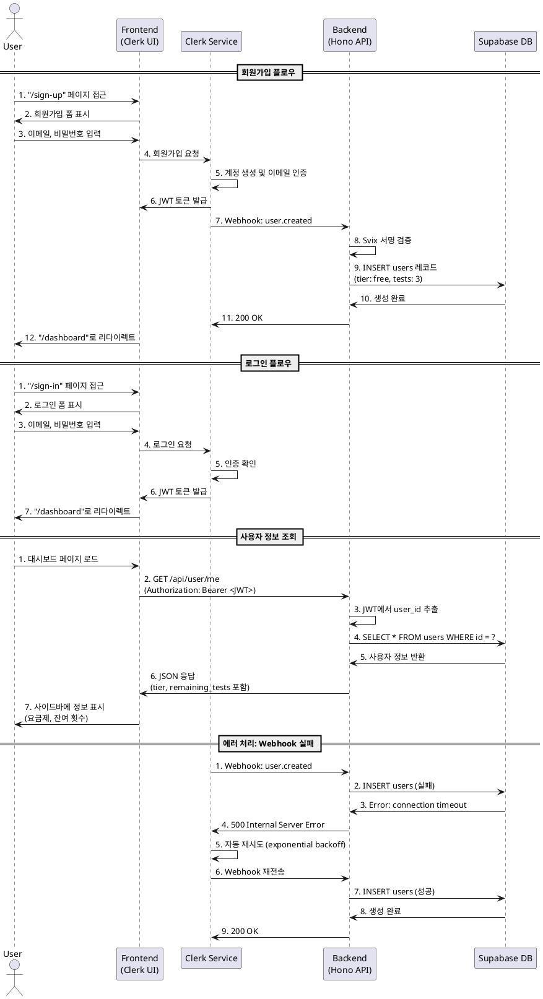

# [AUTH] 회원가입 및 로그인 - 상세 스펙

## 1. 기능 개요

### 목적
- Clerk SDK를 활용한 사용자 인증 및 회원가입 처리
- 인증된 사용자의 초기 데이터 생성 및 구독 정보 초기화
- 신규 사용자에게 무료 체험 기회(3회) 자동 부여

### Primary Actor
- 신규 방문자 (미인증 사용자)
- 기존 회원 (로그인 시도 사용자)

### Precondition
- 사용자가 메인 페이지 또는 로그인 페이지에 접근
- 인터넷 연결 상태 정상
- Clerk SDK가 정상적으로 로드됨

### Trigger
- 메인 페이지에서 "시작하기" 버튼 클릭 (미인증 상태)
- 직접 로그인/회원가입 페이지 접근
- 보호된 페이지 접근 시도 (자동 리다이렉트)

## 2. Main Scenario

### 2.1 회원가입 플로우

#### Step 1: 회원가입 페이지 진입
- 사용자가 `/sign-up` 페이지에 접근
- Clerk 제공 회원가입 UI 렌더링
- 이메일, 비밀번호 입력 폼 표시

#### Step 2: 사용자 정보 입력
- 이메일 주소 입력
- 비밀번호 입력 (최소 8자, 영문+숫자 포함)
- 이메일 인증 코드 발송 및 확인

#### Step 3: Clerk 계정 생성
- Clerk SDK가 사용자 계정 생성
- Clerk User ID 발급 (예: `user_2xxx...`)
- JWT 토큰 생성 및 세션 수립

#### Step 4: Webhook을 통한 사용자 레코드 생성
- Clerk에서 `user.created` 웹훅 전송
- Next.js API (`/api/webhooks/clerk`)에서 수신
- Supabase `users` 테이블에 레코드 INSERT:
  - `id`: Clerk User ID
  - `email`: 사용자 이메일
  - `name`: Clerk에서 제공하는 이름 (없을 경우 NULL)
  - `subscription_tier`: `'free'` (기본값)
  - `remaining_tests`: `3` (무료 체험 횟수)
  - `created_at`: 현재 시각

#### Step 5: 대시보드 리다이렉트
- 회원가입 완료 후 자동으로 `/dashboard`로 이동
- 환영 메시지 또는 온보딩 가이드 표시 (선택적)

### 2.2 로그인 플로우

#### Step 1: 로그인 페이지 진입
- 사용자가 `/sign-in` 페이지에 접근
- Clerk 제공 로그인 UI 렌더링

#### Step 2: 인증 정보 입력
- 이메일 및 비밀번호 입력
- Clerk SDK가 인증 처리

#### Step 3: 세션 수립
- Clerk JWT 토큰 발급
- 브라우저 쿠키에 세션 저장
- 클라이언트 사이드 Clerk 컨텍스트 업데이트

#### Step 4: 사용자 정보 확인
- 첫 번째 API 요청 시 JWT에서 `user_id` 추출
- Supabase에서 사용자 레코드 조회
- 구독 정보 및 잔여 횟수 확인

#### Step 5: 대시보드 이동
- 로그인 성공 후 `/dashboard`로 리다이렉트
- 사이드바에 사용자 정보 표시:
  - 이메일 주소
  - 잔여 검사 횟수
  - 현재 구독 등급

## 3. API 엔드포인트

### 3.1 Clerk Webhook 처리

**엔드포인트**: `POST /api/webhooks/clerk`

**인증**: Clerk Webhook Secret 검증

**요청 헤더**:
```
svix-id: msg_xxx
svix-timestamp: 1234567890
svix-signature: v1,xxx...
```

**요청 본문** (`user.created` 이벤트):
```json
{
  "type": "user.created",
  "data": {
    "id": "user_2xxx...",
    "email_addresses": [
      {
        "email_address": "user@example.com"
      }
    ],
    "first_name": "홍",
    "last_name": "길동",
    "profile_image_url": "https://..."
  }
}
```

**응답** (200 OK):
```json
{
  "received": true
}
```

**처리 로직**:
1. Webhook 서명 검증 (`svix-signature`)
2. 이벤트 타입 확인 (`user.created`, `user.updated`, `user.deleted`)
3. `user.created` 처리:
   - `users` 테이블에 레코드 생성
   - 기본값 설정 (`tier: 'free'`, `remaining_tests: 3`)
4. `user.updated` 처리:
   - 사용자 정보 업데이트 (이메일, 이름, 프로필 이미지)
5. `user.deleted` 처리:
   - 사용자 레코드 삭제 (CASCADE로 관련 데이터 자동 삭제)

**Zod 스키마** (`src/features/auth/backend/schema.ts`):
```typescript
import { z } from 'zod';

export const clerkWebhookEventSchema = z.object({
  type: z.enum(['user.created', 'user.updated', 'user.deleted']),
  data: z.object({
    id: z.string(),
    email_addresses: z.array(
      z.object({
        email_address: z.string().email(),
      })
    ).optional(),
    first_name: z.string().nullable().optional(),
    last_name: z.string().nullable().optional(),
    profile_image_url: z.string().url().nullable().optional(),
  }),
});

export type ClerkWebhookEvent = z.infer<typeof clerkWebhookEventSchema>;
```

### 3.2 사용자 정보 조회 (클라이언트)

**엔드포인트**: `GET /api/user/me`

**인증**: Bearer Token (Clerk JWT) 필수

**요청 헤더**:
```
Authorization: Bearer <clerk_jwt_token>
```

**응답** (200 OK):
```json
{
  "id": "user_2xxx...",
  "email": "user@example.com",
  "name": "홍길동",
  "profile_image_url": "https://...",
  "subscription_tier": "free",
  "remaining_tests": 3,
  "created_at": "2025-01-26T10:00:00Z"
}
```

**Zod 스키마**:
```typescript
export const userResponseSchema = z.object({
  id: z.string(),
  email: z.string().email(),
  name: z.string().nullable(),
  profile_image_url: z.string().url().nullable(),
  subscription_tier: z.enum(['free', 'pro']),
  remaining_tests: z.number().int().min(0),
  created_at: z.string().datetime(),
});

export type UserResponse = z.infer<typeof userResponseSchema>;
```

## 4. 데이터베이스 스키마

### 4.1 users 테이블

```sql
CREATE TABLE IF NOT EXISTS users (
  id TEXT PRIMARY KEY,                    -- Clerk User ID
  email TEXT NOT NULL UNIQUE,             -- 사용자 이메일
  name TEXT,                              -- 사용자 이름 (first_name + last_name)
  profile_image_url TEXT,                 -- 프로필 이미지 URL
  subscription_tier TEXT NOT NULL
    DEFAULT 'free'
    CHECK (subscription_tier IN ('free', 'pro')),
  remaining_tests INTEGER NOT NULL DEFAULT 3,
  created_at TIMESTAMP WITH TIME ZONE DEFAULT NOW(),
  updated_at TIMESTAMP WITH TIME ZONE DEFAULT NOW()
);

CREATE INDEX idx_users_email ON users(email);
CREATE INDEX idx_users_subscription_tier ON users(subscription_tier);

-- updated_at 자동 업데이트 트리거
CREATE TRIGGER update_users_updated_at
  BEFORE UPDATE ON users
  FOR EACH ROW
  EXECUTE FUNCTION update_updated_at_column();
```

### 4.2 Migration 파일

**파일명**: `/supabase/migrations/0001_create_users_table.sql`

```sql
-- Create users table
CREATE TABLE IF NOT EXISTS users (
  id TEXT PRIMARY KEY,
  email TEXT NOT NULL UNIQUE,
  name TEXT,
  profile_image_url TEXT,
  subscription_tier TEXT NOT NULL DEFAULT 'free'
    CHECK (subscription_tier IN ('free', 'pro')),
  remaining_tests INTEGER NOT NULL DEFAULT 3,
  created_at TIMESTAMP WITH TIME ZONE DEFAULT NOW(),
  updated_at TIMESTAMP WITH TIME ZONE DEFAULT NOW()
);

-- Indexes
CREATE INDEX IF NOT EXISTS idx_users_email ON users(email);
CREATE INDEX IF NOT EXISTS idx_users_subscription_tier ON users(subscription_tier);

-- Comments
COMMENT ON TABLE users IS '사용자 정보 및 구독 상태';
COMMENT ON COLUMN users.id IS 'Clerk User ID';
COMMENT ON COLUMN users.subscription_tier IS '구독 등급 (free: 초기 3회, pro: 월 10회)';
COMMENT ON COLUMN users.remaining_tests IS '잔여 검사 횟수';

-- Trigger for updated_at
CREATE OR REPLACE FUNCTION update_updated_at_column()
RETURNS TRIGGER AS $$
BEGIN
  NEW.updated_at = NOW();
  RETURN NEW;
END;
$$ LANGUAGE plpgsql;

CREATE TRIGGER update_users_updated_at
  BEFORE UPDATE ON users
  FOR EACH ROW
  EXECUTE FUNCTION update_updated_at_column();
```

## 5. UI 컴포넌트 구성

### 5.1 페이지 컴포넌트

#### `/app/sign-up/page.tsx`
```typescript
'use client';

import { SignUp } from '@clerk/nextjs';

export default async function SignUpPage() {
  return (
    <div className="flex min-h-screen items-center justify-center">
      <SignUp
        appearance={{
          elements: {
            rootBox: 'mx-auto',
            card: 'shadow-lg',
          },
        }}
        routing="path"
        path="/sign-up"
        signInUrl="/sign-in"
        afterSignUpUrl="/dashboard"
      />
    </div>
  );
}
```

#### `/app/sign-in/page.tsx`
```typescript
'use client';

import { SignIn } from '@clerk/nextjs';

export default async function SignInPage() {
  return (
    <div className="flex min-h-screen items-center justify-center">
      <SignIn
        appearance={{
          elements: {
            rootBox: 'mx-auto',
            card: 'shadow-lg',
          },
        }}
        routing="path"
        path="/sign-in"
        signUpUrl="/sign-up"
        afterSignInUrl="/dashboard"
      />
    </div>
  );
}
```

### 5.2 Protected Route 미들웨어

#### `/middleware.ts`
```typescript
import { authMiddleware } from '@clerk/nextjs';

export default authMiddleware({
  publicRoutes: ['/', '/sign-in', '/sign-up', '/api/webhooks/clerk'],
  ignoredRoutes: ['/api/webhooks/clerk'],
});

export const config = {
  matcher: ['/((?!.+\\.[\\w]+$|_next).*)', '/', '/(api|trpc)(.*)'],
};
```

### 5.3 Clerk Provider 설정

#### `/app/layout.tsx`
```typescript
import { ClerkProvider } from '@clerk/nextjs';
import { koKR } from '@clerk/localizations';

export default function RootLayout({ children }: { children: React.ReactNode }) {
  return (
    <ClerkProvider localization={koKR}>
      <html lang="ko">
        <body>{children}</body>
      </html>
    </ClerkProvider>
  );
}
```

## 6. 백엔드 서비스 로직

### 6.1 Webhook Handler

**파일**: `/src/features/auth/backend/route.ts`

```typescript
import { Hono } from 'hono';
import { Webhook } from 'svix';
import type { AppEnv } from '@/backend/hono/context';
import { clerkWebhookEventSchema } from './schema';
import { createUser, updateUser, deleteUser } from './service';

const route = new Hono<AppEnv>();

route.post('/webhooks/clerk', async (c) => {
  const svixId = c.req.header('svix-id');
  const svixTimestamp = c.req.header('svix-timestamp');
  const svixSignature = c.req.header('svix-signature');

  if (!svixId || !svixTimestamp || !svixSignature) {
    return c.json({ error: 'Missing svix headers' }, 400);
  }

  const payload = await c.req.text();
  const webhookSecret = c.get('config').CLERK_WEBHOOK_SECRET;

  try {
    const wh = new Webhook(webhookSecret);
    const evt = wh.verify(payload, {
      'svix-id': svixId,
      'svix-timestamp': svixTimestamp,
      'svix-signature': svixSignature,
    });

    const parsedEvent = clerkWebhookEventSchema.parse(evt);

    switch (parsedEvent.type) {
      case 'user.created':
        await createUser(c.get('supabase'), parsedEvent.data);
        break;
      case 'user.updated':
        await updateUser(c.get('supabase'), parsedEvent.data);
        break;
      case 'user.deleted':
        await deleteUser(c.get('supabase'), parsedEvent.data.id);
        break;
    }

    return c.json({ received: true });
  } catch (error) {
    c.get('logger').error('Clerk webhook error:', error);
    return c.json({ error: 'Webhook verification failed' }, 400);
  }
});

export default route;
```

### 6.2 Service Layer

**파일**: `/src/features/auth/backend/service.ts`

```typescript
import type { SupabaseClient } from '@supabase/supabase-js';

interface ClerkUserData {
  id: string;
  email_addresses?: Array<{ email_address: string }>;
  first_name?: string | null;
  last_name?: string | null;
  profile_image_url?: string | null;
}

export async function createUser(
  supabase: SupabaseClient,
  userData: ClerkUserData
) {
  const email = userData.email_addresses?.[0]?.email_address;
  if (!email) {
    throw new Error('Email address is required');
  }

  const name = [userData.first_name, userData.last_name]
    .filter(Boolean)
    .join(' ') || null;

  const { error } = await supabase.from('users').insert({
    id: userData.id,
    email,
    name,
    profile_image_url: userData.profile_image_url,
    subscription_tier: 'free',
    remaining_tests: 3,
  });

  if (error) {
    throw new Error(`Failed to create user: ${error.message}`);
  }
}

export async function updateUser(
  supabase: SupabaseClient,
  userData: ClerkUserData
) {
  const email = userData.email_addresses?.[0]?.email_address;
  const name = [userData.first_name, userData.last_name]
    .filter(Boolean)
    .join(' ') || null;

  const { error } = await supabase
    .from('users')
    .update({
      email,
      name,
      profile_image_url: userData.profile_image_url,
    })
    .eq('id', userData.id);

  if (error) {
    throw new Error(`Failed to update user: ${error.message}`);
  }
}

export async function deleteUser(supabase: SupabaseClient, userId: string) {
  const { error } = await supabase.from('users').delete().eq('id', userId);

  if (error) {
    throw new Error(`Failed to delete user: ${error.message}`);
  }
}
```

## 7. Edge Cases 및 에러 처리

### 7.1 회원가입 중 오류

| 케이스 | 처리 방법 |
|--------|-----------|
| 중복 이메일 가입 시도 | Clerk UI가 자동으로 에러 메시지 표시 ("이미 사용 중인 이메일입니다") |
| Webhook 처리 실패 | 자동 재시도 (Clerk의 기본 재시도 정책), 로그 기록 |
| Supabase 연결 실패 | Webhook 응답 500 반환, Clerk가 자동 재시도 |
| 사용자 레코드 생성 실패 | 에러 로깅 후 다음 API 요청 시 재생성 시도 |

### 7.2 로그인 중 오류

| 케이스 | 처리 방법 |
|--------|-----------|
| 잘못된 비밀번호 | Clerk UI가 에러 메시지 표시 ("비밀번호가 일치하지 않습니다") |
| 존재하지 않는 계정 | "이메일 또는 비밀번호가 올바르지 않습니다" (보안상 모호한 메시지) |
| 세션 만료 | 자동 로그아웃 후 로그인 페이지로 리다이렉트 |
| JWT 검증 실패 | API 요청 시 401 Unauthorized 반환, 클라이언트에서 재로그인 유도 |

### 7.3 사용자 레코드 불일치

| 케이스 | 처리 방법 |
|--------|-----------|
| Clerk에는 있으나 Supabase에 없음 | API 요청 시 자동으로 레코드 생성 (fallback) |
| Supabase에는 있으나 Clerk에 없음 | 불가능한 케이스 (Clerk를 단일 진실 공급원으로 사용) |
| 데이터 동기화 오류 | 주기적 동기화 스크립트 또는 수동 복구 |

### 7.4 Webhook 보안

| 위험 | 대응 방안 |
|------|----------|
| 위조된 Webhook 요청 | Svix 서명 검증 필수 (`svix-signature`) |
| Replay Attack | Timestamp 검증 (5분 이내 요청만 허용) |
| 대량 요청 공격 | Rate Limiting (IP당 분당 100회) |

## 8. Business Rules

### 8.1 초기 무료 체험
- 신규 가입 시 자동으로 3회 무료 검사 제공
- 한 번 소진된 무료 횟수는 복구 불가
- Pro 구독 후에도 초기 무료 횟수는 별도 추적하지 않음

### 8.2 계정 삭제
- 사용자가 Clerk에서 계정 삭제 시 모든 데이터 CASCADE 삭제:
  - 검사 이력 (`saju_tests`)
  - 구독 정보 (`subscriptions`)
  - 결제 내역 (`payments`)
- GDPR 준수: 30일 이내 완전 삭제 (Supabase 즉시 삭제 + Clerk 30일 유예)

### 8.3 이메일 변경
- Clerk에서 이메일 변경 시 `user.updated` Webhook 발생
- Supabase `users` 테이블의 이메일도 자동 동기화

### 8.4 세션 관리
- JWT 유효기간: 1시간
- Refresh Token 유효기간: 7일
- 자동 갱신: Clerk SDK가 백그라운드에서 처리

## 9. 보안 고려사항

### 9.1 인증 흐름 보안
- Clerk JWT를 모든 API 요청에 필수 포함
- JWT 페이로드에서 `user_id` 추출 후 DB 조회
- 클라이언트는 절대 `user_id`를 직접 전송하지 않음

### 9.2 민감 정보 보호
- 비밀번호는 Clerk에서만 관리 (자체 DB에 저장하지 않음)
- 프로필 이미지 URL은 Clerk CDN 사용 (직접 업로드 없음)
- 환경 변수로 API Key 관리 (`CLERK_SECRET_KEY`, `CLERK_WEBHOOK_SECRET`)

### 9.3 CORS 설정
- Webhook 엔드포인트는 Clerk IP만 허용 (선택적)
- 클라이언트 API는 동일 도메인만 허용

## 10. Sequence Diagram



## 11. 환경 변수 설정

```env
# Clerk
NEXT_PUBLIC_CLERK_PUBLISHABLE_KEY=pk_test_xxx
CLERK_SECRET_KEY=sk_test_xxx
CLERK_WEBHOOK_SECRET=whsec_xxx

# Clerk Routes
NEXT_PUBLIC_CLERK_SIGN_IN_URL=/sign-in
NEXT_PUBLIC_CLERK_SIGN_UP_URL=/sign-up
NEXT_PUBLIC_CLERK_AFTER_SIGN_IN_URL=/dashboard
NEXT_PUBLIC_CLERK_AFTER_SIGN_UP_URL=/dashboard

# Supabase
NEXT_PUBLIC_SUPABASE_URL=https://xxx.supabase.co
SUPABASE_SERVICE_ROLE_KEY=eyJxxx...
```

## 12. 테스트 시나리오

### 12.1 회원가입 성공 테스트
1. `/sign-up` 페이지 접근
2. 새로운 이메일, 비밀번호 입력
3. 이메일 인증 코드 확인
4. 회원가입 완료 후 대시보드 이동 확인
5. Supabase `users` 테이블에 레코드 생성 확인
6. `remaining_tests`가 3인지 확인

### 12.2 로그인 성공 테스트
1. `/sign-in` 페이지 접근
2. 등록된 이메일, 비밀번호 입력
3. 대시보드 이동 확인
4. 사이드바에 사용자 정보 표시 확인

### 12.3 Webhook 처리 테스트
1. Clerk Dashboard에서 테스트 Webhook 전송
2. 로그에서 `user.created` 이벤트 수신 확인
3. Supabase에서 사용자 레코드 생성 확인
4. Webhook 응답 200 확인

### 12.4 중복 가입 방지 테스트
1. 이미 가입된 이메일로 회원가입 시도
2. Clerk UI에서 "이미 사용 중인 이메일입니다" 에러 확인
3. 회원가입 진행 차단 확인

### 12.5 세션 만료 테스트
1. 로그인 후 7일 경과 (또는 강제 만료)
2. 보호된 페이지 접근 시도
3. 자동으로 로그인 페이지 리다이렉트 확인

## 13. 성능 요구사항

- 회원가입 완료 시간: 5초 이내
- 로그인 완료 시간: 2초 이내
- Webhook 처리 시간: 1초 이내
- JWT 검증 시간: 100ms 이내

## 14. 모니터링 및 로깅

### 14.1 로그 대상
- 회원가입 성공/실패
- 로그인 성공/실패
- Webhook 수신 및 처리 결과
- JWT 검증 오류

### 14.2 메트릭
- 일일 신규 가입자 수
- 로그인 성공률
- Webhook 처리 성공률
- 세션 만료로 인한 재로그인 비율

## 15. 향후 개선 사항

- 소셜 로그인 추가 (Google, Kakao)
- 2단계 인증 (2FA) 도입
- 사용자 프로필 편집 기능
- 비밀번호 찾기 플로우 개선
