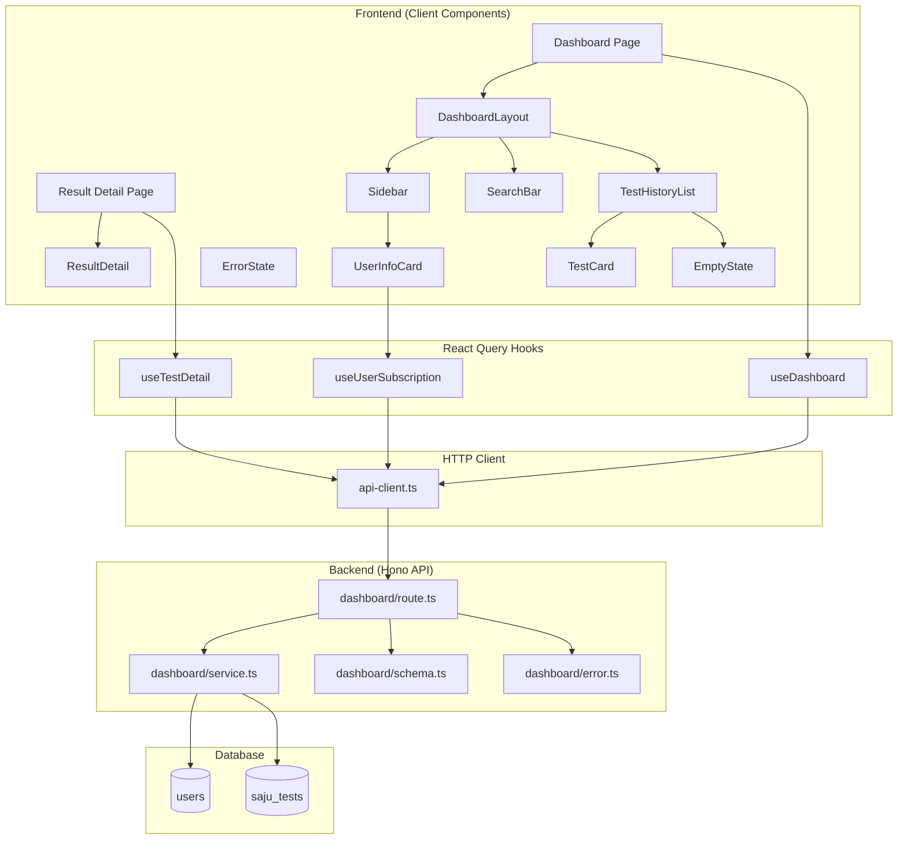
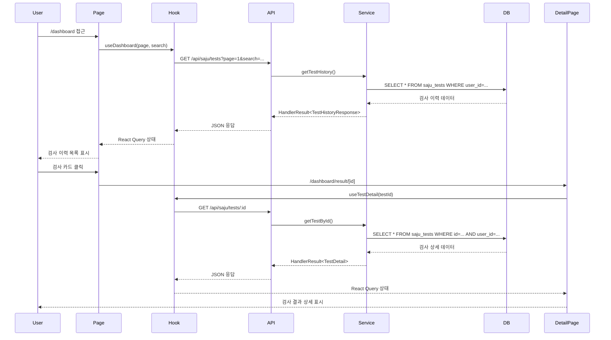

# 대시보드 기능 구현 계획 (Implementation Plan)

## 개요

대시보드 기능은 사용자가 과거 사주 검사 이력을 조회하고 관리하는 핵심 기능입니다. 검사 이력 목록 조회, 검색, 상세 재조회 기능을 제공하며, AGENTS.md에 명시된 코드베이스 구조를 준수하여 구현합니다.

### 구현 범위

- **DASH-HOME**: 대시보드 홈 - 검사 이력 목록 조회 (페이지네이션)
- **DASH-SEARCH**: 검사 이력 검색 (검사자 이름 기반)
- **DASH-VIEW**: 검사 결과 재조회 (상세 페이지)

---

## 모듈 설계 개요

### Backend Modules (Hono API Layer)

| 모듈 이름 | 경로 | 설명 |
|---------|------|------|
| Dashboard Route | `src/features/dashboard/backend/route.ts` | Hono 라우터 정의 (검사 이력 목록, 검색, 상세 조회) |
| Dashboard Service | `src/features/dashboard/backend/service.ts` | Supabase 접근 및 비즈니스 로직 |
| Dashboard Schema | `src/features/dashboard/backend/schema.ts` | Zod 스키마 정의 (요청/응답) |
| Dashboard Error | `src/features/dashboard/backend/error.ts` | 에러 코드 정의 |

### Frontend Modules (Presentation Layer)

| 모듈 이름 | 경로 | 설명 |
|---------|------|------|
| Dashboard Page | `src/app/dashboard/page.tsx` | 대시보드 메인 페이지 |
| Result Detail Page | `src/app/dashboard/result/[id]/page.tsx` | 검사 결과 상세 페이지 |
| DashboardLayout | `src/features/dashboard/components/DashboardLayout.tsx` | 공통 레이아웃 (사이드바 포함) |
| Sidebar | `src/features/dashboard/components/Sidebar.tsx` | 사이드바 (네비게이션 + 사용자 정보) |
| SearchBar | `src/features/dashboard/components/SearchBar.tsx` | 검색창 컴포넌트 (debounce 적용) |
| TestHistoryList | `src/features/dashboard/components/TestHistoryList.tsx` | 검사 이력 목록 컴포넌트 |
| TestCard | `src/features/dashboard/components/TestCard.tsx` | 개별 검사 카드 컴포넌트 |
| EmptyState | `src/features/dashboard/components/EmptyState.tsx` | 빈 상태 화면 |
| ErrorState | `src/features/dashboard/components/ErrorState.tsx` | 에러 상태 화면 |
| ResultDetail | `src/features/dashboard/components/ResultDetail.tsx` | 검사 결과 상세 컴포넌트 |
| UserInfoCard | `src/features/dashboard/components/UserInfoCard.tsx` | 사용자 정보 카드 (구독 정보) |

### Hooks (React Query)

| 모듈 이름 | 경로 | 설명 |
|---------|------|------|
| useDashboard | `src/features/dashboard/hooks/useDashboard.ts` | 검사 이력 목록/검색 훅 |
| useTestDetail | `src/features/dashboard/hooks/useTestDetail.ts` | 검사 결과 상세 조회 훅 |
| useUserSubscription | `src/features/dashboard/hooks/useUserSubscription.ts` | 사용자 구독 정보 조회 훅 |

### Shared Modules

| 모듈 이름 | 경로 | 설명 |
|---------|------|------|
| DTO | `src/features/dashboard/lib/dto.ts` | Backend schema 재노출 (클라이언트 측 재사용) |
| Date Utils | `src/lib/utils/date.ts` | 날짜 포맷팅 유틸리티 (공통) |

---

## Diagram

### Architecture Diagram



### Data Flow Diagram



---

## Implementation Plan

### Phase 1: Backend API 구현

#### 1.1 Schema 정의 (`src/features/dashboard/backend/schema.ts`)

**목적**: API 요청/응답에 대한 Zod 스키마 정의

**구현 내용**:
```typescript
// Query Parameter Schemas
- TestHistoryQuerySchema: page, limit, search 파라미터 검증
- TestDetailParamsSchema: testId UUID 검증

// Table Row Schemas
- SajuTestRowSchema: saju_tests 테이블 row 스키마
- UserInfoRowSchema: users 테이블 일부 컬럼 스키마

// Response Schemas
- TestHistoryItemSchema: 목록용 간략 정보
- TestHistoryResponseSchema: 목록 + 페이지네이션 정보
- TestDetailResponseSchema: 검사 상세 정보 (full_result 포함)
- UserSubscriptionSchema: 사용자 구독 정보
```

**테스트 전략**:
- Zod 스키마 파싱 단위 테스트
- 유효한/유효하지 않은 입력 검증

---

#### 1.2 Error 정의 (`src/features/dashboard/backend/error.ts`)

**목적**: 대시보드 기능 관련 에러 코드 정의

**구현 내용**:
```typescript
export const dashboardErrorCodes = {
  testNotFound: 'TEST_NOT_FOUND',
  testFetchError: 'TEST_FETCH_ERROR',
  unauthorizedAccess: 'UNAUTHORIZED_TEST_ACCESS',
  validationError: 'DASHBOARD_VALIDATION_ERROR',
  userNotFound: 'USER_NOT_FOUND',
} as const;

export type DashboardServiceError =
  (typeof dashboardErrorCodes)[keyof typeof dashboardErrorCodes];
```

---

#### 1.3 Service 구현 (`src/features/dashboard/backend/service.ts`)

**목적**: Supabase 접근 및 비즈니스 로직 처리

**함수 목록**:

1. **`getTestHistory`**: 검사 이력 목록 조회 (페이지네이션, 검색 지원)
   - 파라미터: `userId`, `page`, `limit`, `search?`
   - 반환: `HandlerResult<TestHistoryResponse>`
   - 로직:
     - Supabase에서 `saju_tests` 테이블 조회
     - `user_id` 필터링
     - `search`가 있으면 `test_name ILIKE` 조건 추가
     - `created_at DESC` 정렬
     - 페이지네이션 적용 (offset, limit)
     - 전체 카운트 조회
     - 스키마 검증 후 반환

2. **`getTestById`**: 검사 상세 조회
   - 파라미터: `userId`, `testId`
   - 반환: `HandlerResult<TestDetail>`
   - 로직:
     - `saju_tests` 테이블에서 `id`와 `user_id`로 조회
     - 데이터 없으면 `testNotFound` 에러
     - `user_id` 불일치 시 `unauthorizedAccess` 에러
     - 스키마 검증 후 반환

3. **`getUserSubscription`**: 사용자 구독 정보 조회
   - 파라미터: `userId`
   - 반환: `HandlerResult<UserSubscription>`
   - 로직:
     - `users` 테이블에서 `subscription_tier`, `remaining_tests` 조회
     - 스키마 검증 후 반환

**단위 테스트**:
- Mock Supabase 클라이언트 사용
- 성공 시나리오: 정상 데이터 반환
- 실패 시나리오: DB 오류, 권한 없음, 데이터 없음
- 검색 시나리오: 검색어에 따른 필터링 동작
- 페이지네이션 시나리오: offset/limit 계산

---

#### 1.4 Route 구현 (`src/features/dashboard/backend/route.ts`)

**목적**: Hono 라우터 정의 및 엔드포인트 등록

**엔드포인트**:

1. **`GET /api/saju/tests`**: 검사 이력 목록/검색
   - 쿼리 파라미터: `page`, `limit`, `search`
   - 미들웨어: JWT 인증 (Clerk)
   - 핸들러:
     - 쿼리 파라미터 검증
     - `userId` 추출 (JWT에서)
     - `getTestHistory` 서비스 호출
     - 결과에 따라 `respond` 호출

2. **`GET /api/saju/tests/:id`**: 검사 상세 조회
   - 경로 파라미터: `id` (UUID)
   - 미들웨어: JWT 인증
   - 핸들러:
     - 경로 파라미터 검증
     - `userId` 추출
     - `getTestById` 서비스 호출
     - 결과에 따라 `respond` 호출

3. **`GET /api/user/subscription`**: 사용자 구독 정보 조회
   - 미들웨어: JWT 인증
   - 핸들러:
     - `userId` 추출
     - `getUserSubscription` 서비스 호출
     - 결과에 따라 `respond` 호출

**통합 테스트**:
- API 엔드포인트 E2E 테스트 (Hono 테스트 유틸 사용)
- 인증 실패 시나리오 (JWT 없음/유효하지 않음)
- 권한 검증 시나리오 (다른 사용자 데이터 접근 차단)
- 페이지네이션 동작 검증
- 검색 동작 검증

---

#### 1.5 Hono App 라우터 등록 (`src/backend/hono/app.ts`)

**수정 내용**:
```typescript
import { registerDashboardRoutes } from '@/features/dashboard/backend/route';

export const createHonoApp = () => {
  const app = new Hono<AppEnv>();

  // ... 기존 미들웨어 ...

  registerExampleRoutes(app);
  registerDashboardRoutes(app); // 추가

  return app;
};
```

---

### Phase 2: Frontend 구현

#### 2.1 DTO 재노출 (`src/features/dashboard/lib/dto.ts`)

**목적**: Backend schema를 프론트엔드에서 재사용

**구현 내용**:
```typescript
export {
  TestHistoryQuerySchema,
  TestHistoryResponseSchema,
  TestDetailResponseSchema,
  UserSubscriptionSchema,
  type TestHistoryItem,
  type TestHistoryResponse,
  type TestDetail,
  type UserSubscription,
} from '@/features/dashboard/backend/schema';
```

---

#### 2.2 React Query 훅 구현

##### 2.2.1 `useDashboard` (`src/features/dashboard/hooks/useDashboard.ts`)

**목적**: 검사 이력 목록 및 검색 훅

**구현 내용**:
```typescript
import { useQuery } from '@tanstack/react-query';
import { apiClient, extractApiErrorMessage } from '@/lib/remote/api-client';
import { TestHistoryResponseSchema } from '../lib/dto';

export const useDashboard = (page: number, search?: string) => {
  return useQuery({
    queryKey: ['saju-tests', page, search],
    queryFn: async () => {
      const { data } = await apiClient.get('/api/saju/tests', {
        params: { page, limit: 10, search },
      });
      return TestHistoryResponseSchema.parse(data);
    },
    staleTime: 30_000, // 30초
  });
};
```

---

##### 2.2.2 `useTestDetail` (`src/features/dashboard/hooks/useTestDetail.ts`)

**목적**: 검사 결과 상세 조회 훅

**구현 내용**:
```typescript
import { useQuery } from '@tanstack/react-query';
import { apiClient } from '@/lib/remote/api-client';
import { TestDetailResponseSchema } from '../lib/dto';

export const useTestDetail = (testId: string) => {
  return useQuery({
    queryKey: ['saju-test', testId],
    queryFn: async () => {
      const { data } = await apiClient.get(`/api/saju/tests/${testId}`);
      return TestDetailResponseSchema.parse(data);
    },
    enabled: Boolean(testId),
    staleTime: 60_000, // 1분
  });
};
```

---

##### 2.2.3 `useUserSubscription` (`src/features/dashboard/hooks/useUserSubscription.ts`)

**목적**: 사용자 구독 정보 조회 훅

**구현 내용**:
```typescript
import { useQuery } from '@tanstack/react-query';
import { apiClient } from '@/lib/remote/api-client';
import { UserSubscriptionSchema } from '../lib/dto';

export const useUserSubscription = () => {
  return useQuery({
    queryKey: ['user-subscription'],
    queryFn: async () => {
      const { data } = await apiClient.get('/api/user/subscription');
      return UserSubscriptionSchema.parse(data);
    },
    staleTime: 30_000,
  });
};
```

---

#### 2.3 공통 유틸리티 (`src/lib/utils/date.ts`)

**목적**: 날짜 포맷팅 유틸리티 (전체 프로젝트에서 재사용)

**구현 내용**:
```typescript
import { format, formatDistance } from 'date-fns';
import { ko } from 'date-fns/locale';

export const formatDate = (date: string | Date): string => {
  return format(new Date(date), 'yyyy년 MM월 dd일', { locale: ko });
};

export const formatRelativeTime = (date: string | Date): string => {
  return formatDistance(new Date(date), new Date(), {
    addSuffix: true,
    locale: ko,
  });
};

export const formatDateTime = (date: string | Date): string => {
  return format(new Date(date), 'yyyy-MM-dd HH:mm:ss');
};
```

---

#### 2.4 컴포넌트 구현

##### 2.4.1 `UserInfoCard` (`src/features/dashboard/components/UserInfoCard.tsx`)

**목적**: 사이드바 하단 사용자 정보 표시

**Props**:
```typescript
interface UserInfoCardProps {
  email: string;
  subscriptionTier: 'free' | 'pro';
  remainingTests: number;
  onClick: () => void;
}
```

**UI 구성**:
- 사용자 이메일
- 구독 등급 배지 (free/pro)
- 잔여 횟수 (예: "3/10회 남음")
- 클릭 시 `/dashboard/subscription`으로 이동

**QA Sheet**:
| 테스트 케이스 | 입력 | 기대 출력 |
|------------|-----|----------|
| Free 사용자 | tier: 'free', remaining: 2 | "무료 플랜" 배지, "2회 남음" |
| Pro 사용자 | tier: 'pro', remaining: 7 | "Pro" 배지, "7/10회 남음" |
| 횟수 0회 | remaining: 0 | "0회 남음" (빨간색 강조) |
| 클릭 동작 | 카드 클릭 | onClick 콜백 호출 |

---

##### 2.4.2 `Sidebar` (`src/features/dashboard/components/Sidebar.tsx`)

**목적**: 대시보드 사이드바 (네비게이션 + 사용자 정보)

**UI 구성**:
- 로고
- 네비게이션 버튼 (홈, 새 검사)
- 하단 `UserInfoCard`

**QA Sheet**:
| 테스트 케이스 | 입력 | 기대 출력 |
|------------|-----|----------|
| 사이드바 렌더링 | - | 로고, 네비게이션, 사용자 정보 표시 |
| 홈 버튼 클릭 | 버튼 클릭 | `/dashboard`로 이동 |
| 새 검사 버튼 클릭 | 버튼 클릭 | `/dashboard/new`로 이동 |
| UserInfoCard 클릭 | 카드 클릭 | `/dashboard/subscription`으로 이동 |

---

##### 2.4.3 `SearchBar` (`src/features/dashboard/components/SearchBar.tsx`)

**목적**: 검색창 (debounce 적용)

**Props**:
```typescript
interface SearchBarProps {
  value: string;
  onChange: (value: string) => void;
  isLoading?: boolean;
}
```

**UI 구성**:
- Input 컴포넌트 (shadcn-ui)
- Search 아이콘
- 로딩 시 Spinner 표시

**동작**:
- 입력값 변경 시 `onChange` 콜백 호출
- 부모 컴포넌트에서 debounce 처리

**QA Sheet**:
| 테스트 케이스 | 입력 | 기대 출력 |
|------------|-----|----------|
| 입력 변경 | "홍길동" 입력 | onChange("홍길동") 호출 |
| 로딩 상태 | isLoading: true | Spinner 표시 |
| 빈 값 입력 | "" 입력 | onChange("") 호출 |

---

##### 2.4.4 `TestCard` (`src/features/dashboard/components/TestCard.tsx`)

**목적**: 개별 검사 카드

**Props**:
```typescript
interface TestCardProps {
  test: TestHistoryItem;
}
```

**UI 구성**:
- 검사자 이름
- 생년월일 (포맷팅)
- 성별
- 상태 배지 (completed/processing/failed)
- 생성 시각 (상대 시간)

**동작**:
- 클릭 시 `/dashboard/result/${test.id}`로 이동

**QA Sheet**:
| 테스트 케이스 | 입력 | 기대 출력 |
|------------|-----|----------|
| 완료된 검사 | status: 'completed' | "완료" 배지 (초록색) |
| 처리 중 검사 | status: 'processing' | "분석 중" 배지 (노란색) |
| 실패한 검사 | status: 'failed' | "실패" 배지 (빨간색) |
| 날짜 포맷팅 | created_at: "2025-01-26T10:00:00Z" | "3시간 전" |
| 클릭 동작 | 카드 클릭 | 상세 페이지로 이동 |

---

##### 2.4.5 `TestHistoryList` (`src/features/dashboard/components/TestHistoryList.tsx`)

**목적**: 검사 이력 목록 렌더링

**Props**:
```typescript
interface TestHistoryListProps {
  tests: TestHistoryItem[];
  pagination: {
    page: number;
    limit: number;
    total: number;
    total_pages: number;
  };
  onPageChange: (page: number) => void;
}
```

**UI 구성**:
- `TestCard` 리스트
- 페이지네이션 버튼

**QA Sheet**:
| 테스트 케이스 | 입력 | 기대 출력 |
|------------|-----|----------|
| 빈 목록 | tests: [] | `EmptyState` 컴포넌트 표시 |
| 목록 렌더링 | tests: [test1, test2] | 2개의 `TestCard` 렌더링 |
| 페이지 변경 | 페이지 2 버튼 클릭 | onPageChange(2) 호출 |

---

##### 2.4.6 `EmptyState` (`src/features/dashboard/components/EmptyState.tsx`)

**목적**: 검사 이력이 없을 때 표시

**UI 구성**:
- 아이콘 (SearchX from lucide-react)
- 메시지: "검사 내역이 없습니다"
- 설명: "첫 사주 분석을 시작해보세요"
- "새 검사 시작" 버튼

**QA Sheet**:
| 테스트 케이스 | 입력 | 기대 출력 |
|------------|-----|----------|
| 빈 상태 렌더링 | - | 아이콘, 메시지, 버튼 표시 |
| 버튼 클릭 | 버튼 클릭 | `/dashboard/new`로 이동 |

---

##### 2.4.7 `ErrorState` (`src/features/dashboard/components/ErrorState.tsx`)

**목적**: 에러 발생 시 표시

**Props**:
```typescript
interface ErrorStateProps {
  error: {
    status?: number;
    message: string;
  };
  onRetry: () => void;
}
```

**UI 구성**:
- 아이콘 (AlertCircle from lucide-react)
- 에러 메시지
- "다시 시도" 버튼

**QA Sheet**:
| 테스트 케이스 | 입력 | 기대 출력 |
|------------|-----|----------|
| 404 에러 | status: 404 | "검사 결과를 찾을 수 없습니다" |
| 일반 에러 | message: "Network error" | 메시지 표시 + 재시도 버튼 |
| 재시도 클릭 | 버튼 클릭 | onRetry() 호출 |

---

##### 2.4.8 `ResultDetail` (`src/features/dashboard/components/ResultDetail.tsx`)

**목적**: 검사 결과 상세 표시

**Props**:
```typescript
interface ResultDetailProps {
  test: TestDetail;
}
```

**UI 구성**:
- 검사 대상자 정보 섹션
  - 이름, 생년월일, 성별, 출생시간
- AI 분석 결과 섹션
  - `full_result` 마크다운 렌더링
- 메타 정보
  - 사용된 AI 모델
  - 검사 수행 시각

**QA Sheet**:
| 테스트 케이스 | 입력 | 기대 출력 |
|------------|-----|----------|
| 완료된 검사 | status: 'completed' | 전체 분석 결과 표시 |
| 출생시간 모름 | is_birth_time_unknown: true | "출생시간: 정보 없음" |
| 마크다운 렌더링 | full_result: "## 제목\n내용" | HTML로 변환되어 표시 |

---

##### 2.4.9 `DashboardLayout` (`src/features/dashboard/components/DashboardLayout.tsx`)

**목적**: 대시보드 공통 레이아웃

**Props**:
```typescript
interface DashboardLayoutProps {
  children: React.ReactNode;
}
```

**UI 구성**:
- 좌측 `Sidebar`
- 우측 메인 컨텐츠 영역 (`children`)

**QA Sheet**:
| 테스트 케이스 | 입력 | 기대 출력 |
|------------|-----|----------|
| 레이아웃 렌더링 | children: <div>Test</div> | 사이드바 + 메인 영역 표시 |
| 반응형 동작 | 모바일 화면 | 사이드바 햄버거 메뉴로 전환 |

---

#### 2.5 페이지 구현

##### 2.5.1 `Dashboard Page` (`src/app/dashboard/page.tsx`)

**목적**: 대시보드 메인 페이지

**구현 내용**:
```typescript
'use client';

import { useState } from 'react';
import { useDebounce } from 'react-use';
import { useSearchParams, useRouter } from 'next/navigation';
import { DashboardLayout } from '@/features/dashboard/components/DashboardLayout';
import { SearchBar } from '@/features/dashboard/components/SearchBar';
import { TestHistoryList } from '@/features/dashboard/components/TestHistoryList';
import { EmptyState } from '@/features/dashboard/components/EmptyState';
import { ErrorState } from '@/features/dashboard/components/ErrorState';
import { useDashboard } from '@/features/dashboard/hooks/useDashboard';

export default function DashboardPage() {
  const router = useRouter();
  const searchParams = useSearchParams();

  const [searchQuery, setSearchQuery] = useState(
    searchParams.get('search') || ''
  );
  const [debouncedQuery, setDebouncedQuery] = useState('');
  const [page, setPage] = useState(1);

  useDebounce(
    () => setDebouncedQuery(searchQuery),
    300,
    [searchQuery]
  );

  const { data, isLoading, error, refetch } = useDashboard(
    page,
    debouncedQuery || undefined
  );

  const handleSearch = (query: string) => {
    setSearchQuery(query);
    setPage(1); // 검색 시 첫 페이지로

    // URL 쿼리 파라미터 업데이트
    const params = new URLSearchParams(searchParams);
    if (query) {
      params.set('search', query);
    } else {
      params.delete('search');
    }
    router.push(`/dashboard?${params.toString()}`);
  };

  if (error) {
    return (
      <DashboardLayout>
        <ErrorState
          error={{ message: error.message }}
          onRetry={refetch}
        />
      </DashboardLayout>
    );
  }

  const hasTests = data && data.tests.length > 0;

  return (
    <DashboardLayout>
      <div className="space-y-6">
        <header>
          <h1 className="text-3xl font-bold">검사 이력</h1>
          <p className="text-muted-foreground">
            과거에 수행한 사주 분석 결과를 확인하세요
          </p>
        </header>

        <SearchBar
          value={searchQuery}
          onChange={handleSearch}
          isLoading={isLoading}
        />

        {isLoading ? (
          <div>Loading skeleton...</div>
        ) : hasTests ? (
          <TestHistoryList
            tests={data.tests}
            pagination={data.pagination}
            onPageChange={setPage}
          />
        ) : (
          <EmptyState />
        )}
      </div>
    </DashboardLayout>
  );
}
```

**QA Sheet**:
| 테스트 케이스 | 입력 | 기대 출력 |
|------------|-----|----------|
| 초기 로딩 | 페이지 접근 | 스켈레톤 UI 표시 |
| 데이터 로드 완료 | API 성공 | 검사 이력 목록 표시 |
| 검색 입력 | "홍길동" 입력 후 300ms 대기 | 검색 API 호출 |
| 검색 결과 없음 | 검색어: "존재하지않는이름" | "검색 결과가 없습니다" 표시 |
| 페이지 변경 | 페이지 2 클릭 | page=2로 API 재호출 |
| 에러 발생 | API 실패 | ErrorState 표시 |

---

##### 2.5.2 `Result Detail Page` (`src/app/dashboard/result/[id]/page.tsx`)

**목적**: 검사 결과 상세 페이지

**구현 내용**:
```typescript
'use client';

import { use } from 'react';
import { useRouter } from 'next/navigation';
import { DashboardLayout } from '@/features/dashboard/components/DashboardLayout';
import { ResultDetail } from '@/features/dashboard/components/ResultDetail';
import { ErrorState } from '@/features/dashboard/components/ErrorState';
import { useTestDetail } from '@/features/dashboard/hooks/useTestDetail';

interface ResultDetailPageProps {
  params: Promise<{ id: string }>;
}

export default function ResultDetailPage({ params }: ResultDetailPageProps) {
  const { id } = use(params);
  const router = useRouter();
  const { data, isLoading, error, refetch } = useTestDetail(id);

  if (isLoading) {
    return (
      <DashboardLayout>
        <div>Loading...</div>
      </DashboardLayout>
    );
  }

  if (error) {
    return (
      <DashboardLayout>
        <ErrorState
          error={{ message: error.message }}
          onRetry={refetch}
        />
      </DashboardLayout>
    );
  }

  if (!data) {
    return (
      <DashboardLayout>
        <ErrorState
          error={{ status: 404, message: '검사 결과를 찾을 수 없습니다' }}
          onRetry={() => router.push('/dashboard')}
        />
      </DashboardLayout>
    );
  }

  return (
    <DashboardLayout>
      <ResultDetail test={data} />
    </DashboardLayout>
  );
}
```

**QA Sheet**:
| 테스트 케이스 | 입력 | 기대 출력 |
|------------|-----|----------|
| 초기 로딩 | 페이지 접근 | 로딩 상태 표시 |
| 데이터 로드 완료 | API 성공 | 검사 결과 상세 표시 |
| 존재하지 않는 ID | 유효하지 않은 UUID | 404 에러 표시 |
| 권한 없는 접근 | 다른 사용자의 검사 ID | 403 에러 + 대시보드 복귀 |
| 처리 중인 검사 | status: 'processing' | "분석 진행 중" 메시지 |

---

### Phase 3: 통합 및 테스트

#### 3.1 Backend 단위 테스트

**테스트 대상**:
- `getTestHistory` 함수
  - 정상 조회
  - 검색 필터링
  - 페이지네이션
  - DB 오류 처리
- `getTestById` 함수
  - 정상 조회
  - 존재하지 않는 ID
  - 권한 없는 접근
- `getUserSubscription` 함수
  - 정상 조회
  - 사용자 없음

**테스트 도구**: Vitest + Mock Supabase

---

#### 3.2 Frontend 컴포넌트 테스트

**테스트 대상**:
- `SearchBar`: 입력 및 onChange 동작
- `TestCard`: 클릭 동작, 날짜 포맷팅
- `EmptyState`: 버튼 클릭
- `ErrorState`: 재시도 버튼

**테스트 도구**: React Testing Library

---

#### 3.3 E2E 통합 테스트

**시나리오**:
1. 대시보드 접근 → 검사 이력 목록 표시
2. 검색창에 "홍길동" 입력 → 검색 결과 표시
3. 검사 카드 클릭 → 상세 페이지 이동
4. 뒤로가기 → 대시보드 복귀

**테스트 도구**: Playwright (MCP 도구 활용 가능)

---

## Shadcn-ui 컴포넌트 추가

다음 컴포넌트들을 설치해야 합니다:

```bash
npx shadcn@latest add card
npx shadcn@latest add button
npx shadcn@latest add input
npx shadcn@latest add badge
npx shadcn@latest add skeleton
```

---

## Database Migration

대시보드 기능은 기존 `users`와 `saju_tests` 테이블을 사용합니다. `database.md`에 명시된 스키마가 이미 존재한다고 가정하며, 추가 마이그레이션은 불필요합니다.

필요한 인덱스 확인:
```sql
-- 이미 database.md에 정의됨
CREATE INDEX IF NOT EXISTS idx_saju_tests_user_id ON saju_tests(user_id);
CREATE INDEX IF NOT EXISTS idx_saju_tests_test_name ON saju_tests(test_name);
CREATE INDEX IF NOT EXISTS idx_saju_tests_created_at ON saju_tests(created_at DESC);
```

---

## 배포 체크리스트

- [ ] Backend API 엔드포인트 구현 완료
- [ ] Hono 라우터 등록 완료
- [ ] React Query 훅 구현 완료
- [ ] 모든 컴포넌트 구현 완료
- [ ] Shadcn-ui 컴포넌트 설치 완료
- [ ] 단위 테스트 작성 완료
- [ ] E2E 테스트 작성 완료
- [ ] 인덱스 생성 확인
- [ ] 에러 처리 및 로깅 설정
- [ ] 반응형 UI 검증
- [ ] 한글 텍스트 깨짐 확인

---

## 구현 우선순위

1. **P0 (필수)**: Backend API + 기본 UI
   - Schema, Error, Service, Route 구현
   - DashboardLayout, Sidebar, TestCard, TestHistoryList
   - Dashboard Page, Result Detail Page
   - useDashboard, useTestDetail 훅

2. **P1 (중요)**: 검색 및 사용자 정보
   - SearchBar, EmptyState, ErrorState
   - useUserSubscription 훅
   - UserInfoCard

3. **P2 (최적화)**: 테스트 및 폴리싱
   - 단위 테스트, E2E 테스트
   - 로딩 스켈레톤 UI
   - 에러 바운더리

---

## 향후 개선 사항

1. **무한 스크롤**: 페이지네이션 대신 무한 스크롤 적용
2. **고급 필터**: 생년월일, 성별 등 추가 필터 옵션
3. **정렬 옵션**: 이름순, 날짜순 선택
4. **검사 삭제**: 사용자가 이력 삭제 기능
5. **검사 공유**: 특정 검사 결과 공유 링크 생성
6. **즐겨찾기**: 자주 보는 검사 북마크
7. **Virtual Scroll**: 대량 데이터 렌더링 최적화
