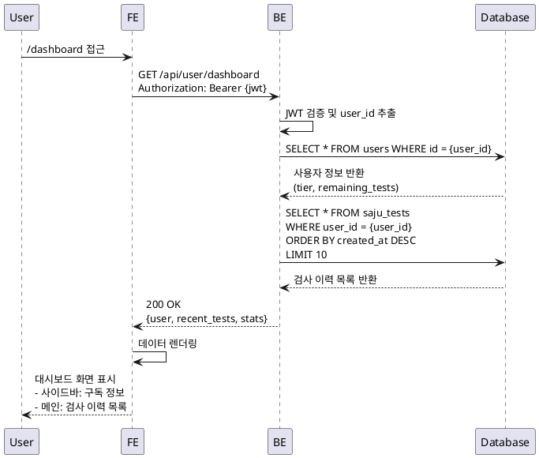
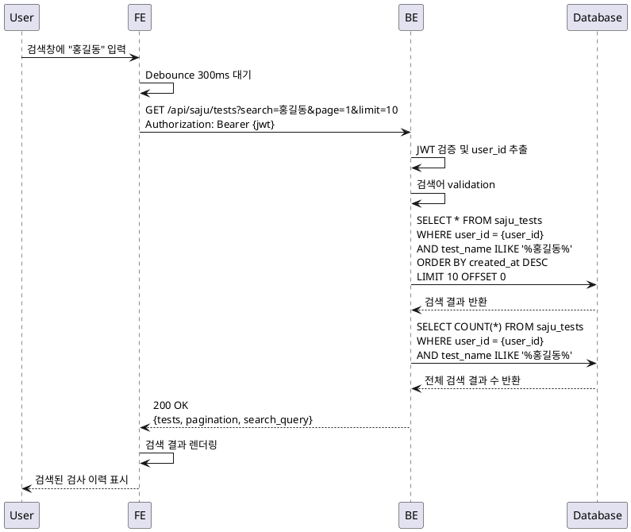
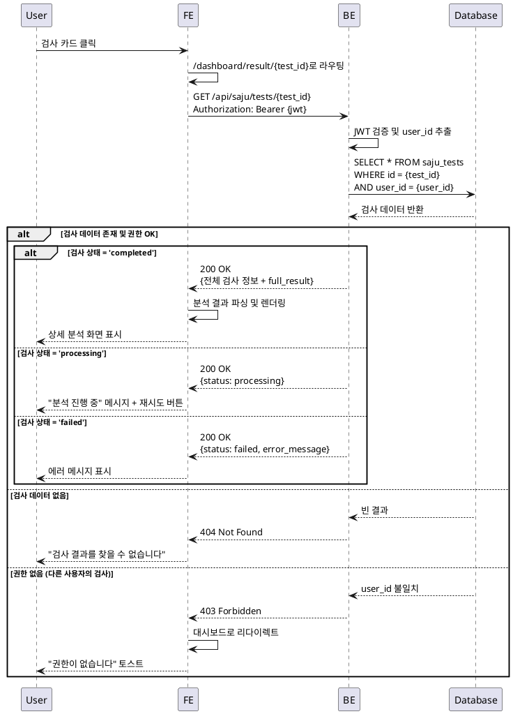

# 대시보드 기능 상세 스펙

## 개요

대시보드는 사용자가 과거 사주 검사 이력을 조회하고 관리하는 메인 페이지입니다. 검사 이력 목록 조회, 검색, 상세 재조회 기능을 제공합니다.

## 포함 기능

1. **DASH-HOME**: 대시보드 홈 - 검사 이력 목록 조회
2. **DASH-SEARCH**: 검사 이력 검색
3. **DASH-VIEW**: 검사 결과 재조회

---

## DASH-HOME: 대시보드 홈

### 기능 개요

사용자의 사주 검사 이력 목록을 시간 역순으로 표시하며, 구독 정보 및 잔여 횟수를 함께 제공합니다.

### Primary Actor

인증된 사용자

### Precondition

- 사용자가 로그인 상태여야 함
- Clerk 세션이 유효해야 함

### Trigger

사용자가 `/dashboard` 경로로 접근

### Main Scenario

1. 사용자가 대시보드 페이지에 접근
2. 시스템이 Clerk JWT 토큰 검증
3. 시스템이 사용자 구독 정보 조회 (요금제, 잔여 횟수)
4. 시스템이 사용자의 검사 이력 목록 조회 (최신순, 페이지네이션)
5. UI가 다음을 표시:
   - 사이드바: 사용자 정보, 요금제, 잔여 횟수
   - 메인 영역: 검사 이력 목록 또는 빈 상태 메시지
6. 사용자가 검사 카드를 클릭하면 상세 페이지로 이동

### Edge Cases

- **검사 이력 없음**: "검사 내역이 없습니다" 메시지와 "새 검사 시작" 버튼 표시
- **세션 만료**: 자동으로 로그인 페이지로 리다이렉트
- **네트워크 오류**: 에러 메시지 표시 및 재시도 버튼 제공
- **로딩 중**: 스켈레톤 UI 표시

### Business Rules

- 검사 이력은 최신순(created_at DESC)으로 정렬
- 페이지당 10개 항목 표시
- 사이드바 정보는 실시간으로 DB에서 조회
- 무한 스크롤 또는 페이지네이션 중 선택 가능

---

## DASH-SEARCH: 검사 이력 검색

### 기능 개요

사용자가 검사자 이름을 기준으로 과거 검사 이력을 검색할 수 있습니다.

### Primary Actor

인증된 사용자

### Precondition

- 사용자가 로그인 상태여야 함
- 대시보드 페이지에 있어야 함

### Trigger

사용자가 검색창에 검색어를 입력하고 엔터 또는 검색 버튼 클릭

### Main Scenario

1. 사용자가 검색창에 검사자 이름 입력 (예: "홍길동")
2. 시스템이 `test_name` 컬럼에서 부분 일치 검색 수행 (ILIKE)
3. 검색 결과를 시간 역순으로 정렬하여 표시
4. 검색 결과 없을 시 "검색 결과가 없습니다" 메시지 표시
5. 사용자가 검색어를 지우면 전체 이력으로 복원

### Edge Cases

- **빈 검색어**: 전체 이력 표시 (검색 무시)
- **특수문자 포함**: 이스케이프 처리하여 안전하게 검색
- **검색 중 네트워크 오류**: 이전 결과 유지 및 에러 토스트 표시
- **검색 결과 없음**: "검색 결과가 없습니다" + 검색어 표시

### Business Rules

- 검색은 `test_name` 컬럼만 대상으로 함
- 대소문자 구분 없음 (PostgreSQL ILIKE 사용)
- 검색어 최소 길이: 1자
- 검색 결과도 페이지네이션 적용
- Debounce 적용 (300ms)으로 불필요한 API 호출 방지

---

## DASH-VIEW: 검사 결과 재조회

### 기능 개요

사용자가 과거에 수행한 검사 결과를 다시 조회하여 전체 분석 내용을 확인할 수 있습니다.

### Primary Actor

인증된 사용자

### Precondition

- 사용자가 로그인 상태여야 함
- 조회하려는 검사가 사용자 본인의 것이어야 함
- 검사 상태가 'completed'여야 함

### Trigger

사용자가 대시보드에서 검사 이력 카드 클릭

### Main Scenario

1. 사용자가 검사 이력 목록에서 특정 검사 선택
2. 시스템이 `/dashboard/result/[test_id]`로 라우팅
3. 시스템이 검사 ID로 데이터 조회
4. 시스템이 사용자 권한 확인 (user_id 일치 여부)
5. 시스템이 전체 분석 결과 파싱 및 렌더링
6. UI가 다음 정보 표시:
   - 검사 대상자 정보 (이름, 생년월일, 성별, 출생시간)
   - AI 분석 전체 결과 (`full_result`)
   - 검사 수행 시각

### Edge Cases

- **존재하지 않는 검사 ID**: 404 페이지 표시
- **권한 없는 접근**: 403 에러 및 대시보드로 리다이렉트
- **미완료 검사**: "분석이 아직 완료되지 않았습니다" 메시지 + 재시도 버튼
- **실패한 검사**: 에러 메시지 표시 (`error_message` 표시)
- **URL 직접 입력**: 동일하게 권한 검증 수행

### Business Rules

- 본인의 검사만 조회 가능 (user_id 검증 필수)
- 검사 횟수 차감 없음 (재조회는 무료)
- 분석 결과는 수정 불가능 (읽기 전용)
- 브라우저 뒤로가기 시 대시보드로 복귀

---

## API 엔드포인트 정의

### 1. 대시보드 정보 조회

```
GET /api/user/dashboard
```

**인증**: Bearer Token (Clerk JWT)

**Query Parameters**: 없음

**Response (200 OK)**:
```json
{
  "user": {
    "id": "user_xxx",
    "email": "user@example.com",
    "name": "홍길동",
    "subscription_tier": "pro",
    "remaining_tests": 7
  },
  "recent_tests": [
    {
      "id": "uuid-1",
      "test_name": "김철수",
      "created_at": "2025-01-25T15:00:00Z"
    },
    {
      "id": "uuid-2",
      "test_name": "이영희",
      "created_at": "2025-01-24T10:30:00Z"
    }
  ],
  "stats": {
    "total_tests": 15,
    "this_month_tests": 3
  }
}
```

**Error Responses**:
- `401 Unauthorized`: JWT 토큰 없음 또는 유효하지 않음
- `500 Internal Server Error`: DB 조회 오류

---

### 2. 검사 이력 목록 조회 (페이지네이션)

```
GET /api/saju/tests?page=1&limit=10
```

**인증**: Bearer Token (Clerk JWT)

**Query Parameters**:
- `page` (optional): 페이지 번호, 기본값 `1`
- `limit` (optional): 페이지당 항목 수, 기본값 `10`, 최대 `50`

**Response (200 OK)**:
```json
{
  "tests": [
    {
      "id": "uuid-here",
      "test_name": "홍길동",
      "birth_date": "1990-01-01",
      "gender": "male",
      "status": "completed",
      "created_at": "2025-01-26T10:00:00Z"
    }
  ],
  "pagination": {
    "page": 1,
    "limit": 10,
    "total": 25,
    "total_pages": 3
  }
}
```

**Error Responses**:
- `401 Unauthorized`: 인증 실패
- `400 Bad Request`: 잘못된 페이지 파라미터

---

### 3. 검사 이력 검색

```
GET /api/saju/tests?search=홍길동&page=1&limit=10
```

**인증**: Bearer Token (Clerk JWT)

**Query Parameters**:
- `search` (optional): 검사자 이름 검색어
- `page` (optional): 페이지 번호
- `limit` (optional): 페이지당 항목 수

**Response (200 OK)**:
```json
{
  "tests": [
    {
      "id": "uuid-here",
      "test_name": "홍길동",
      "birth_date": "1990-01-01",
      "gender": "male",
      "status": "completed",
      "created_at": "2025-01-26T10:00:00Z"
    }
  ],
  "pagination": {
    "page": 1,
    "limit": 10,
    "total": 3,
    "total_pages": 1
  },
  "search_query": "홍길동"
}
```

**검색 로직**:
```sql
SELECT * FROM saju_tests
WHERE user_id = $1
  AND test_name ILIKE '%' || $2 || '%'
ORDER BY created_at DESC
LIMIT $3 OFFSET $4;
```

**Error Responses**:
- `401 Unauthorized`: 인증 실패

---

### 4. 검사 결과 상세 조회

```
GET /api/saju/tests/{test_id}
```

**인증**: Bearer Token (Clerk JWT)

**Path Parameters**:
- `test_id`: 검사 UUID

**Response (200 OK)** - 완료된 검사:
```json
{
  "id": "uuid-here",
  "test_name": "홍길동",
  "birth_date": "1990-01-01",
  "birth_time": "14:30:00",
  "is_birth_time_unknown": false,
  "gender": "male",
  "status": "completed",
  "ai_model": "gemini-2.5-pro",
  "summary_result": "요약 내용...",
  "full_result": "전체 분석 내용...",
  "created_at": "2025-01-26T10:00:00Z",
  "completed_at": "2025-01-26T10:01:00Z"
}
```

**Response (200 OK)** - 처리 중인 검사:
```json
{
  "id": "uuid-here",
  "test_name": "홍길동",
  "status": "processing",
  "message": "분석이 진행 중입니다. 잠시만 기다려주세요."
}
```

**Error Responses**:
- `401 Unauthorized`: 인증 실패
- `403 Forbidden`: 다른 사용자의 검사 접근 시도
- `404 Not Found`: 존재하지 않는 검사 ID

---

## 데이터베이스 스키마 영향

### 사용 테이블

#### 1. `users` 테이블
- **읽기**: 사용자 구독 정보, 잔여 횟수 조회
- **컬럼**: `id`, `email`, `name`, `subscription_tier`, `remaining_tests`

#### 2. `saju_tests` 테이블
- **읽기**: 검사 이력 목록, 검색, 상세 조회
- **컬럼**:
  - `id`, `user_id`, `test_name`, `birth_date`, `birth_time`
  - `is_birth_time_unknown`, `gender`, `status`
  - `ai_model`, `summary_result`, `full_result`
  - `created_at`, `completed_at`

### 필요한 인덱스

이미 `database.md`에 정의되어 있음:
- `idx_saju_tests_user_id`: user_id 컬럼 (사용자별 이력 조회)
- `idx_saju_tests_test_name`: test_name 컬럼 (검색 최적화)
- `idx_saju_tests_created_at`: created_at 컬럼 (시간순 정렬)

### 쿼리 예시

**대시보드 메인 조회**:
```sql
-- 사용자 정보
SELECT id, email, name, subscription_tier, remaining_tests
FROM users
WHERE id = $1;

-- 검사 이력 목록 (페이지네이션)
SELECT id, test_name, birth_date, gender, status, created_at
FROM saju_tests
WHERE user_id = $1
ORDER BY created_at DESC
LIMIT $2 OFFSET $3;

-- 전체 검사 수
SELECT COUNT(*) FROM saju_tests WHERE user_id = $1;
```

**검색 쿼리**:
```sql
SELECT id, test_name, birth_date, gender, status, created_at
FROM saju_tests
WHERE user_id = $1
  AND test_name ILIKE '%' || $2 || '%'
ORDER BY created_at DESC
LIMIT $3 OFFSET $4;
```

**상세 조회 쿼리**:
```sql
SELECT *
FROM saju_tests
WHERE id = $1 AND user_id = $2;
```

---

## UI 컴포넌트 구성

### 페이지 구조

```
/dashboard
├─ DashboardLayout (공통 레이아웃)
│  ├─ Sidebar
│  │  ├─ Logo
│  │  ├─ NavButton (홈)
│  │  ├─ NavButton (새 검사)
│  │  └─ UserInfoCard
│  │     ├─ Avatar
│  │     ├─ Email
│  │     ├─ SubscriptionBadge (free/pro)
│  │     └─ RemainingTests
│  │
│  └─ MainContent
│     ├─ Header
│     │  ├─ PageTitle
│     │  └─ SearchBar
│     │
│     └─ Content
│        ├─ TestHistoryList (이력 있을 때)
│        │  ├─ TestCard × N
│        │  └─ Pagination
│        │
│        └─ EmptyState (이력 없을 때)
│           ├─ EmptyIcon
│           ├─ Message
│           └─ NewTestButton
```

### 주요 컴포넌트 상세

#### 1. Sidebar (`src/features/dashboard/components/Sidebar.tsx`)
```typescript
export function Sidebar() {
  const { user, subscription } = useUser();

  return (
    <aside>
      <nav>
        <NavLink href="/dashboard">홈</NavLink>
        <NavLink href="/dashboard/new">새 검사</NavLink>
      </nav>

      <UserInfoCard
        user={user}
        tier={subscription.subscription_tier}
        remainingTests={subscription.remaining_tests}
        onClick={() => router.push('/dashboard/subscription')}
      />
    </aside>
  );
}
```

#### 2. SearchBar (`src/features/dashboard/components/SearchBar.tsx`)
```typescript
export function SearchBar() {
  const [query, setQuery] = useState('');
  const debouncedQuery = useDebounce(query, 300);

  return (
    <div className="search-bar">
      <Input
        placeholder="검사자 이름으로 검색..."
        value={query}
        onChange={(e) => setQuery(e.target.value)}
      />
      <SearchIcon />
    </div>
  );
}
```

#### 3. TestCard (`src/features/dashboard/components/TestCard.tsx`)
```typescript
interface TestCardProps {
  test: {
    id: string;
    test_name: string;
    birth_date: string;
    gender: string;
    status: string;
    created_at: string;
  };
}

export function TestCard({ test }: TestCardProps) {
  const router = useRouter();

  return (
    <Card
      onClick={() => router.push(`/dashboard/result/${test.id}`)}
      className="cursor-pointer hover:shadow-lg"
    >
      <CardHeader>
        <h3>{test.test_name}</h3>
        <StatusBadge status={test.status} />
      </CardHeader>
      <CardContent>
        <p>생년월일: {formatDate(test.birth_date)}</p>
        <p>성별: {test.gender === 'male' ? '남성' : '여성'}</p>
      </CardContent>
      <CardFooter>
        <time>{formatRelativeTime(test.created_at)}</time>
      </CardFooter>
    </Card>
  );
}
```

#### 4. EmptyState (`src/features/dashboard/components/EmptyState.tsx`)
```typescript
export function EmptyState() {
  return (
    <div className="empty-state">
      <SearchXIcon size={64} />
      <h2>검사 내역이 없습니다</h2>
      <p>첫 사주 분석을 시작해보세요</p>
      <Button asChild>
        <Link href="/dashboard/new">새 검사 시작</Link>
      </Button>
    </div>
  );
}
```

### 상태 관리

**React Query 훅**:
```typescript
// src/features/dashboard/hooks/useDashboard.ts
export function useDashboard(page: number, search?: string) {
  return useQuery({
    queryKey: ['saju-tests', page, search],
    queryFn: () => apiClient.get('/api/saju/tests', {
      params: { page, limit: 10, search }
    }),
    staleTime: 30_000, // 30초
  });
}

// src/features/dashboard/hooks/useTestDetail.ts
export function useTestDetail(testId: string) {
  return useQuery({
    queryKey: ['saju-test', testId],
    queryFn: () => apiClient.get(`/api/saju/tests/${testId}`),
    enabled: !!testId,
  });
}
```

---

## 에러 처리

### 에러 시나리오 및 처리

| 에러 상황 | HTTP Status | UI 처리 |
|----------|-------------|---------|
| 인증 토큰 만료 | 401 | 로그인 페이지로 리다이렉트 |
| 권한 없는 검사 접근 | 403 | 토스트 메시지 + 대시보드로 복귀 |
| 존재하지 않는 검사 | 404 | 404 페이지 표시 |
| 네트워크 오류 | 500 | 에러 토스트 + 재시도 버튼 |
| 검색 API 오류 | 500 | 이전 결과 유지 + 에러 토스트 |

### 에러 컴포넌트

```typescript
// src/features/dashboard/components/ErrorState.tsx
export function ErrorState({ error, onRetry }: ErrorStateProps) {
  if (error.status === 404) {
    return (
      <div className="error-state">
        <AlertCircleIcon size={64} />
        <h2>검사 결과를 찾을 수 없습니다</h2>
        <Button onClick={() => router.push('/dashboard')}>
          대시보드로 돌아가기
        </Button>
      </div>
    );
  }

  return (
    <div className="error-state">
      <AlertCircleIcon size={64} />
      <h2>문제가 발생했습니다</h2>
      <p>{error.message}</p>
      <Button onClick={onRetry}>다시 시도</Button>
    </div>
  );
}
```

---

## 검색 기능 구현 상세

### 프론트엔드 구현

#### Debounce 적용
```typescript
import { useDebounce } from 'react-use';

export function DashboardPage() {
  const [searchQuery, setSearchQuery] = useState('');
  const [debouncedQuery, setDebouncedQuery] = useState('');

  useDebounce(
    () => setDebouncedQuery(searchQuery),
    300,
    [searchQuery]
  );

  const { data, isLoading } = useDashboard(1, debouncedQuery);

  return (
    <div>
      <SearchBar
        value={searchQuery}
        onChange={setSearchQuery}
        isLoading={isLoading}
      />
      <TestHistoryList tests={data?.tests} />
    </div>
  );
}
```

#### URL 쿼리 파라미터 동기화
```typescript
import { useRouter } from 'next/navigation';
import { useSearchParams } from 'next/navigation';

export function DashboardPage() {
  const router = useRouter();
  const searchParams = useSearchParams();
  const searchQuery = searchParams.get('search') || '';

  const handleSearch = (query: string) => {
    const params = new URLSearchParams(searchParams);
    if (query) {
      params.set('search', query);
    } else {
      params.delete('search');
    }
    router.push(`/dashboard?${params.toString()}`);
  };

  // ...
}
```

### 백엔드 구현

#### Hono 라우터
```typescript
// src/features/dashboard/backend/route.ts
import { Hono } from 'hono';
import { z } from 'zod';
import { zValidator } from '@hono/zod-validator';

const querySchema = z.object({
  page: z.coerce.number().min(1).default(1),
  limit: z.coerce.number().min(1).max(50).default(10),
  search: z.string().optional(),
});

export const dashboardRoutes = new Hono()
  .get('/tests', zValidator('query', querySchema), async (c) => {
    const userId = c.get('userId'); // Clerk middleware
    const { page, limit, search } = c.req.valid('query');

    const result = await getTestHistory(c.get('supabase'), {
      userId,
      page,
      limit,
      search,
    });

    return c.json(result);
  });
```

#### Service 레이어
```typescript
// src/features/dashboard/backend/service.ts
export async function getTestHistory(
  supabase: SupabaseClient,
  params: {
    userId: string;
    page: number;
    limit: number;
    search?: string;
  }
) {
  const { userId, page, limit, search } = params;
  const offset = (page - 1) * limit;

  let query = supabase
    .from('saju_tests')
    .select('*', { count: 'exact' })
    .eq('user_id', userId)
    .order('created_at', { ascending: false });

  if (search) {
    query = query.ilike('test_name', `%${search}%`);
  }

  const { data, error, count } = await query
    .range(offset, offset + limit - 1);

  if (error) throw error;

  return {
    tests: data,
    pagination: {
      page,
      limit,
      total: count || 0,
      total_pages: Math.ceil((count || 0) / limit),
    },
    ...(search && { search_query: search }),
  };
}
```

### 검색 최적화

#### PostgreSQL 인덱스
```sql
-- 이미 database.md에 정의됨
CREATE INDEX idx_saju_tests_test_name ON saju_tests(test_name);
```

#### 대소문자 구분 없는 검색
```sql
-- ILIKE 연산자 사용 (PostgreSQL)
SELECT * FROM saju_tests
WHERE test_name ILIKE '%홍길동%';
```

#### SQL Injection 방지
- Parameterized Query 사용 (Supabase 자동 처리)
- 사용자 입력 직접 SQL에 삽입 금지

---

## Sequence Diagram

### DASH-HOME: 대시보드 조회



### DASH-SEARCH: 검사 이력 검색



### DASH-VIEW: 검사 결과 재조회



---

## 성능 고려사항

### 1. 페이지네이션
- 한 번에 10개씩 로딩하여 초기 로딩 시간 최소화
- 무한 스크롤 vs 페이지 버튼: 사용자 선호도에 따라 선택

### 2. 캐싱 전략
- React Query `staleTime`: 30초
- 검색 결과는 캐시하지 않음 (실시간 반영)
- 사용자 정보는 글로벌 상태로 관리 (Zustand 또는 React Query)

### 3. 인덱스 활용
- `user_id`, `test_name`, `created_at` 컬럼 인덱스 활용
- 검색 쿼리 성능 최적화

### 4. 프론트엔드 최적화
- Skeleton UI로 로딩 경험 개선
- Debounce로 불필요한 API 호출 방지
- Virtual Scroll (검사 이력이 매우 많을 경우)

---

## 보안 고려사항

### 1. 인증 및 권한
- 모든 API 요청에 Clerk JWT 필수
- 검사 결과 조회 시 `user_id` 검증 필수
- URL 직접 입력으로 다른 사용자 데이터 접근 차단

### 2. 입력 검증
- 검색어 SQL Injection 방지 (Parameterized Query)
- XSS 방지 (React 자동 이스케이프)

### 3. Rate Limiting
- 검색 API: 분당 60회
- 상세 조회 API: 분당 100회

---

## 테스트 시나리오

### 1. 단위 테스트
- `getTestHistory` 함수 테스트 (검색 포함)
- `useDebounce` 훅 테스트
- 페이지네이션 계산 로직 테스트

### 2. 통합 테스트
- API 엔드포인트 E2E 테스트
- 인증 실패 시나리오 테스트
- 권한 검증 테스트

### 3. UI 테스트
- 검색 입력 및 결과 표시 테스트
- 빈 상태 화면 렌더링 테스트
- 에러 상태 처리 테스트

---

## 배포 체크리스트

- [ ] 데이터베이스 인덱스 생성 확인
- [ ] API 엔드포인트 인증 미들웨어 적용
- [ ] 검색 쿼리 성능 테스트
- [ ] 에러 처리 및 로깅 설정
- [ ] React Query 캐싱 설정 확인
- [ ] Debounce 시간 튜닝
- [ ] 페이지네이션 한계값 설정
- [ ] Rate Limiting 설정

---

## 향후 개선 사항

1. **고급 검색**: 생년월일, 성별 등 추가 필터
2. **정렬 옵션**: 이름순, 날짜순 선택 가능
3. **즐겨찾기**: 자주 보는 검사 북마크
4. **검사 비교**: 두 검사 결과 비교 기능
5. **검사 삭제**: 사용자가 직접 이력 삭제 가능
6. **검사 공유**: 특정 검사 결과 공유 링크 생성
