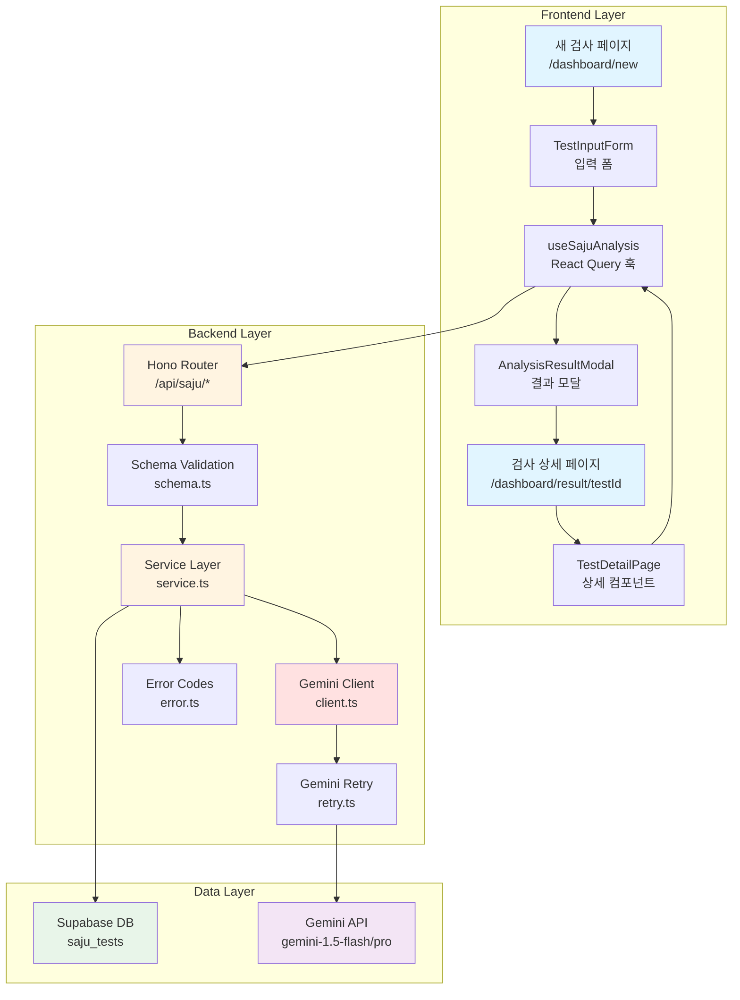

# 사주 검사 수행 기능 구현 계획서

## 개요

사주 검사 수행(TEST-INPUT, TEST-ANALYZE, TEST-MODAL, TEST-DETAIL) 기능을 구현하기 위한 모듈화 설계 문서입니다. Gemini API를 활용한 AI 사주 분석, 잔여 횟수 관리, 결과 저장 및 조회 기능을 포함합니다.

**참조 문서**:
- `docs/003/spec.md` (기능 상세 스펙)
- `docs/external/gemini.md` (Gemini API 연동 가이드)
- `docs/database.md` (DB 스키마)
- `docs/api.md` (API 설계)

---

## 구현 모듈 목록

### 1. Backend 모듈

#### 1.1 Gemini 클라이언트 레이어
- **위치**: `src/backend/gemini/client.ts`
- **설명**: Gemini API 싱글톤 클라이언트 및 모델 선택 로직
- **주요 기능**:
  - `@google/generative-ai` SDK 초기화
  - 구독 등급별 모델 선택 (`gemini-1.5-flash` / `gemini-1.5-pro`)
  - API Key 환경변수 검증

#### 1.2 Gemini 재시도 유틸
- **위치**: `src/backend/gemini/retry.ts`
- **설명**: Rate Limit 에러 처리 및 지수 백오프 재시도
- **주요 기능**:
  - `RESOURCE_EXHAUSTED` (429) 에러 감지
  - 지수 백오프(Exponential Backoff) 재시도
  - 최대 재시도 횟수 제한

#### 1.3 사주 검사 서비스
- **위치**: `src/features/saju/backend/service.ts`
- **설명**: 사주 분석 비즈니스 로직
- **주요 기능**:
  - 잔여 횟수 확인 및 차감
  - 검사 레코드 생성 및 상태 관리
  - Gemini API 호출 및 프롬프트 구성
  - AI 응답 파싱 (summary/full_result 분리)
  - 에러 시 횟수 복구
  - 검사 결과 조회 (단건, 목록, 검색)

#### 1.4 사주 검사 스키마
- **위치**: `src/features/saju/backend/schema.ts`
- **설명**: Zod 기반 요청/응답 스키마 정의
- **주요 스키마**:
  - `AnalyzeSajuRequestSchema`: 검사 요청 (이름, 생년월일, 출생시간, 성별)
  - `SajuTestResponseSchema`: 검사 결과 응답
  - `GetSajuTestListQuerySchema`: 검사 이력 목록 쿼리 (페이지네이션, 검색)

#### 1.5 사주 검사 에러 코드
- **위치**: `src/features/saju/backend/error.ts`
- **설명**: 기능별 에러 코드 정의
- **주요 에러**:
  - `NO_TESTS_REMAINING`: 잔여 횟수 부족
  - `AI_SERVICE_ERROR`: Gemini API 에러
  - `AI_TIMEOUT`: AI 분석 타임아웃
  - `VALIDATION_ERROR`: 입력 데이터 검증 실패
  - `NOT_FOUND`: 검사 결과 없음
  - `FORBIDDEN`: 권한 없음

#### 1.6 사주 검사 라우터
- **위치**: `src/features/saju/backend/route.ts`
- **설명**: Hono 기반 API 엔드포인트
- **엔드포인트**:
  - `POST /api/saju/analyze`: 새 검사 수행
  - `GET /api/saju/tests/:testId`: 검사 결과 조회 (폴링용)
  - `GET /api/saju/tests`: 검사 이력 목록 (페이지네이션, 검색)

---

### 2. Frontend 모듈

#### 2.1 사주 검사 React Query 훅
- **위치**: `src/features/saju/hooks/useSajuAnalysis.ts`
- **설명**: 서버 상태 관리 훅
- **주요 훅**:
  - `useAnalyzeSaju`: 검사 수행 Mutation
  - `useSajuTest`: 검사 결과 조회 Query (폴링)
  - `useSajuTestList`: 검사 이력 목록 Query

#### 2.2 검사 입력 폼 컴포넌트
- **위치**: `src/features/saju/components/TestInputForm.tsx`
- **설명**: 사주 정보 입력 폼 (react-hook-form + zod)
- **주요 필드**:
  - 이름 (TextInput)
  - 생년월일 (DatePicker)
  - 출생시간 (TimePicker)
  - 출생시간 모름 (Checkbox)
  - 성별 (RadioGroup)
- **검증**:
  - 클라이언트 측 실시간 검증
  - Zod 스키마 기반 유효성 검사

#### 2.3 분석 결과 모달 컴포넌트
- **위치**: `src/features/saju/components/AnalysisResultModal.tsx`
- **설명**: 분석 완료 후 요약 결과 표시 모달
- **주요 기능**:
  - 요약 결과 표시
  - 검사 메타 정보 (이름, 생년월일, 성별)
  - 상세 보기 / 닫기 버튼

#### 2.4 검사 상세 페이지 컴포넌트
- **위치**: `src/features/saju/components/TestDetailPage.tsx`
- **설명**: 전체 분석 결과 표시 페이지
- **주요 섹션**:
  - 검사 메타 정보
  - 사주팔자, 오행 분석
  - 성격, 재물운, 직업운, 건강, 인간관계
  - 향후 1년 운세

#### 2.5 새 검사 페이지
- **위치**: `src/app/(dashboard)/dashboard/new/page.tsx`
- **설명**: 새 검사 수행 페이지
- **주요 기능**:
  - 잔여 횟수 표시
  - 검사 입력 폼 렌더링
  - 분석 진행 중 로딩 상태
  - 분석 완료 시 모달 표시

#### 2.6 검사 상세 조회 페이지
- **위치**: `src/app/(dashboard)/dashboard/result/[testId]/page.tsx`
- **설명**: 검사 결과 상세 조회 페이지
- **주요 기능**:
  - URL 파라미터로 testId 추출
  - 권한 확인 및 에러 처리
  - 처리 중 상태일 경우 폴링

---

### 3. 공통 모듈

#### 3.1 DTO 재노출
- **위치**: `src/features/saju/lib/dto.ts`
- **설명**: 백엔드 스키마를 프론트엔드에서 재사용
- **재노출 타입**:
  - `AnalyzeSajuRequest`
  - `SajuTestResponse`
  - `GetSajuTestListQuery`

#### 3.2 사주 분석 유틸리티
- **위치**: `src/features/saju/lib/utils.ts`
- **설명**: 사주 관련 유틸 함수
- **주요 함수**:
  - `formatBirthDate`: 날짜 포맷팅 (YYYY-MM-DD)
  - `formatBirthTime`: 시간 포맷팅 (HH:MM:SS)
  - `parseAIResult`: AI 응답 파싱 (summary/full 분리)
  - `getGenderLabel`: 성별 한글 변환

---

### 4. Database Migration

#### 4.1 saju_tests 테이블 생성
- **위치**: `supabase/migrations/20250126000001_create_saju_tests_table.sql`
- **설명**: 사주 검사 결과 테이블
- **컬럼**:
  - `id` (UUID, PK)
  - `user_id` (TEXT, FK → users.id)
  - `test_name` (TEXT): 검사 대상자 이름
  - `birth_date` (DATE): 생년월일
  - `birth_time` (TIME, nullable): 출생시간
  - `is_birth_time_unknown` (BOOLEAN): 출생시간 모름 여부
  - `gender` (TEXT): 성별 ('male' | 'female')
  - `model_used` (TEXT): 사용된 AI 모델
  - `status` (TEXT): 검사 상태 ('processing' | 'completed' | 'failed')
  - `summary_result` (TEXT, nullable): 요약 결과
  - `full_result` (TEXT, nullable): 전체 분석 결과
  - `error_message` (TEXT, nullable): 에러 메시지
  - `created_at` (TIMESTAMPTZ)
  - `completed_at` (TIMESTAMPTZ, nullable)
  - `updated_at` (TIMESTAMPTZ)
- **인덱스**:
  - `idx_saju_tests_user_id` (user_id)
  - `idx_saju_tests_status` (status)
  - `idx_saju_tests_created_at` (created_at DESC)
  - `idx_saju_tests_test_name` (test_name, 검색용)

---

## Diagram



---

## Implementation Plan

### Phase 1: Backend - Gemini 클라이언트 레이어

**목표**: Gemini API 연동 기반 구축

#### 파일: `src/backend/gemini/client.ts`
```typescript
import { GoogleGenerativeAI } from '@google/generative-ai'

const GEMINI_API_KEY = process.env.GEMINI_API_KEY!

if (!GEMINI_API_KEY) {
  throw new Error('GEMINI_API_KEY is not defined in environment variables')
}

let genAI: GoogleGenerativeAI | null = null

export function getGeminiClient(): GoogleGenerativeAI {
  if (!genAI) {
    genAI = new GoogleGenerativeAI(GEMINI_API_KEY)
  }
  return genAI
}

export function getModelByTier(tier: 'free' | 'pro'): string {
  return tier === 'pro' ? 'gemini-1.5-pro' : 'gemini-1.5-flash'
}
```

#### 파일: `src/backend/gemini/retry.ts`
```typescript
export async function retryWithBackoff<T>(
  fn: () => Promise<T>,
  maxRetries = 3,
  initialDelayMs = 1000
): Promise<T> {
  let lastError: any

  for (let attempt = 0; attempt < maxRetries; attempt++) {
    try {
      return await fn()
    } catch (error: any) {
      lastError = error

      if (error.status === 429 && attempt < maxRetries - 1) {
        const delay = initialDelayMs * Math.pow(2, attempt)
        await new Promise((resolve) => setTimeout(resolve, delay))
        continue
      }

      throw error
    }
  }

  throw lastError
}
```

#### Unit Test: `src/backend/gemini/__tests__/client.test.ts`
- ✅ `getGeminiClient`가 싱글톤 인스턴스 반환
- ✅ `getModelByTier('free')`가 `gemini-1.5-flash` 반환
- ✅ `getModelByTier('pro')`가 `gemini-1.5-pro` 반환
- ✅ `GEMINI_API_KEY` 없을 때 에러 발생

#### Unit Test: `src/backend/gemini/__tests__/retry.test.ts`
- ✅ Rate Limit 에러 시 재시도
- ✅ 최대 재시도 횟수 초과 시 에러 throw
- ✅ 지수 백오프 딜레이 검증

---

### Phase 2: Backend - 사주 검사 스키마 및 에러 코드

**목표**: API 요청/응답 타입 정의 및 에러 처리

#### 파일: `src/features/saju/backend/schema.ts`
```typescript
import { z } from 'zod'

export const AnalyzeSajuRequestSchema = z.object({
  test_name: z.string().min(2, '이름은 2자 이상이어야 합니다').max(50),
  birth_date: z.string().regex(/^\d{4}-\d{2}-\d{2}$/, '올바른 날짜 형식이 아닙니다'),
  birth_time: z.string().regex(/^\d{2}:\d{2}:\d{2}$/).optional(),
  is_birth_time_unknown: z.boolean().default(false),
  gender: z.enum(['male', 'female'], { message: '성별을 선택해주세요' }),
})

export type AnalyzeSajuRequest = z.infer<typeof AnalyzeSajuRequestSchema>

export const SajuTestResponseSchema = z.object({
  id: z.string().uuid(),
  test_name: z.string(),
  birth_date: z.string(),
  birth_time: z.string().nullable(),
  is_birth_time_unknown: z.boolean(),
  gender: z.enum(['male', 'female']),
  status: z.enum(['processing', 'completed', 'failed']),
  model_used: z.string(),
  summary_result: z.string().nullable(),
  full_result: z.string().nullable(),
  error_message: z.string().nullable(),
  created_at: z.string(),
  completed_at: z.string().nullable(),
})

export type SajuTestResponse = z.infer<typeof SajuTestResponseSchema>

export const GetSajuTestListQuerySchema = z.object({
  page: z.coerce.number().int().min(1).default(1),
  limit: z.coerce.number().int().min(1).max(50).default(10),
  search: z.string().optional(),
})

export type GetSajuTestListQuery = z.infer<typeof GetSajuTestListQuerySchema>
```

#### 파일: `src/features/saju/backend/error.ts`
```typescript
export const sajuErrorCodes = {
  noTestsRemaining: 'NO_TESTS_REMAINING',
  aiServiceError: 'AI_SERVICE_ERROR',
  aiTimeout: 'AI_TIMEOUT',
  validationError: 'VALIDATION_ERROR',
  notFound: 'NOT_FOUND',
  forbidden: 'FORBIDDEN',
  fetchError: 'FETCH_ERROR',
} as const

export type SajuServiceError = typeof sajuErrorCodes[keyof typeof sajuErrorCodes]
```

#### Unit Test: `src/features/saju/backend/__tests__/schema.test.ts`
- ✅ `AnalyzeSajuRequestSchema` 유효한 입력 파싱 성공
- ✅ 이름 2자 미만 시 검증 실패
- ✅ 잘못된 날짜 형식 검증 실패
- ✅ 성별 enum 외 값 검증 실패

---

### Phase 3: Backend - 사주 검사 서비스

**목표**: 핵심 비즈니스 로직 구현

#### 파일: `src/features/saju/backend/service.ts`
```typescript
import type { SupabaseClient } from '@supabase/supabase-js'
import { getGeminiClient, getModelByTier } from '@/backend/gemini/client'
import { retryWithBackoff } from '@/backend/gemini/retry'
import { success, failure, type HandlerResult } from '@/backend/http/response'
import { sajuErrorCodes, type SajuServiceError } from './error'
import type { AnalyzeSajuRequest, SajuTestResponse } from './schema'

const SAJU_TESTS_TABLE = 'saju_tests'
const AI_TIMEOUT_MS = 30000

function buildSajuPrompt(data: AnalyzeSajuRequest): string {
  const genderText = data.gender === 'male' ? '남성' : '여성'
  const birthTimeText = data.is_birth_time_unknown
    ? '출생시간을 알 수 없음'
    : data.birth_time
    ? `출생시간: ${data.birth_time}`
    : '출생시간 정보 없음'

  return `
당신은 전문 사주 명리학자입니다. 다음 정보를 바탕으로 상세한 사주 분석을 해주세요.

[개인 정보]
- 이름: ${data.test_name}
- 생년월일: ${data.birth_date}
- ${birthTimeText}
- 성별: ${genderText}

[요청 사항]
1. 사주팔자 구성
2. 오행 분석
3. 성격 및 기질
4. 건강 운세
5. 재물 운세
6. 애정 및 대인 관계
7. 직업 및 진로
8. 주의사항

[응답 형식]
다음 JSON 형식으로 응답해주세요:
{
  "summary": "200자 이내의 핵심 요약",
  "full_analysis": "상세 분석 내용 (마크다운 형식)"
}
  `.trim()
}

export async function analyzeSaju(
  supabase: SupabaseClient,
  userId: string,
  data: AnalyzeSajuRequest
): Promise<HandlerResult<{ testId: string; summary: string }, SajuServiceError, unknown>> {
  // 1. 사용자 구독 정보 조회
  const { data: user, error: userError } = await supabase
    .from('users')
    .select('subscription_tier, remaining_tests')
    .eq('id', userId)
    .single()

  if (userError || !user) {
    return failure(500, sajuErrorCodes.fetchError, '사용자 정보를 찾을 수 없습니다')
  }

  // 2. 잔여 횟수 확인
  if (user.remaining_tests <= 0) {
    return failure(403, sajuErrorCodes.noTestsRemaining, '잔여 검사 횟수가 없습니다')
  }

  // 3. 모델 선택
  const modelName = getModelByTier(user.subscription_tier as 'free' | 'pro')

  // 4. 검사 레코드 생성
  const { data: testRecord, error: insertError } = await supabase
    .from(SAJU_TESTS_TABLE)
    .insert({
      user_id: userId,
      test_name: data.test_name,
      birth_date: data.birth_date,
      birth_time: data.birth_time || null,
      is_birth_time_unknown: data.is_birth_time_unknown,
      gender: data.gender,
      model_used: modelName,
      status: 'processing',
    })
    .select()
    .single()

  if (insertError || !testRecord) {
    return failure(500, sajuErrorCodes.fetchError, '검사 레코드 생성 실패')
  }

  // 5. 횟수 즉시 차감
  await supabase
    .from('users')
    .update({ remaining_tests: user.remaining_tests - 1 })
    .eq('id', userId)

  try {
    // 6. Gemini API 호출 (타임아웃 + 재시도)
    const genAI = getGeminiClient()
    const model = genAI.getGenerativeModel({ model: modelName })
    const prompt = buildSajuPrompt(data)

    const controller = new AbortController()
    const timeoutId = setTimeout(() => controller.abort(), AI_TIMEOUT_MS)

    const result = await retryWithBackoff(
      () => model.generateContent({
        contents: [{ role: 'user', parts: [{ text: prompt }] }],
      }),
      3,
      1000
    )

    clearTimeout(timeoutId)

    const text = result.response.text()

    // 7. JSON 파싱
    let summary = ''
    let fullResult = text

    try {
      const jsonMatch = text.match(/\{[\s\S]*\}/)
      if (jsonMatch) {
        const parsed = JSON.parse(jsonMatch[0])
        summary = parsed.summary || ''
        fullResult = parsed.full_analysis || text
      }
    } catch {
      summary = text.substring(0, 200)
      fullResult = text
    }

    // 8. 결과 저장
    await supabase
      .from(SAJU_TESTS_TABLE)
      .update({
        status: 'completed',
        summary_result: summary,
        full_result: fullResult,
        completed_at: new Date().toISOString(),
      })
      .eq('id', testRecord.id)

    return success({ testId: testRecord.id, summary })

  } catch (error: any) {
    // 9. 에러 처리
    const isTimeout = error.name === 'AbortError'
    const errorMessage = isTimeout
      ? 'AI 분석 시간이 초과되었습니다'
      : error.message || '알 수 없는 오류가 발생했습니다'

    await supabase
      .from(SAJU_TESTS_TABLE)
      .update({
        status: 'failed',
        error_message: errorMessage,
      })
      .eq('id', testRecord.id)

    // 횟수 복구
    await supabase
      .from('users')
      .update({ remaining_tests: user.remaining_tests })
      .eq('id', userId)

    return failure(
      isTimeout ? 504 : 500,
      isTimeout ? sajuErrorCodes.aiTimeout : sajuErrorCodes.aiServiceError,
      errorMessage,
      { testId: testRecord.id }
    )
  }
}

export async function getSajuTest(
  supabase: SupabaseClient,
  userId: string,
  testId: string
): Promise<HandlerResult<SajuTestResponse, SajuServiceError, unknown>> {
  const { data, error } = await supabase
    .from(SAJU_TESTS_TABLE)
    .select('*')
    .eq('id', testId)
    .eq('user_id', userId)
    .single()

  if (error || !data) {
    return failure(404, sajuErrorCodes.notFound, '검사 결과를 찾을 수 없습니다')
  }

  return success(data as SajuTestResponse)
}

export async function getSajuTestList(
  supabase: SupabaseClient,
  userId: string,
  options: { page: number; limit: number; search?: string }
): Promise<HandlerResult<{ tests: SajuTestResponse[]; pagination: any }, SajuServiceError, unknown>> {
  const { page, limit, search } = options
  const offset = (page - 1) * limit

  let query = supabase
    .from(SAJU_TESTS_TABLE)
    .select('*', { count: 'exact' })
    .eq('user_id', userId)
    .order('created_at', { ascending: false })

  if (search) {
    query = query.ilike('test_name', `%${search}%`)
  }

  const { data, error, count } = await query.range(offset, offset + limit - 1)

  if (error) {
    return failure(500, sajuErrorCodes.fetchError, '검사 이력 조회 실패')
  }

  return success({
    tests: data as SajuTestResponse[],
    pagination: {
      page,
      limit,
      total: count || 0,
      totalPages: Math.ceil((count || 0) / limit),
    },
  })
}
```

#### Unit Test: `src/features/saju/backend/__tests__/service.test.ts`
- ✅ `analyzeSaju`: 정상 플로우 (횟수 차감 → AI 호출 → 결과 저장)
- ✅ `analyzeSaju`: 횟수 부족 시 403 에러
- ✅ `analyzeSaju`: AI 에러 시 횟수 복구
- ✅ `analyzeSaju`: AI 타임아웃 시 504 에러
- ✅ `getSajuTest`: 정상 조회
- ✅ `getSajuTest`: 권한 없음 404 에러
- ✅ `getSajuTestList`: 페이지네이션 및 검색 정상 작동

---

### Phase 4: Backend - Hono 라우터

**목표**: API 엔드포인트 노출

#### 파일: `src/features/saju/backend/route.ts`
```typescript
import type { Hono } from 'hono'
import { zValidator } from '@hono/zod-validator'
import { respond, failure } from '@/backend/http/response'
import { getSupabase, type AppEnv } from '@/backend/hono/context'
import { analyzeSaju, getSajuTest, getSajuTestList } from './service'
import { AnalyzeSajuRequestSchema, GetSajuTestListQuerySchema } from './schema'

export const registerSajuRoutes = (app: Hono<AppEnv>) => {
  // 새 검사 수행
  app.post('/saju/analyze', zValidator('json', AnalyzeSajuRequestSchema), async (c) => {
    const userId = c.get('userId') // Clerk 미들웨어에서 주입 (추후 구현)
    const supabase = getSupabase(c)
    const data = c.req.valid('json')

    const result = await analyzeSaju(supabase, userId, data)
    return respond(c, result)
  })

  // 검사 결과 조회
  app.get('/saju/tests/:testId', async (c) => {
    const userId = c.get('userId')
    const supabase = getSupabase(c)
    const testId = c.req.param('testId')

    const result = await getSajuTest(supabase, userId, testId)
    return respond(c, result)
  })

  // 검사 이력 목록
  app.get('/saju/tests', zValidator('query', GetSajuTestListQuerySchema), async (c) => {
    const userId = c.get('userId')
    const supabase = getSupabase(c)
    const query = c.req.valid('query')

    const result = await getSajuTestList(supabase, userId, query)
    return respond(c, result)
  })
}
```

#### Hono App 등록: `src/backend/hono/app.ts`
```typescript
import { registerSajuRoutes } from '@/features/saju/backend/route'

export function createHonoApp() {
  // ... existing code ...

  registerSajuRoutes(app)

  // ... existing code ...
}
```

---

### Phase 5: Frontend - React Query 훅

**목표**: 서버 상태 관리 훅 구현

#### 파일: `src/features/saju/hooks/useSajuAnalysis.ts`
```typescript
'use client'

import { useMutation, useQuery, useQueryClient } from '@tanstack/react-query'
import { apiClient } from '@/lib/remote/api-client'
import type { AnalyzeSajuRequest, SajuTestResponse } from '../lib/dto'

export function useAnalyzeSaju() {
  const queryClient = useQueryClient()

  return useMutation({
    mutationFn: async (data: AnalyzeSajuRequest) => {
      const response = await apiClient.post('/saju/analyze', data)
      return response.data
    },
    onSuccess: () => {
      queryClient.invalidateQueries({ queryKey: ['saju-tests'] })
    },
  })
}

export function useSajuTest(testId: string, options?: { refetchInterval?: number }) {
  return useQuery({
    queryKey: ['saju-test', testId],
    queryFn: async () => {
      const response = await apiClient.get(`/saju/tests/${testId}`)
      return response.data as SajuTestResponse
    },
    enabled: !!testId,
    refetchInterval: options?.refetchInterval,
  })
}

export function useSajuTestList(page = 1, search = '') {
  return useQuery({
    queryKey: ['saju-tests', page, search],
    queryFn: async () => {
      const response = await apiClient.get('/saju/tests', {
        params: { page, search },
      })
      return response.data
    },
  })
}
```

#### 파일: `src/features/saju/lib/dto.ts`
```typescript
export type {
  AnalyzeSajuRequest,
  SajuTestResponse,
  GetSajuTestListQuery,
} from '../backend/schema'
```

---

### Phase 6: Frontend - 검사 입력 폼

**목표**: 사주 정보 입력 UI 구현

#### 파일: `src/features/saju/components/TestInputForm.tsx`
```typescript
'use client'

import { useForm } from 'react-hook-form'
import { zodResolver } from '@hookform/resolvers/zod'
import { z } from 'zod'
import { Button } from '@/components/ui/button'
import { Input } from '@/components/ui/input'
import { Checkbox } from '@/components/ui/checkbox'
import { RadioGroup } from '@/components/ui/radio-group'
import type { AnalyzeSajuRequest } from '../lib/dto'

const formSchema = z.object({
  test_name: z.string().min(2, '이름은 2자 이상이어야 합니다').max(50),
  birth_date: z.string().regex(/^\d{4}-\d{2}-\d{2}$/),
  birth_time: z.string().optional(),
  is_birth_time_unknown: z.boolean().default(false),
  gender: z.enum(['male', 'female']),
})

interface TestInputFormProps {
  onSubmit: (data: AnalyzeSajuRequest) => void
  isLoading?: boolean
  remainingTests: number
}

export function TestInputForm({ onSubmit, isLoading, remainingTests }: TestInputFormProps) {
  const form = useForm<AnalyzeSajuRequest>({
    resolver: zodResolver(formSchema),
    defaultValues: {
      test_name: '',
      birth_date: '',
      birth_time: '',
      is_birth_time_unknown: false,
      gender: 'male',
    },
  })

  const isBirthTimeUnknown = form.watch('is_birth_time_unknown')

  return (
    <form onSubmit={form.handleSubmit(onSubmit)} className="space-y-6">
      <div className="mb-4">
        <p className="text-sm text-muted-foreground">
          잔여 검사 횟수: <span className="font-bold">{remainingTests}회</span>
        </p>
      </div>

      <div>
        <label className="block mb-2 font-medium">검사 대상자 이름</label>
        <Input {...form.register('test_name')} placeholder="홍길동" />
        {form.formState.errors.test_name && (
          <p className="text-sm text-destructive mt-1">{form.formState.errors.test_name.message}</p>
        )}
      </div>

      <div>
        <label className="block mb-2 font-medium">생년월일</label>
        <Input type="date" {...form.register('birth_date')} />
        {form.formState.errors.birth_date && (
          <p className="text-sm text-destructive mt-1">{form.formState.errors.birth_date.message}</p>
        )}
      </div>

      <div>
        <label className="block mb-2 font-medium">출생시간</label>
        <Input
          type="time"
          step="1"
          {...form.register('birth_time')}
          disabled={isBirthTimeUnknown}
        />
        <div className="flex items-center mt-2">
          <Checkbox
            id="birth_time_unknown"
            checked={isBirthTimeUnknown}
            onCheckedChange={(checked) => form.setValue('is_birth_time_unknown', !!checked)}
          />
          <label htmlFor="birth_time_unknown" className="ml-2 text-sm">
            정확한 출생시간을 모릅니다
          </label>
        </div>
      </div>

      <div>
        <label className="block mb-2 font-medium">성별</label>
        <RadioGroup
          value={form.watch('gender')}
          onValueChange={(value) => form.setValue('gender', value as 'male' | 'female')}
          className="flex gap-4"
        >
          <div className="flex items-center">
            <input type="radio" value="male" id="male" />
            <label htmlFor="male" className="ml-2">남성</label>
          </div>
          <div className="flex items-center">
            <input type="radio" value="female" id="female" />
            <label htmlFor="female" className="ml-2">여성</label>
          </div>
        </RadioGroup>
      </div>

      <Button
        type="submit"
        disabled={isLoading || remainingTests === 0}
        className="w-full"
      >
        {isLoading ? '분석 중...' : '검사 시작'}
      </Button>

      {remainingTests === 0 && (
        <p className="text-sm text-destructive text-center">
          잔여 횟수가 없습니다. 구독을 업그레이드해주세요.
        </p>
      )}
    </form>
  )
}
```

#### QA Sheet: `src/features/saju/components/__tests__/TestInputForm.qa.md`
- ✅ 이름 입력란에 2자 미만 입력 시 에러 메시지 표시
- ✅ 생년월일 필드가 캘린더 UI로 표시됨
- ✅ 출생시간 모름 체크 시 출생시간 입력 비활성화
- ✅ 성별 라디오 버튼 선택 가능
- ✅ 잔여 횟수 0회일 때 제출 버튼 비활성화
- ✅ 제출 중 로딩 상태 표시

---

### Phase 7: Frontend - 분석 결과 모달

**목표**: 분석 완료 후 요약 결과 표시

#### 파일: `src/features/saju/components/AnalysisResultModal.tsx`
```typescript
'use client'

import { Dialog, DialogContent, DialogHeader, DialogTitle, DialogFooter } from '@/components/ui/dialog'
import { Button } from '@/components/ui/button'

interface AnalysisResultModalProps {
  open: boolean
  onClose: () => void
  onViewDetail: () => void
  testName: string
  birthDate: string
  gender: 'male' | 'female'
  summary: string
}

export function AnalysisResultModal({
  open,
  onClose,
  onViewDetail,
  testName,
  birthDate,
  gender,
  summary,
}: AnalysisResultModalProps) {
  return (
    <Dialog open={open} onOpenChange={onClose}>
      <DialogContent className="max-w-2xl">
        <DialogHeader>
          <DialogTitle>분석 완료</DialogTitle>
        </DialogHeader>

        <div className="space-y-4">
          <div className="grid grid-cols-2 gap-4 text-sm">
            <div>
              <p className="text-muted-foreground">검사 대상자</p>
              <p className="font-medium">{testName}</p>
            </div>
            <div>
              <p className="text-muted-foreground">생년월일</p>
              <p className="font-medium">{birthDate}</p>
            </div>
            <div>
              <p className="text-muted-foreground">성별</p>
              <p className="font-medium">{gender === 'male' ? '남성' : '여성'}</p>
            </div>
          </div>

          <div className="border-t pt-4">
            <h3 className="font-semibold mb-2">요약</h3>
            <p className="text-sm text-muted-foreground whitespace-pre-wrap">{summary}</p>
          </div>
        </div>

        <DialogFooter>
          <Button variant="outline" onClick={onClose}>
            닫기
          </Button>
          <Button onClick={onViewDetail}>
            상세 보기
          </Button>
        </DialogFooter>
      </DialogContent>
    </Dialog>
  )
}
```

#### QA Sheet: `src/features/saju/components/__tests__/AnalysisResultModal.qa.md`
- ✅ 모달이 open=true일 때 표시됨
- ✅ 검사 정보(이름, 생년월일, 성별) 정상 표시
- ✅ 요약 내용이 줄바꿈 포함하여 표시
- ✅ "닫기" 버튼 클릭 시 onClose 호출
- ✅ "상세 보기" 버튼 클릭 시 onViewDetail 호출

---

### Phase 8: Frontend - 검사 상세 페이지

**목표**: 전체 분석 결과 조회 UI 구현

#### 파일: `src/features/saju/components/TestDetailPage.tsx`
```typescript
'use client'

import { ArrowLeft } from 'lucide-react'
import { Button } from '@/components/ui/button'
import type { SajuTestResponse } from '../lib/dto'

interface TestDetailPageProps {
  test: SajuTestResponse
  onBack: () => void
}

export function TestDetailPage({ test, onBack }: TestDetailPageProps) {
  return (
    <div className="container mx-auto p-6 max-w-4xl">
      <div className="mb-6">
        <Button variant="ghost" onClick={onBack}>
          <ArrowLeft className="mr-2 h-4 w-4" />
          목록으로
        </Button>
      </div>

      <div className="space-y-6">
        <div className="border-b pb-4">
          <h1 className="text-2xl font-bold mb-4">검사 상세 결과</h1>
          <div className="grid grid-cols-2 gap-4 text-sm">
            <div>
              <p className="text-muted-foreground">검사 대상자</p>
              <p className="font-medium">{test.test_name}</p>
            </div>
            <div>
              <p className="text-muted-foreground">생년월일</p>
              <p className="font-medium">{test.birth_date}</p>
            </div>
            <div>
              <p className="text-muted-foreground">출생시간</p>
              <p className="font-medium">
                {test.is_birth_time_unknown ? '정보 없음' : test.birth_time || '정보 없음'}
              </p>
            </div>
            <div>
              <p className="text-muted-foreground">성별</p>
              <p className="font-medium">{test.gender === 'male' ? '남성' : '여성'}</p>
            </div>
            <div>
              <p className="text-muted-foreground">검사 일시</p>
              <p className="font-medium">{new Date(test.created_at).toLocaleString('ko-KR')}</p>
            </div>
          </div>
        </div>

        <div className="prose max-w-none">
          <div className="whitespace-pre-wrap">
            {test.full_result || '분석 결과를 불러올 수 없습니다.'}
          </div>
        </div>
      </div>
    </div>
  )
}
```

#### QA Sheet: `src/features/saju/components/__tests__/TestDetailPage.qa.md`
- ✅ 검사 메타 정보 모두 표시
- ✅ 출생시간 모름일 경우 "정보 없음" 표시
- ✅ 전체 분석 결과가 마크다운 형식으로 렌더링
- ✅ "목록으로" 버튼 클릭 시 onBack 호출

---

### Phase 9: Frontend - 페이지 구현

**목표**: 라우팅 페이지 구현

#### 파일: `src/app/(dashboard)/dashboard/new/page.tsx`
```typescript
'use client'

import { useState } from 'react'
import { useRouter } from 'next/navigation'
import { TestInputForm } from '@/features/saju/components/TestInputForm'
import { AnalysisResultModal } from '@/features/saju/components/AnalysisResultModal'
import { useAnalyzeSaju } from '@/features/saju/hooks/useSajuAnalysis'
import type { AnalyzeSajuRequest } from '@/features/saju/lib/dto'

export default function NewTestPage() {
  const router = useRouter()
  const analyzeSaju = useAnalyzeSaju()
  const [modalData, setModalData] = useState<any>(null)

  const handleSubmit = async (data: AnalyzeSajuRequest) => {
    try {
      const result = await analyzeSaju.mutateAsync(data)
      setModalData({
        testId: result.testId,
        testName: data.test_name,
        birthDate: data.birth_date,
        gender: data.gender,
        summary: result.summary,
      })
    } catch (error: any) {
      alert(error.response?.data?.error?.message || '검사 실패')
    }
  }

  return (
    <div className="container mx-auto p-6 max-w-2xl">
      <h1 className="text-2xl font-bold mb-6">새 사주 검사</h1>
      <TestInputForm
        onSubmit={handleSubmit}
        isLoading={analyzeSaju.isPending}
        remainingTests={7} // TODO: 실제 사용자 정보에서 조회
      />

      {modalData && (
        <AnalysisResultModal
          open={!!modalData}
          onClose={() => setModalData(null)}
          onViewDetail={() => router.push(`/dashboard/result/${modalData.testId}`)}
          {...modalData}
        />
      )}
    </div>
  )
}
```

#### 파일: `src/app/(dashboard)/dashboard/result/[testId]/page.tsx`
```typescript
'use client'

import { use } from 'react'
import { useRouter } from 'next/navigation'
import { TestDetailPage } from '@/features/saju/components/TestDetailPage'
import { useSajuTest } from '@/features/saju/hooks/useSajuAnalysis'

interface PageProps {
  params: Promise<{ testId: string }>
}

export default function TestDetailPageRoute({ params }: PageProps) {
  const router = useRouter()
  const { testId } = use(params)
  const { data: test, isLoading, error } = useSajuTest(testId, {
    refetchInterval: (query) => {
      return query.state.data?.status === 'processing' ? 5000 : false
    },
  })

  if (isLoading) {
    return <div className="container mx-auto p-6">로딩 중...</div>
  }

  if (error || !test) {
    return (
      <div className="container mx-auto p-6">
        <p className="text-destructive">검사 결과를 찾을 수 없습니다.</p>
      </div>
    )
  }

  if (test.status === 'processing') {
    return <div className="container mx-auto p-6">분석 진행 중입니다...</div>
  }

  if (test.status === 'failed') {
    return (
      <div className="container mx-auto p-6">
        <p className="text-destructive">분석 중 오류가 발생했습니다.</p>
      </div>
    )
  }

  return <TestDetailPage test={test} onBack={() => router.push('/dashboard')} />
}
```

---

### Phase 10: Database Migration

**목표**: saju_tests 테이블 생성

#### 파일: `supabase/migrations/20250126000001_create_saju_tests_table.sql`
```sql
-- Saju Tests 테이블 생성
CREATE TABLE IF NOT EXISTS public.saju_tests (
  id UUID PRIMARY KEY DEFAULT gen_random_uuid(),
  user_id TEXT NOT NULL REFERENCES public.users(id) ON DELETE CASCADE,
  test_name TEXT NOT NULL,
  birth_date DATE NOT NULL,
  birth_time TIME,
  is_birth_time_unknown BOOLEAN DEFAULT FALSE,
  gender TEXT NOT NULL CHECK (gender IN ('male', 'female')),
  model_used TEXT NOT NULL,
  status TEXT DEFAULT 'processing' CHECK (status IN ('processing', 'completed', 'failed')),
  summary_result TEXT,
  full_result TEXT,
  error_message TEXT,
  created_at TIMESTAMP WITH TIME ZONE DEFAULT NOW(),
  completed_at TIMESTAMP WITH TIME ZONE,
  updated_at TIMESTAMP WITH TIME ZONE DEFAULT NOW()
);

-- 인덱스 생성
CREATE INDEX IF NOT EXISTS idx_saju_tests_user_id ON public.saju_tests(user_id);
CREATE INDEX IF NOT EXISTS idx_saju_tests_status ON public.saju_tests(status);
CREATE INDEX IF NOT EXISTS idx_saju_tests_created_at ON public.saju_tests(created_at DESC);
CREATE INDEX IF NOT EXISTS idx_saju_tests_test_name ON public.saju_tests(test_name);

-- RLS 비활성화 (요구사항)
ALTER TABLE public.saju_tests DISABLE ROW LEVEL SECURITY;

-- updated_at 자동 업데이트 트리거
CREATE TRIGGER update_saju_tests_updated_at
BEFORE UPDATE ON public.saju_tests
FOR EACH ROW
EXECUTE FUNCTION update_updated_at_column();
```

---

## 환경 설정

### 1. 환경변수 추가 (`.env.local`)
```env
GEMINI_API_KEY=AIzaSy...your-api-key-here
```

### 2. 패키지 설치
```bash
npm install @google/generative-ai
```

### 3. Shadcn UI 컴포넌트 설치
```bash
npx shadcn@latest add dialog
npx shadcn@latest add checkbox
npx shadcn@latest add radio-group
```

---

## 테스트 전략

### Backend Unit Tests
- Gemini 클라이언트 싱글톤 테스트
- 재시도 로직 테스트
- 스키마 검증 테스트
- 서비스 로직 테스트 (모킹 사용)

### Frontend QA Sheets
- 각 컴포넌트별 QA 시트 작성
- 사용자 시나리오 기반 테스트

### Integration Tests (선택사항)
- E2E 테스트: 검사 수행 → 모달 → 상세 조회 플로우

---

## 배포 체크리스트

- [ ] `GEMINI_API_KEY` 환경변수 설정 (Vercel)
- [ ] Supabase 마이그레이션 실행
- [ ] Hono 앱에 라우터 등록 확인
- [ ] API 엔드포인트 정상 작동 확인
- [ ] Gemini API 무료 플랜 Quota 확인
- [ ] 에러 처리 로직 검증
- [ ] 프론트엔드 빌드 에러 없음

---

## 향후 개선사항

1. **백그라운드 작업 큐**: AI 타임아웃 시 백그라운드에서 재시도
2. **미완료 검사 정리 스케줄러**: 30분 이상 processing 상태인 검사 자동 정리
3. **AI 응답 캐싱**: 동일 입력에 대한 응답 캐싱
4. **프롬프트 최적화**: AI 응답 품질 개선
5. **사용량 모니터링**: Gemini API 사용량 추적 대시보드
