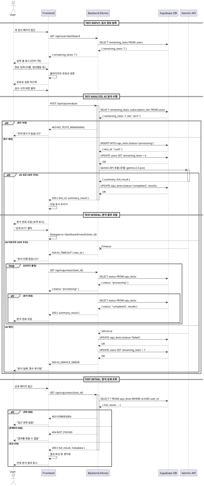

# 사주 검사 수행 상세 스펙

## 기능 개요

사용자가 검사 대상자의 생년월일시 정보를 입력하고 AI 기반 사주 분석을 수행하는 핵심 기능입니다. 무료/Pro 등급에 따라 다른 AI 모델을 사용하며, 검사 횟수를 차감하고 결과를 저장합니다.

## 포함 플로우

1. **TEST-INPUT**: 검사 정보 입력 및 유효성 검증
2. **TEST-ANALYZE**: AI 분석 수행 및 횟수 차감
3. **TEST-MODAL**: 분석 완료 후 요약 결과 모달 표시
4. **TEST-DETAIL**: 전체 분석 결과 상세 조회

---

## [TEST-INPUT] 검사 정보 입력

### Primary Actor
사용자 (인증된 무료/Pro 회원)

### Precondition
- 사용자가 로그인된 상태
- 잔여 검사 횟수가 1회 이상

### Trigger
- 대시보드에서 "새 검사" 버튼 클릭
- `/dashboard/new` 페이지 접근

### Main Scenario

1. 사용자가 새 검사 페이지에 진입
2. 시스템은 사용자의 잔여 횟수를 조회하여 표시
3. 사용자가 다음 정보를 입력:
   - 검사 대상자 이름 (필수, 2-50자)
   - 생년월일 (필수, 캘린더 선택)
   - 출생시간 (선택, 시계 UI로 시/분 선택)
   - 출생시간 모름 체크박스 (선택)
   - 성별 (필수, 라디오 버튼: 남성/여성)
4. 시스템은 실시간으로 입력 유효성 검증
5. 모든 필수 항목이 입력되면 "검사 시작" 버튼 활성화
6. 사용자가 "검사 시작" 버튼 클릭 시 TEST-ANALYZE 플로우로 진행

### Edge Cases

**잔여 횟수 부족**
- 조건: `remaining_tests = 0`
- 처리:
  - "검사 시작" 버튼 비활성화
  - 알림 메시지: "잔여 검사 횟수가 없습니다. 구독을 업그레이드해주세요"
  - "구독 업그레이드" 버튼 표시 → 클릭 시 `/dashboard/subscription` 이동

**과거 날짜 검증**
- 조건: 생년월일이 오늘보다 미래인 경우
- 처리: 에러 메시지 표시 "생년월일은 오늘 이전이어야 합니다"

**출생시간 모름 선택 시**
- 조건: 출생시간 모름 체크박스 체크
- 처리:
  - 출생시간 입력 필드 비활성화
  - `is_birth_time_unknown = true`, `birth_time = null`로 저장

**이름 유효성 검증**
- 조건: 이름이 2자 미만 또는 50자 초과
- 처리: 에러 메시지 "이름은 2자 이상 50자 이하로 입력해주세요"

### Business Rules

- 무료 회원: 최초 가입 시 3회 제공, 소진 후 추가 불가
- Pro 회원: 월 10회 제공, 매월 결제일에 초기화
- 검사 시작 전까지는 횟수 차감 없음
- 입력 데이터는 클라이언트 측 및 서버 측 이중 검증

### UI 컴포넌트 구성

```typescript
// src/features/test/components/TestInputForm.tsx
<TestInputForm>
  <FormHeader>
    <Title>새 사주 검사</Title>
    <RemainingTestsIndicator remaining={7} tier="pro" />
  </FormHeader>

  <FormBody>
    <TextInput name="test_name" label="검사 대상자 이름" required />
    <DatePicker name="birth_date" label="생년월일" required />
    <TimePicker name="birth_time" label="출생시간" />
    <Checkbox name="is_birth_time_unknown" label="정확한 출생시간을 모릅니다" />
    <RadioGroup name="gender" label="성별" options={["male", "female"]} required />
  </FormBody>

  <FormFooter>
    <Button
      type="submit"
      disabled={!isValid || remaining === 0}
      loading={isAnalyzing}
    >
      검사 시작
    </Button>
  </FormFooter>
</TestInputForm>
```

### API 엔드포인트

#### 사용자 정보 조회 (페이지 로드 시)

```
GET /api/user/dashboard
```

**Response:**
```json
{
  "user": {
    "id": "user_xxx",
    "subscription_tier": "pro",
    "remaining_tests": 7
  }
}
```

---

## [TEST-ANALYZE] AI 분석 수행

### Primary Actor
시스템 (사용자 요청에 따라 자동 실행)

### Precondition
- TEST-INPUT에서 유효한 데이터 입력 완료
- 잔여 검사 횟수 1회 이상

### Trigger
- "검사 시작" 버튼 클릭

### Main Scenario

1. 클라이언트가 검사 분석 API 호출
2. 백엔드는 Clerk JWT에서 user_id 추출
3. DB 트랜잭션 시작:
   - users 테이블에서 `remaining_tests` 확인
   - `remaining_tests < 1`이면 403 에러 반환
   - `saju_tests` 테이블에 레코드 INSERT (status: 'processing')
   - users 테이블 `remaining_tests` 즉시 차감
4. 사용자 구독 등급에 따라 AI 모델 선택:
   - free → `gemini-2.5-flash`
   - pro → `gemini-2.5-pro`
5. Gemini API 호출 (타임아웃: 30초):
   - 프롬프트: 사주 분석 요청
   - 응답: 요약 결과 + 전체 분석 결과
6. 분석 성공 시:
   - `saju_tests` 테이블 UPDATE:
     - `status = 'completed'`
     - `summary_result = AI 요약`
     - `full_result = AI 전체 결과`
     - `completed_at = NOW()`
7. 클라이언트에 성공 응답 반환 (test_id, summary_result 포함)
8. 프론트엔드는 TEST-MODAL 플로우로 진행

### Edge Cases

**횟수 부족 (동시성 문제)**
- 조건: 다른 탭에서 동시에 검사 시작하여 횟수가 이미 0
- 처리:
  - DB 조회 시점에 remaining_tests 재확인
  - 403 에러 반환: `NO_TESTS_REMAINING`
  - 프론트엔드: 에러 메시지 표시 + 페이지 새로고침

**AI API 타임아웃**
- 조건: Gemini API가 30초 이내 응답 없음
- 처리:
  - 504 Gateway Timeout 반환
  - `test_id` 포함하여 클라이언트에 전달
  - 백그라운드에서 분석 계속 진행
  - 프론트엔드: "분석이 진행 중입니다. 잠시 후 결과를 확인해주세요" 메시지
  - 클라이언트는 5초마다 `GET /api/saju/tests/{test_id}` 폴링

**AI API 에러**
- 조건: Gemini API가 에러 응답 (400, 500 등)
- 처리:
  - `saju_tests` 테이블 UPDATE:
    - `status = 'failed'`
    - `error_message = 에러 내용`
  - users 테이블 `remaining_tests` 복구 (+1)
  - 500 에러 반환: `AI_SERVICE_ERROR`
  - 프론트엔드: "분석 중 오류가 발생했습니다. 다시 시도해주세요" + 횟수 복구 안내

**네트워크 오류 (클라이언트 측)**
- 조건: 클라이언트의 네트워크 연결 끊김
- 처리:
  - 프론트엔드: 재시도 안내 메시지
  - 백엔드: 미완료 검사 정리 스케줄러가 30분 후 처리

**중복 클릭 방지**
- 조건: 사용자가 "검사 시작" 버튼 여러 번 클릭
- 처리:
  - 프론트엔드: 버튼 비활성화 + 로딩 상태 표시
  - React Query의 `isLoading` 상태 활용

**페이지 이탈**
- 조건: 분석 중 사용자가 페이지 닫기/새로고침
- 처리:
  - 백그라운드에서 분석은 계속 진행
  - 미완료 상태로 30분 이상 경과 시 시스템 정리 스케줄러가 횟수 복구

### Business Rules

- 횟수 차감은 분석 시작 즉시 수행 (롤백 방지)
- 분석 실패 시에만 횟수 복구
- AI 타임아웃은 실패로 간주하지 않음 (백그라운드 처리 계속)
- 한 사용자당 동시 분석 제한 없음 (횟수만 충분하면 가능)

### AI 분석 프로세스 상세

#### Gemini API 프롬프트 구조

```
역할: 당신은 전문 사주명리학자입니다.

입력:
- 이름: {test_name}
- 생년월일: {birth_date}
- 출생시간: {birth_time} (모름: {is_birth_time_unknown})
- 성별: {gender}

요청사항:
1. 사주팔자 추출
2. 오행 분석
3. 운세 풀이 (성격, 재물, 직업, 건강, 인간관계)
4. 향후 1년 운세

응답 형식:
[요약] (200자 이내)
짧은 핵심 요약

[전체 분석]
1. 사주팔자: ...
2. 오행 분석: ...
3. 성격: ...
4. 재물운: ...
5. 직업운: ...
6. 건강: ...
7. 인간관계: ...
8. 향후 1년 운세: ...
```

#### 응답 파싱

```typescript
// Gemini 응답을 파싱하여 summary와 full_result 분리
function parseGeminiResponse(response: string) {
  const summaryMatch = response.match(/\[요약\]([\s\S]*?)\[전체 분석\]/);
  const fullMatch = response.match(/\[전체 분석\]([\s\S]*)/);

  return {
    summary: summaryMatch?.[1].trim() || '',
    full: fullMatch?.[1].trim() || response
  };
}
```

### DB 스키마 영향

#### saju_tests 테이블

**INSERT (검사 시작 시):**
```sql
INSERT INTO saju_tests (
  user_id, test_name, birth_date, birth_time,
  is_birth_time_unknown, gender, status, ai_model
) VALUES (
  'user_xxx', '홍길동', '1990-01-01', '14:30:00',
  false, 'male', 'processing', 'gemini-2.5-pro'
) RETURNING id;
```

**UPDATE (분석 완료 시):**
```sql
UPDATE saju_tests
SET
  status = 'completed',
  summary_result = '요약 내용...',
  full_result = '전체 분석 내용...',
  completed_at = NOW()
WHERE id = 'uuid-here';
```

**UPDATE (분석 실패 시):**
```sql
UPDATE saju_tests
SET
  status = 'failed',
  error_message = '에러 메시지'
WHERE id = 'uuid-here';
```

#### users 테이블

**횟수 차감:**
```sql
UPDATE users
SET
  remaining_tests = remaining_tests - 1,
  updated_at = NOW()
WHERE id = 'user_xxx' AND remaining_tests > 0;
```

**횟수 복구 (실패 시):**
```sql
UPDATE users
SET
  remaining_tests = remaining_tests + 1,
  updated_at = NOW()
WHERE id = 'user_xxx';
```

### API 엔드포인트

#### 검사 분석 수행

```
POST /api/saju/analyze
Authorization: Bearer {clerk_jwt}
```

**Request Body:**
```json
{
  "test_name": "홍길동",
  "birth_date": "1990-01-01",
  "birth_time": "14:30:00",
  "is_birth_time_unknown": false,
  "gender": "male"
}
```

**Response (200 OK) - 성공:**
```json
{
  "test_id": "uuid-here",
  "status": "completed",
  "summary_result": "요약 내용...",
  "message": "검사가 완료되었습니다"
}
```

**Response (403 Forbidden) - 횟수 부족:**
```json
{
  "error": "NO_TESTS_REMAINING",
  "message": "잔여 검사 횟수가 없습니다"
}
```

**Response (504 Gateway Timeout) - 타임아웃:**
```json
{
  "error": "AI_TIMEOUT",
  "test_id": "uuid-here",
  "message": "AI 분석 시간이 초과되었습니다. 잠시 후 결과를 확인해주세요"
}
```

**Response (500 Internal Server Error) - AI 에러:**
```json
{
  "error": "AI_SERVICE_ERROR",
  "message": "분석 중 오류가 발생했습니다. 다시 시도해주세요"
}
```

#### 검사 결과 폴링 (타임아웃 시)

```
GET /api/saju/tests/{test_id}
Authorization: Bearer {clerk_jwt}
```

**Response (200 OK) - 처리 중:**
```json
{
  "id": "uuid-here",
  "test_name": "홍길동",
  "status": "processing",
  "message": "분석 진행 중입니다"
}
```

**Response (200 OK) - 완료:**
```json
{
  "id": "uuid-here",
  "test_name": "홍길동",
  "status": "completed",
  "summary_result": "요약 내용...",
  "full_result": "전체 분석 내용..."
}
```

### 횟수 차감 및 복구 로직

#### 차감 시나리오

```typescript
// src/features/test/backend/service.ts
async function performAnalysis(userId: string, input: TestInput) {
  // 1. 트랜잭션 시작
  const { data: user } = await supabase
    .from('users')
    .select('remaining_tests, subscription_tier')
    .eq('id', userId)
    .single();

  // 2. 횟수 확인
  if (user.remaining_tests < 1) {
    throw new Error('NO_TESTS_REMAINING');
  }

  // 3. 검사 레코드 생성
  const { data: test } = await supabase
    .from('saju_tests')
    .insert({
      user_id: userId,
      status: 'processing',
      ai_model: user.subscription_tier === 'pro'
        ? 'gemini-2.5-pro'
        : 'gemini-2.5-flash',
      ...input
    })
    .select()
    .single();

  // 4. 횟수 즉시 차감 (트랜잭션)
  await supabase
    .from('users')
    .update({ remaining_tests: user.remaining_tests - 1 })
    .eq('id', userId);

  // 5. AI 분석 수행
  try {
    const result = await geminiAnalyze(input, test.ai_model);

    // 6. 성공: 결과 저장
    await supabase
      .from('saju_tests')
      .update({
        status: 'completed',
        summary_result: result.summary,
        full_result: result.full,
        completed_at: new Date()
      })
      .eq('id', test.id);

    return { test_id: test.id, summary: result.summary };

  } catch (error) {
    // 7. 실패: 횟수 복구
    await supabase
      .from('saju_tests')
      .update({ status: 'failed', error_message: error.message })
      .eq('id', test.id);

    await supabase
      .from('users')
      .update({ remaining_tests: user.remaining_tests })
      .eq('id', userId);

    throw error;
  }
}
```

#### 복구 시나리오

**즉시 복구 (AI 에러):**
- 조건: Gemini API가 에러 응답
- 시점: API 요청 실패 즉시
- 방법: users.remaining_tests += 1

**지연 복구 (미완료 검사 정리):**
- 조건: status='processing'이고 30분 이상 경과
- 시점: 시스템 스케줄러 (매시간 실행)
- 방법:
  ```sql
  UPDATE users u
  SET remaining_tests = remaining_tests + 1
  FROM saju_tests st
  WHERE st.user_id = u.id
    AND st.status = 'processing'
    AND st.created_at < NOW() - INTERVAL '30 minutes';

  DELETE FROM saju_tests
  WHERE status = 'processing'
    AND created_at < NOW() - INTERVAL '30 minutes';
  ```

---

## [TEST-MODAL] 분석 결과 모달

### Primary Actor
사용자

### Precondition
- TEST-ANALYZE에서 분석 성공 응답 수신

### Trigger
- 분석 API가 200 OK 응답 반환

### Main Scenario

1. 분석 완료 시 자동으로 모달 표시
2. 모달에 요약 결과 표시:
   - 검사 대상자 이름
   - 생년월일, 성별
   - AI 요약 (200자 이내)
3. 모달 하단에 두 개의 버튼 표시:
   - "상세 보기": TEST-DETAIL 페이지로 이동
   - "닫기": 모달 닫고 대시보드로 이동

### Edge Cases

**요약 결과 파싱 실패**
- 조건: summary_result가 null 또는 빈 문자열
- 처리: "요약 정보가 없습니다" 기본 메시지 표시

**모달 외부 클릭**
- 조건: 사용자가 모달 외부 영역 클릭
- 처리: 모달 닫지 않음 (명시적 버튼 클릭만 허용)

### Business Rules

- 모달은 분석 완료 후 자동으로 표시
- ESC 키로 닫기 가능
- 모달 닫으면 대시보드로 리다이렉트
- 상세 보기 선택 시 `/dashboard/result/{test_id}` 이동

### UI 컴포넌트 구성

```typescript
// src/features/test/components/AnalysisResultModal.tsx
<Modal open={true} onOpenChange={handleClose}>
  <ModalContent>
    <ModalHeader>
      <ModalTitle>분석 완료</ModalTitle>
      <CloseButton onClick={handleClose} />
    </ModalHeader>

    <ModalBody>
      <TestInfo>
        <InfoRow label="검사 대상자" value={testName} />
        <InfoRow label="생년월일" value={formatDate(birthDate)} />
        <InfoRow label="성별" value={gender === 'male' ? '남성' : '여성'} />
      </TestInfo>

      <Divider />

      <SummarySection>
        <SectionTitle>요약</SectionTitle>
        <SummaryText>{summaryResult}</SummaryText>
      </SummarySection>
    </ModalBody>

    <ModalFooter>
      <Button variant="outline" onClick={handleClose}>
        닫기
      </Button>
      <Button variant="primary" onClick={handleViewDetails}>
        상세 보기
      </Button>
    </ModalFooter>
  </ModalContent>
</Modal>
```

---

## [TEST-DETAIL] 분석 상세 조회

### Primary Actor
사용자

### Precondition
- 사용자가 로그인된 상태
- 조회하려는 검사 ID가 존재
- 사용자가 해당 검사의 소유자

### Trigger
- 대시보드에서 검사 이력 클릭
- 분석 모달에서 "상세 보기" 버튼 클릭
- URL 직접 접근: `/dashboard/result/{test_id}`

### Main Scenario

1. 페이지 로드 시 검사 ID로 데이터 조회 API 호출
2. 백엔드는 Clerk JWT에서 user_id 추출
3. DB에서 검사 레코드 조회:
   - user_id 일치 여부 확인
   - status가 'completed'인지 확인
4. 전체 분석 결과 파싱 및 렌더링:
   - 사주팔자
   - 오행 분석
   - 성격, 재물운, 직업운, 건강, 인간관계
   - 향후 1년 운세
5. 검사 메타 정보 표시:
   - 검사 대상자 이름
   - 생년월일, 출생시간, 성별
   - 검사 일시

### Edge Cases

**존재하지 않는 검사 ID**
- 조건: DB에 해당 test_id 없음
- 처리:
  - 404 에러 페이지 표시
  - "검사 결과를 찾을 수 없습니다" 메시지
  - 대시보드로 돌아가기 버튼

**권한 없는 접근**
- 조건: test.user_id !== jwt.user_id
- 처리:
  - 403 에러 페이지 표시
  - "접근 권한이 없습니다" 메시지
  - 대시보드로 돌아가기 버튼

**미완료 검사 접근**
- 조건: status = 'processing'
- 처리:
  - 로딩 상태 표시
  - "분석 진행 중입니다" 메시지
  - 5초마다 자동 새로고침 (폴링)

**분석 실패 검사 접근**
- 조건: status = 'failed'
- 처리:
  - 에러 메시지 표시: "분석 중 오류가 발생했습니다"
  - "다시 검사하기" 버튼 → `/dashboard/new` 이동

**전체 결과 파싱 실패**
- 조건: full_result가 null 또는 빈 문자열
- 처리: "분석 결과를 불러올 수 없습니다" 기본 메시지

### Business Rules

- 본인의 검사 결과만 조회 가능
- 삭제된 검사는 조회 불가
- 완료된 검사는 무제한 재조회 가능 (횟수 차감 없음)
- URL을 통한 직접 접근 가능

### UI 컴포넌트 구성

```typescript
// src/features/test/components/TestDetailPage.tsx
<TestDetailPage>
  <Header>
    <BackButton to="/dashboard" />
    <Title>검사 상세 결과</Title>
  </Header>

  <TestMetaInfo>
    <InfoGrid>
      <InfoItem label="검사 대상자" value={testName} />
      <InfoItem label="생년월일" value={formatDate(birthDate)} />
      <InfoItem label="출생시간" value={birthTime || '정보 없음'} />
      <InfoItem label="성별" value={gender === 'male' ? '남성' : '여성'} />
      <InfoItem label="검사 일시" value={formatDateTime(createdAt)} />
    </InfoGrid>
  </TestMetaInfo>

  <Divider />

  <AnalysisContent>
    <Section>
      <SectionTitle>사주팔자</SectionTitle>
      <SectionContent>{parsedResult.saju}</SectionContent>
    </Section>

    <Section>
      <SectionTitle>오행 분석</SectionTitle>
      <SectionContent>{parsedResult.ohang}</SectionContent>
    </Section>

    <Section>
      <SectionTitle>성격</SectionTitle>
      <SectionContent>{parsedResult.personality}</SectionContent>
    </Section>

    <Section>
      <SectionTitle>재물운</SectionTitle>
      <SectionContent>{parsedResult.wealth}</SectionContent>
    </Section>

    <Section>
      <SectionTitle>직업운</SectionTitle>
      <SectionContent>{parsedResult.career}</SectionContent>
    </Section>

    <Section>
      <SectionTitle>건강</SectionTitle>
      <SectionContent>{parsedResult.health}</SectionContent>
    </Section>

    <Section>
      <SectionTitle>인간관계</SectionTitle>
      <SectionContent>{parsedResult.relationship}</SectionContent>
    </Section>

    <Section>
      <SectionTitle>향후 1년 운세</SectionTitle>
      <SectionContent>{parsedResult.forecast}</SectionContent>
    </Section>
  </AnalysisContent>

  <Footer>
    <Button variant="outline" onClick={() => router.push('/dashboard')}>
      목록으로
    </Button>
    <Button variant="primary" onClick={() => router.push('/dashboard/new')}>
      새 검사
    </Button>
  </Footer>
</TestDetailPage>
```

### API 엔드포인트

#### 검사 결과 상세 조회

```
GET /api/saju/tests/{test_id}
Authorization: Bearer {clerk_jwt}
```

**Response (200 OK) - 완료:**
```json
{
  "id": "uuid-here",
  "test_name": "홍길동",
  "birth_date": "1990-01-01",
  "birth_time": "14:30:00",
  "is_birth_time_unknown": false,
  "gender": "male",
  "status": "completed",
  "ai_model": "gemini-2.5-pro",
  "summary_result": "요약 내용...",
  "full_result": "전체 분석 내용...",
  "created_at": "2025-01-26T10:00:00Z",
  "completed_at": "2025-01-26T10:01:00Z"
}
```

**Response (200 OK) - 처리 중:**
```json
{
  "id": "uuid-here",
  "test_name": "홍길동",
  "status": "processing",
  "message": "분석 진행 중입니다"
}
```

**Response (404 Not Found):**
```json
{
  "error": "NOT_FOUND",
  "message": "검사 결과를 찾을 수 없습니다"
}
```

**Response (403 Forbidden):**
```json
{
  "error": "FORBIDDEN",
  "message": "접근 권한이 없습니다"
}
```

### DB 스키마 영향

#### 조회 쿼리

```sql
SELECT
  id, user_id, test_name, birth_date, birth_time,
  is_birth_time_unknown, gender, status, ai_model,
  summary_result, full_result, error_message,
  created_at, completed_at
FROM saju_tests
WHERE id = 'uuid-here' AND user_id = 'user_xxx';
```

---

## PlantUML Sequence Diagram



---

## 요약

### 핵심 기능
- **TEST-INPUT**: 검사 정보 입력 및 유효성 검증, 잔여 횟수 확인
- **TEST-ANALYZE**: AI 분석 수행, 횟수 차감 및 에러 시 복구
- **TEST-MODAL**: 분석 완료 후 요약 결과 모달 표시
- **TEST-DETAIL**: 전체 분석 결과 상세 조회

### 주요 엣지케이스
- 횟수 부족, 동시성 문제
- AI 타임아웃 (폴링 처리)
- AI 에러 (횟수 복구)
- 미완료 검사 정리 (스케줄러)
- 권한 없는 접근 차단

### 횟수 관리
- **차감**: 분석 시작 즉시 (트랜잭션)
- **복구**: AI 에러 시 즉시, 미완료 검사는 30분 후 스케줄러

### API 엔드포인트
- `POST /api/saju/analyze`: 검사 수행
- `GET /api/saju/tests/{test_id}`: 검사 결과 조회 (폴링용)
- `GET /api/user/dashboard`: 사용자 정보 조회

### DB 테이블
- `users`: 잔여 횟수 관리
- `saju_tests`: 검사 결과 저장 (processing → completed/failed)
