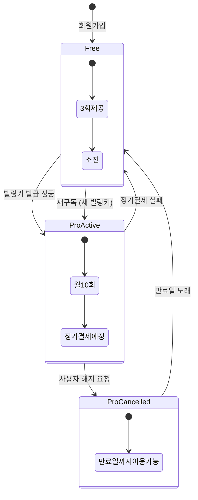
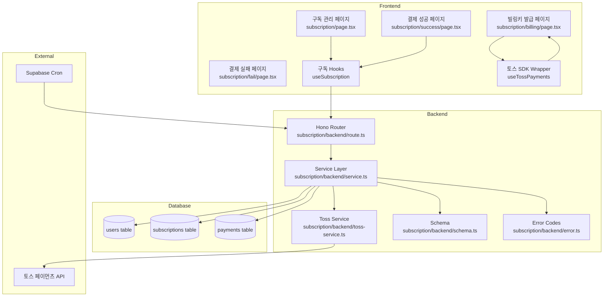
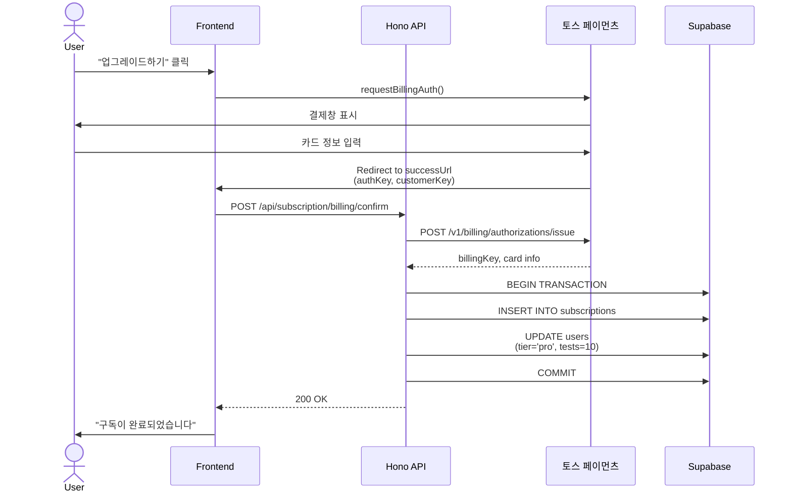

# 구독 관리 기능 구현 계획서

## 개요

이 문서는 **구독 관리 기능(SUB-VIEW, SUB-UPGRADE, SUB-PAYMENT, SUB-CANCEL, SUB-REACTIVATE)** 구현을 위한 모듈화 설계를 정의합니다.

### 주요 기능
- **구독 정보 조회**: 현재 사용자의 구독 등급, 잔여 횟수, 결제 정보 조회
- **Pro 구독 신청**: 토스 페이먼츠 SDK를 통한 빌링키 발급 및 구독 활성화
- **구독 해지**: 빌링키 삭제 및 다음 결제일까지 Pro 서비스 유지
- **해지 취소**: 빌링키 삭제 정책으로 인해 실질적으로 불가능 (새 구독 필요)

### 토스 페이먼츠 연동
- **빌링키 발급**: `@tosspayments/payment-widget-sdk` 사용
- **정기결제**: 토스 페이먼츠 REST API (`POST /v1/billing/{billingKey}`)
- **빌링키 삭제**: DB에서 NULL 처리 (토스 API는 삭제 엔드포인트 미제공)

### 기술 스택
- **Backend**: Hono + Supabase (service-role)
- **Frontend**: Next.js 15 App Router + React Query + Zustand (옵션)
- **결제 SDK**: `@tosspayments/payment-widget-sdk`
- **인증**: Clerk JWT

---

## Diagram

### 구독 상태 전이도



### 모듈 간 의존성 다이어그램



### SUB-PAYMENT 시퀀스 다이어그램



---

## Implementation Plan

### 1. Database Layer

#### 1.1 Subscriptions 테이블 마이그레이션
**파일**: `supabase/migrations/[timestamp]_create_subscriptions_table.sql`

```sql
-- Subscriptions 테이블 생성
CREATE TABLE IF NOT EXISTS public.subscriptions (
  id UUID PRIMARY KEY DEFAULT gen_random_uuid(),
  user_id TEXT NOT NULL REFERENCES public.users(id) ON DELETE CASCADE,
  customer_key TEXT UNIQUE,
  billing_key TEXT,
  card_company TEXT,
  card_number TEXT,
  status TEXT DEFAULT 'active' CHECK (status IN ('active', 'cancelled', 'expired')),
  next_billing_date DATE,
  created_at TIMESTAMP WITH TIME ZONE DEFAULT NOW(),
  updated_at TIMESTAMP WITH TIME ZONE DEFAULT NOW(),
  UNIQUE(user_id)
);

-- 인덱스 생성
CREATE INDEX IF NOT EXISTS idx_subscriptions_user_id ON public.subscriptions(user_id);
CREATE INDEX IF NOT EXISTS idx_subscriptions_status ON public.subscriptions(status);
CREATE INDEX IF NOT EXISTS idx_subscriptions_next_billing_date ON public.subscriptions(next_billing_date);

-- updated_at 자동 업데이트 트리거
CREATE TRIGGER update_subscriptions_updated_at
BEFORE UPDATE ON public.subscriptions
FOR EACH ROW
EXECUTE FUNCTION update_updated_at_column();
```

**QA Sheet**:
- [ ] 테이블 생성 확인: `subscriptions` 테이블이 생성되었는가?
- [ ] UNIQUE 제약 확인: 한 사용자당 하나의 구독만 생성되는가?
- [ ] CASCADE 동작 확인: 사용자 삭제 시 구독도 삭제되는가?
- [ ] 인덱스 생성 확인: 3개의 인덱스가 생성되었는가?
- [ ] 트리거 동작 확인: `updated_at`이 자동으로 갱신되는가?

#### 1.2 Payments 테이블 마이그레이션
**파일**: `supabase/migrations/[timestamp]_create_payments_table.sql`

```sql
-- Payments 테이블 생성
CREATE TABLE IF NOT EXISTS public.payments (
  id UUID PRIMARY KEY DEFAULT gen_random_uuid(),
  user_id TEXT NOT NULL REFERENCES public.users(id) ON DELETE CASCADE,
  subscription_id UUID REFERENCES public.subscriptions(id) ON DELETE SET NULL,
  payment_key TEXT,
  order_id TEXT NOT NULL UNIQUE,
  amount INTEGER NOT NULL,
  status TEXT NOT NULL CHECK (status IN ('SUCCESS', 'FAILED', 'CANCELLED')),
  method TEXT DEFAULT 'billing',
  error_code TEXT,
  error_message TEXT,
  paid_at TIMESTAMP WITH TIME ZONE,
  created_at TIMESTAMP WITH TIME ZONE DEFAULT NOW()
);

-- 인덱스 생성
CREATE INDEX IF NOT EXISTS idx_payments_user_id ON public.payments(user_id);
CREATE INDEX IF NOT EXISTS idx_payments_subscription_id ON public.payments(subscription_id);
CREATE INDEX IF NOT EXISTS idx_payments_order_id ON public.payments(order_id);
CREATE INDEX IF NOT EXISTS idx_payments_status ON public.payments(status);
CREATE INDEX IF NOT EXISTS idx_payments_paid_at ON public.payments(paid_at);
```

**QA Sheet**:
- [ ] 테이블 생성 확인
- [ ] order_id UNIQUE 제약 확인 (중복 결제 방지)
- [ ] ON DELETE SET NULL 동작 확인 (구독 삭제 시 payments는 유지)
- [ ] 인덱스 생성 확인

#### 1.3 트랜잭션 함수 생성
**파일**: `supabase/migrations/[timestamp]_create_subscription_functions.sql`

```sql
-- 빌링키 발급 시 구독 생성 + 사용자 업데이트 (원자성 보장)
CREATE OR REPLACE FUNCTION create_subscription_with_user_update(
  p_user_id TEXT,
  p_customer_key TEXT,
  p_billing_key TEXT,
  p_card_company TEXT,
  p_card_number TEXT,
  p_next_billing_date DATE
) RETURNS JSONB AS $$
DECLARE
  v_subscription_id UUID;
BEGIN
  -- 1. subscriptions INSERT
  INSERT INTO subscriptions (
    user_id, customer_key, billing_key,
    card_company, card_number,
    status, next_billing_date
  ) VALUES (
    p_user_id, p_customer_key, p_billing_key,
    p_card_company, p_card_number,
    'active', p_next_billing_date
  )
  RETURNING id INTO v_subscription_id;

  -- 2. users UPDATE
  UPDATE users
  SET subscription_tier = 'pro',
      remaining_tests = 10,
      updated_at = NOW()
  WHERE id = p_user_id;

  RETURN jsonb_build_object(
    'subscription_id', v_subscription_id,
    'status', 'success'
  );
EXCEPTION
  WHEN OTHERS THEN
    RAISE;
END;
$$ LANGUAGE plpgsql;
```

**Unit Test**:
```typescript
describe('create_subscription_with_user_update', () => {
  it('should create subscription and update user atomically', async () => {
    const result = await supabase.rpc('create_subscription_with_user_update', {
      p_user_id: 'test_user_id',
      p_customer_key: 'test_customer_key',
      p_billing_key: 'test_billing_key',
      p_card_company: '신한카드',
      p_card_number: '433012******1234',
      p_next_billing_date: '2025-02-26',
    });

    expect(result.error).toBeNull();
    expect(result.data.status).toBe('success');

    // 구독 생성 확인
    const { data: subscription } = await supabase
      .from('subscriptions')
      .select('*')
      .eq('user_id', 'test_user_id')
      .single();

    expect(subscription?.status).toBe('active');

    // 사용자 업데이트 확인
    const { data: user } = await supabase
      .from('users')
      .select('subscription_tier, remaining_tests')
      .eq('id', 'test_user_id')
      .single();

    expect(user?.subscription_tier).toBe('pro');
    expect(user?.remaining_tests).toBe(10);
  });

  it('should rollback on error', async () => {
    // 존재하지 않는 user_id로 테스트
    const result = await supabase.rpc('create_subscription_with_user_update', {
      p_user_id: 'non_existent_user',
      // ...
    });

    expect(result.error).not.toBeNull();

    // subscriptions 테이블에 레코드가 생성되지 않았는지 확인
    const { data } = await supabase
      .from('subscriptions')
      .select('*')
      .eq('user_id', 'non_existent_user');

    expect(data).toHaveLength(0);
  });
});
```

---

### 2. Backend Layer

#### 2.1 Schema 정의
**파일**: `src/features/subscription/backend/schema.ts`

```typescript
import { z } from 'zod';

// 구독 정보 조회 응답
export const SubscriptionInfoSchema = z.object({
  subscriptionTier: z.enum(['free', 'pro']),
  remainingTests: z.number().int().min(0),
  subscription: z.object({
    status: z.enum(['active', 'cancelled', 'expired']),
    nextBillingDate: z.string().nullable(),
    cardCompany: z.string().nullable(),
    cardNumber: z.string().nullable(),
  }).nullable(),
});

export type SubscriptionInfo = z.infer<typeof SubscriptionInfoSchema>;

// 빌링키 발급 확정 요청
export const ConfirmBillingRequestSchema = z.object({
  customerKey: z.string().uuid(),
  authKey: z.string().min(1),
});

export type ConfirmBillingRequest = z.infer<typeof ConfirmBillingRequestSchema>;

// 빌링키 발급 확정 응답
export const ConfirmBillingResponseSchema = z.object({
  message: z.string(),
  subscriptionTier: z.enum(['pro']),
  remainingTests: z.number(),
  nextBillingDate: z.string(),
});

export type ConfirmBillingResponse = z.infer<typeof ConfirmBillingResponseSchema>;

// 구독 취소 응답
export const CancelSubscriptionResponseSchema = z.object({
  message: z.string(),
  expiryDate: z.string(),
});

export type CancelSubscriptionResponse = z.infer<typeof CancelSubscriptionResponseSchema>;

// DB Row Schemas
export const SubscriptionRowSchema = z.object({
  id: z.string().uuid(),
  user_id: z.string(),
  customer_key: z.string().nullable(),
  billing_key: z.string().nullable(),
  card_company: z.string().nullable(),
  card_number: z.string().nullable(),
  status: z.enum(['active', 'cancelled', 'expired']),
  next_billing_date: z.string().nullable(),
  created_at: z.string(),
  updated_at: z.string(),
});

export type SubscriptionRow = z.infer<typeof SubscriptionRowSchema>;

export const UserRowSchema = z.object({
  id: z.string(),
  subscription_tier: z.enum(['free', 'pro']),
  remaining_tests: z.number(),
});

export type UserRow = z.infer<typeof UserRowSchema>;
```

**Unit Test**:
```typescript
describe('Schema Validation', () => {
  it('should validate SubscriptionInfo correctly', () => {
    const valid = {
      subscriptionTier: 'pro',
      remainingTests: 7,
      subscription: {
        status: 'active',
        nextBillingDate: '2025-02-26',
        cardCompany: '신한카드',
        cardNumber: '433012******1234',
      },
    };

    const result = SubscriptionInfoSchema.safeParse(valid);
    expect(result.success).toBe(true);
  });

  it('should reject invalid subscription tier', () => {
    const invalid = {
      subscriptionTier: 'premium', // 잘못된 값
      remainingTests: 5,
      subscription: null,
    };

    const result = SubscriptionInfoSchema.safeParse(invalid);
    expect(result.success).toBe(false);
  });
});
```

#### 2.2 Error Codes
**파일**: `src/features/subscription/backend/error.ts`

```typescript
export const subscriptionErrorCodes = {
  // 구독 조회 에러
  fetchError: 'SUBSCRIPTION_FETCH_ERROR',
  notFound: 'SUBSCRIPTION_NOT_FOUND',

  // 업그레이드 에러
  alreadySubscribed: 'ALREADY_SUBSCRIBED',
  billingAuthFailed: 'BILLING_AUTH_FAILED',
  billingKeyIssueFailed: 'BILLING_KEY_ISSUE_FAILED',
  duplicateRequest: 'DUPLICATE_REQUEST',

  // 취소 에러
  noActiveSubscription: 'NO_ACTIVE_SUBSCRIPTION',
  alreadyCancelled: 'ALREADY_CANCELLED',

  // 재활성화 에러
  billingKeyDeleted: 'BILLING_KEY_DELETED',
  subscriptionExpired: 'SUBSCRIPTION_EXPIRED',

  // 검증 에러
  validationError: 'VALIDATION_ERROR',

  // DB 에러
  databaseError: 'DATABASE_ERROR',
} as const;

export type SubscriptionErrorCode = (typeof subscriptionErrorCodes)[keyof typeof subscriptionErrorCodes];

export type SubscriptionServiceError = SubscriptionErrorCode;
```

#### 2.3 Toss Service
**파일**: `src/features/subscription/backend/toss-service.ts`

```typescript
import { failure, success, type HandlerResult } from '@/backend/http/response';
import { subscriptionErrorCodes, type SubscriptionServiceError } from './error';

const TOSS_SECRET_KEY = process.env.TOSS_SECRET_KEY!;
const TOSS_API_BASE = 'https://api.tosspayments.com';

const getBasicAuthHeader = () => {
  const auth = Buffer.from(`${TOSS_SECRET_KEY}:`).toString('base64');
  return `Basic ${auth}`;
};

export interface TossBillingData {
  billingKey: string;
  card: {
    company: string;
    number: string;
  };
}

/**
 * 토스 페이먼츠 빌링키 발급 API 호출
 */
export const issueBillingKey = async (
  authKey: string,
  customerKey: string,
): Promise<HandlerResult<TossBillingData, SubscriptionServiceError, unknown>> => {
  try {
    const response = await fetch(`${TOSS_API_BASE}/v1/billing/authorizations/issue`, {
      method: 'POST',
      headers: {
        Authorization: getBasicAuthHeader(),
        'Content-Type': 'application/json',
      },
      body: JSON.stringify({
        authKey,
        customerKey,
      }),
    });

    if (!response.ok) {
      const error = await response.json();
      return failure(
        400,
        subscriptionErrorCodes.billingKeyIssueFailed,
        error.message || '빌링키 발급에 실패했습니다',
        error,
      );
    }

    const data = await response.json();
    return success(data);
  } catch (error: any) {
    return failure(
      500,
      subscriptionErrorCodes.billingAuthFailed,
      '빌링키 발급 중 오류가 발생했습니다',
      error,
    );
  }
};

/**
 * 빌링키로 정기결제 승인
 */
export const chargeBilling = async (
  billingKey: string,
  customerKey: string,
  amount: number,
  orderId: string,
  orderName: string,
): Promise<HandlerResult<any, SubscriptionServiceError, unknown>> => {
  try {
    const response = await fetch(`${TOSS_API_BASE}/v1/billing/${billingKey}`, {
      method: 'POST',
      headers: {
        Authorization: getBasicAuthHeader(),
        'Content-Type': 'application/json',
      },
      body: JSON.stringify({
        customerKey,
        amount,
        orderId,
        orderName,
      }),
    });

    if (!response.ok) {
      const error = await response.json();
      return failure(
        400,
        subscriptionErrorCodes.billingAuthFailed,
        error.message || '결제 승인에 실패했습니다',
        error,
      );
    }

    const data = await response.json();
    return success(data);
  } catch (error: any) {
    return failure(
      500,
      subscriptionErrorCodes.billingAuthFailed,
      '결제 승인 중 오류가 발생했습니다',
      error,
    );
  }
};
```

**Unit Test**:
```typescript
describe('Toss Service', () => {
  describe('issueBillingKey', () => {
    it('should return billing key on success', async () => {
      // Mock fetch
      global.fetch = jest.fn(() =>
        Promise.resolve({
          ok: true,
          json: () => Promise.resolve({
            billingKey: 'test_billing_key',
            card: {
              company: '신한카드',
              number: '433012******1234',
            },
          }),
        } as Response)
      );

      const result = await issueBillingKey('test_auth_key', 'test_customer_key');

      expect(result.ok).toBe(true);
      if (result.ok) {
        expect(result.data.billingKey).toBe('test_billing_key');
      }
    });

    it('should return error on API failure', async () => {
      global.fetch = jest.fn(() =>
        Promise.resolve({
          ok: false,
          json: () => Promise.resolve({
            code: 'INVALID_AUTH_KEY',
            message: '인증키가 만료되었습니다',
          }),
        } as Response)
      );

      const result = await issueBillingKey('invalid_auth_key', 'test_customer_key');

      expect(result.ok).toBe(false);
      if (!result.ok) {
        expect(result.error.code).toBe('BILLING_KEY_ISSUE_FAILED');
      }
    });
  });
});
```

#### 2.4 Service Layer
**파일**: `src/features/subscription/backend/service.ts`

```typescript
import type { SupabaseClient } from '@supabase/supabase-js';
import { failure, success, type HandlerResult } from '@/backend/http/response';
import {
  SubscriptionInfoSchema,
  SubscriptionRowSchema,
  UserRowSchema,
  type SubscriptionInfo,
} from './schema';
import { subscriptionErrorCodes, type SubscriptionServiceError } from './error';

/**
 * 구독 정보 조회
 */
export const getSubscriptionInfo = async (
  client: SupabaseClient,
  userId: string,
): Promise<HandlerResult<SubscriptionInfo, SubscriptionServiceError, unknown>> => {
  try {
    // 1. users 테이블에서 subscription_tier, remaining_tests 조회
    const { data: userData, error: userError } = await client
      .from('users')
      .select('id, subscription_tier, remaining_tests')
      .eq('id', userId)
      .single();

    if (userError || !userData) {
      return failure(
        404,
        subscriptionErrorCodes.notFound,
        '사용자 정보를 찾을 수 없습니다',
        userError,
      );
    }

    const userParse = UserRowSchema.safeParse(userData);
    if (!userParse.success) {
      return failure(
        500,
        subscriptionErrorCodes.validationError,
        '사용자 데이터 검증 실패',
        userParse.error.format(),
      );
    }

    // 2. subscriptions 테이블에서 활성/취소 구독 조회
    const { data: subData, error: subError } = await client
      .from('subscriptions')
      .select('*')
      .eq('user_id', userId)
      .in('status', ['active', 'cancelled'])
      .maybeSingle();

    if (subError) {
      return failure(
        500,
        subscriptionErrorCodes.fetchError,
        '구독 정보 조회 실패',
        subError,
      );
    }

    let subscriptionInfo = null;
    if (subData) {
      const subParse = SubscriptionRowSchema.safeParse(subData);
      if (!subParse.success) {
        return failure(
          500,
          subscriptionErrorCodes.validationError,
          '구독 데이터 검증 실패',
          subParse.error.format(),
        );
      }

      subscriptionInfo = {
        status: subParse.data.status,
        nextBillingDate: subParse.data.next_billing_date,
        cardCompany: subParse.data.card_company,
        cardNumber: subParse.data.card_number,
      };
    }

    const result: SubscriptionInfo = {
      subscriptionTier: userParse.data.subscription_tier,
      remainingTests: userParse.data.remaining_tests,
      subscription: subscriptionInfo,
    };

    const parsed = SubscriptionInfoSchema.safeParse(result);
    if (!parsed.success) {
      return failure(
        500,
        subscriptionErrorCodes.validationError,
        '응답 데이터 검증 실패',
        parsed.error.format(),
      );
    }

    return success(parsed.data);
  } catch (error: any) {
    return failure(
      500,
      subscriptionErrorCodes.fetchError,
      '구독 정보 조회 중 오류 발생',
      error,
    );
  }
};

/**
 * 빌링키 발급 후 구독 생성 (트랜잭션)
 */
export const createSubscription = async (
  client: SupabaseClient,
  userId: string,
  customerKey: string,
  billingKey: string,
  cardCompany: string,
  cardNumber: string,
  nextBillingDate: string,
): Promise<HandlerResult<{ subscriptionId: string }, SubscriptionServiceError, unknown>> => {
  try {
    const { data, error } = await client.rpc('create_subscription_with_user_update', {
      p_user_id: userId,
      p_customer_key: customerKey,
      p_billing_key: billingKey,
      p_card_company: cardCompany,
      p_card_number: cardNumber,
      p_next_billing_date: nextBillingDate,
    });

    if (error) {
      return failure(
        500,
        subscriptionErrorCodes.databaseError,
        '구독 생성 중 오류 발생',
        error,
      );
    }

    return success({ subscriptionId: data.subscription_id });
  } catch (error: any) {
    return failure(
      500,
      subscriptionErrorCodes.databaseError,
      '구독 생성 중 오류 발생',
      error,
    );
  }
};

/**
 * 구독 취소
 */
export const cancelSubscription = async (
  client: SupabaseClient,
  userId: string,
): Promise<HandlerResult<{ expiryDate: string }, SubscriptionServiceError, unknown>> => {
  try {
    // 1. 활성 구독 조회
    const { data: subscription, error: fetchError } = await client
      .from('subscriptions')
      .select('*')
      .eq('user_id', userId)
      .eq('status', 'active')
      .single();

    if (fetchError || !subscription) {
      return failure(
        404,
        subscriptionErrorCodes.noActiveSubscription,
        '해지할 활성 구독이 없습니다',
        fetchError,
      );
    }

    // 2. 구독 상태를 'cancelled'로 변경, billing_key와 customer_key를 NULL로 설정
    const { error: updateError } = await client
      .from('subscriptions')
      .update({
        status: 'cancelled',
        billing_key: null,
        customer_key: null,
      })
      .eq('id', subscription.id);

    if (updateError) {
      return failure(
        500,
        subscriptionErrorCodes.databaseError,
        '구독 취소 중 오류 발생',
        updateError,
      );
    }

    return success({ expiryDate: subscription.next_billing_date! });
  } catch (error: any) {
    return failure(
      500,
      subscriptionErrorCodes.databaseError,
      '구독 취소 중 오류 발생',
      error,
    );
  }
};

/**
 * 구독 재활성화 (현재 정책상 불가능 - 빌링키 삭제됨)
 */
export const reactivateSubscription = async (
  client: SupabaseClient,
  userId: string,
): Promise<HandlerResult<{ nextBillingDate: string }, SubscriptionServiceError, unknown>> => {
  try {
    const { data: subscription, error } = await client
      .from('subscriptions')
      .select('*')
      .eq('user_id', userId)
      .eq('status', 'cancelled')
      .single();

    if (error || !subscription) {
      return failure(
        404,
        subscriptionErrorCodes.notFound,
        '취소된 구독이 없습니다',
        error,
      );
    }

    // 빌링키가 삭제되었는지 확인
    if (!subscription.billing_key) {
      return failure(
        400,
        subscriptionErrorCodes.billingKeyDeleted,
        '빌링키가 삭제되어 재활성화할 수 없습니다. 새로 구독을 신청해주세요',
      );
    }

    // 만료일 경과 확인
    const today = new Date().toISOString().split('T')[0];
    if (subscription.next_billing_date && subscription.next_billing_date < today) {
      return failure(
        400,
        subscriptionErrorCodes.subscriptionExpired,
        '구독 기간이 만료되어 재활성화할 수 없습니다',
      );
    }

    // 재활성화
    const { error: updateError } = await client
      .from('subscriptions')
      .update({ status: 'active' })
      .eq('id', subscription.id);

    if (updateError) {
      return failure(
        500,
        subscriptionErrorCodes.databaseError,
        '구독 재활성화 중 오류 발생',
        updateError,
      );
    }

    return success({ nextBillingDate: subscription.next_billing_date! });
  } catch (error: any) {
    return failure(
      500,
      subscriptionErrorCodes.databaseError,
      '구독 재활성화 중 오류 발생',
      error,
    );
  }
};
```

**Unit Test**:
```typescript
describe('Subscription Service', () => {
  describe('getSubscriptionInfo', () => {
    it('should return subscription info for Pro user', async () => {
      // Mock Supabase client
      const mockClient = {
        from: jest.fn((table) => ({
          select: jest.fn(() => ({
            eq: jest.fn(() => ({
              single: jest.fn(() => Promise.resolve({
                data: {
                  id: 'user_123',
                  subscription_tier: 'pro',
                  remaining_tests: 7,
                },
                error: null,
              })),
              maybeSingle: jest.fn(() => Promise.resolve({
                data: {
                  id: 'sub_123',
                  user_id: 'user_123',
                  status: 'active',
                  next_billing_date: '2025-02-26',
                  card_company: '신한카드',
                  card_number: '433012******1234',
                },
                error: null,
              })),
            })),
            in: jest.fn(() => ({
              maybeSingle: jest.fn(() => Promise.resolve({
                data: {
                  status: 'active',
                  next_billing_date: '2025-02-26',
                },
                error: null,
              })),
            })),
          })),
        })),
      };

      const result = await getSubscriptionInfo(mockClient as any, 'user_123');

      expect(result.ok).toBe(true);
      if (result.ok) {
        expect(result.data.subscriptionTier).toBe('pro');
        expect(result.data.remainingTests).toBe(7);
      }
    });
  });
});
```

#### 2.5 Hono Router
**파일**: `src/features/subscription/backend/route.ts`

```typescript
import type { Hono } from 'hono';
import { failure, respond, type ErrorResult } from '@/backend/http/response';
import { getLogger, getSupabase, type AppEnv } from '@/backend/hono/context';
import {
  ConfirmBillingRequestSchema,
  type ConfirmBillingResponse,
} from './schema';
import {
  getSubscriptionInfo,
  createSubscription,
  cancelSubscription,
  reactivateSubscription,
} from './service';
import { issueBillingKey, chargeBilling } from './toss-service';
import { subscriptionErrorCodes, type SubscriptionServiceError } from './error';

// Clerk JWT 검증 미들웨어 (추후 구현 필요)
const requireAuth = () => async (c: any, next: any) => {
  const authHeader = c.req.header('Authorization');
  if (!authHeader || !authHeader.startsWith('Bearer ')) {
    return c.json({ error: 'Unauthorized' }, 401);
  }

  // Clerk JWT 검증 로직 (추후 구현)
  const token = authHeader.replace('Bearer ', '');
  const userId = 'user_123'; // 실제로는 JWT에서 추출

  c.set('userId', userId);
  await next();
};

export const registerSubscriptionRoutes = (app: Hono<AppEnv>) => {
  // 구독 정보 조회
  app.get('/subscription', requireAuth(), async (c) => {
    const userId = c.get('userId') as string;
    const supabase = getSupabase(c);
    const logger = getLogger(c);

    const result = await getSubscriptionInfo(supabase, userId);

    if (!result.ok) {
      const errorResult = result as ErrorResult<SubscriptionServiceError, unknown>;
      logger.error('Failed to fetch subscription info', errorResult.error.message);
    }

    return respond(c, result);
  });

  // 빌링키 발급 확정
  app.post('/subscription/billing/confirm', requireAuth(), async (c) => {
    const userId = c.get('userId') as string;
    const supabase = getSupabase(c);
    const logger = getLogger(c);

    const body = await c.req.json();
    const parsedBody = ConfirmBillingRequestSchema.safeParse(body);

    if (!parsedBody.success) {
      return respond(
        c,
        failure(
          400,
          subscriptionErrorCodes.validationError,
          '요청 데이터가 유효하지 않습니다',
          parsedBody.error.format(),
        ),
      );
    }

    const { customerKey, authKey } = parsedBody.data;

    // 1. 토스 페이먼츠 빌링키 발급
    const billingResult = await issueBillingKey(authKey, customerKey);
    if (!billingResult.ok) {
      logger.error('Billing key issue failed', billingResult.error);
      return respond(c, billingResult);
    }

    const { billingKey, card } = billingResult.data;

    // 2. 다음 결제일 계산 (현재 날짜 + 1개월)
    const nextBillingDate = new Date();
    nextBillingDate.setMonth(nextBillingDate.getMonth() + 1);
    const nextBillingDateStr = nextBillingDate.toISOString().split('T')[0];

    // 3. 구독 생성 (트랜잭션)
    const createResult = await createSubscription(
      supabase,
      userId,
      customerKey,
      billingKey,
      card.company,
      card.number,
      nextBillingDateStr,
    );

    if (!createResult.ok) {
      logger.error('Subscription creation failed', createResult.error);
      return respond(c, createResult);
    }

    const response: ConfirmBillingResponse = {
      message: '구독이 완료되었습니다',
      subscriptionTier: 'pro',
      remainingTests: 10,
      nextBillingDate: nextBillingDateStr,
    };

    return c.json(response, 200);
  });

  // 구독 취소
  app.post('/subscription/cancel', requireAuth(), async (c) => {
    const userId = c.get('userId') as string;
    const supabase = getSupabase(c);
    const logger = getLogger(c);

    const result = await cancelSubscription(supabase, userId);

    if (!result.ok) {
      logger.error('Subscription cancellation failed', result.error);
      return respond(c, result);
    }

    return c.json({
      message: `구독이 취소되었습니다. ${result.data.expiryDate}까지 이용 가능합니다`,
      expiryDate: result.data.expiryDate,
    }, 200);
  });

  // 구독 재활성화
  app.post('/subscription/reactivate', requireAuth(), async (c) => {
    const userId = c.get('userId') as string;
    const supabase = getSupabase(c);
    const logger = getLogger(c);

    const result = await reactivateSubscription(supabase, userId);

    if (!result.ok) {
      logger.error('Subscription reactivation failed', result.error);
      return respond(c, result);
    }

    return c.json({
      message: '구독이 재활성화되었습니다',
      nextBillingDate: result.data.nextBillingDate,
    }, 200);
  });

  // 정기결제 Cron 엔드포인트
  app.post('/subscription/billing/cron', async (c) => {
    const supabase = getSupabase(c);
    const logger = getLogger(c);

    // Secret Token 검증
    const cronSecret = c.req.header('X-Cron-Secret');
    const expectedSecret = process.env.CRON_SECRET_TOKEN;

    if (cronSecret !== expectedSecret) {
      logger.error('Invalid cron secret token');
      return c.json({ error: 'Unauthorized' }, 401);
    }

    try {
      const today = new Date().toISOString().split('T')[0];

      // 오늘 결제일인 활성 구독 조회
      const { data: subscriptions, error } = await supabase
        .from('subscriptions')
        .select('*')
        .eq('status', 'active')
        .eq('next_billing_date', today);

      if (error) throw error;

      logger.log(`Found ${subscriptions?.length || 0} subscriptions to charge`);

      const results = [];

      for (const sub of subscriptions || []) {
        const orderId = `ORDER-${sub.user_id}-${Date.now()}`;

        try {
          // 정기결제 승인 시도
          const paymentResult = await chargeBilling(
            sub.billing_key,
            sub.customer_key,
            9900,
            orderId,
            'Pro 요금제 월 구독',
          );

          if (!paymentResult.ok) {
            throw new Error(paymentResult.error.message);
          }

          const payment = paymentResult.data;

          // 결제 성공: payments 테이블에 기록
          await supabase.from('payments').insert({
            user_id: sub.user_id,
            subscription_id: sub.id,
            payment_key: payment.paymentKey,
            order_id: orderId,
            amount: 9900,
            status: 'SUCCESS',
            method: 'billing',
            paid_at: new Date().toISOString(),
          });

          // 구독 기간 연장 + 잔여 횟수 추가
          const nextMonth = new Date(sub.next_billing_date);
          nextMonth.setMonth(nextMonth.getMonth() + 1);

          await supabase
            .from('subscriptions')
            .update({
              next_billing_date: nextMonth.toISOString().split('T')[0],
            })
            .eq('id', sub.id);

          await supabase
            .from('users')
            .update({
              remaining_tests: 10,
            })
            .eq('id', sub.user_id);

          results.push({ userId: sub.user_id, status: 'success' });
        } catch (error: any) {
          logger.error(`Payment failed for user ${sub.user_id}:`, error);

          // 결제 실패: payments 테이블에 실패 기록
          await supabase.from('payments').insert({
            user_id: sub.user_id,
            subscription_id: sub.id,
            order_id: orderId,
            amount: 9900,
            status: 'FAILED',
            method: 'billing',
            error_message: error.message,
          });

          // 구독 즉시 해지
          await supabase
            .from('subscriptions')
            .update({ status: 'expired' })
            .eq('id', sub.id);

          await supabase
            .from('users')
            .update({ subscription_tier: 'free', remaining_tests: 0 })
            .eq('id', sub.user_id);

          results.push({ userId: sub.user_id, status: 'failed', error: error.message });
        }
      }

      return c.json({ message: 'Cron job completed', results });
    } catch (error: any) {
      logger.error('Cron job error:', error);
      return c.json({ error: error.message }, 500);
    }
  });
};
```

#### 2.6 Hono App 등록
**파일**: `src/backend/hono/app.ts` (수정)

```typescript
import { registerSubscriptionRoutes } from '@/features/subscription/backend/route';

export const createHonoApp = () => {
  // ... 기존 코드 ...

  registerExampleRoutes(app);
  registerSubscriptionRoutes(app); // 추가

  singletonApp = app;
  return app;
};
```

---

### 3. Frontend Layer

#### 3.1 DTO 재노출
**파일**: `src/features/subscription/lib/dto.ts`

```typescript
export {
  SubscriptionInfoSchema,
  ConfirmBillingRequestSchema,
  ConfirmBillingResponseSchema,
  CancelSubscriptionResponseSchema,
  type SubscriptionInfo,
  type ConfirmBillingRequest,
  type ConfirmBillingResponse,
  type CancelSubscriptionResponse,
} from '@/features/subscription/backend/schema';
```

#### 3.2 API Client Hooks
**파일**: `src/features/subscription/hooks/useSubscription.ts`

```typescript
'use client';

import { useQuery, useMutation, useQueryClient } from '@tanstack/react-query';
import { apiClient } from '@/lib/remote/api-client';
import type {
  SubscriptionInfo,
  ConfirmBillingRequest,
  ConfirmBillingResponse,
  CancelSubscriptionResponse,
} from '@/features/subscription/lib/dto';

const subscriptionKeys = {
  all: ['subscription'] as const,
  info: () => [...subscriptionKeys.all, 'info'] as const,
};

/**
 * 구독 정보 조회
 */
export const useSubscriptionInfo = () => {
  return useQuery<SubscriptionInfo>({
    queryKey: subscriptionKeys.info(),
    queryFn: async () => {
      const response = await apiClient.get('/subscription');
      return response.data;
    },
  });
};

/**
 * 빌링키 발급 확정
 */
export const useConfirmBilling = () => {
  const queryClient = useQueryClient();

  return useMutation<ConfirmBillingResponse, Error, ConfirmBillingRequest>({
    mutationFn: async (data) => {
      const response = await apiClient.post('/subscription/billing/confirm', data);
      return response.data;
    },
    onSuccess: () => {
      queryClient.invalidateQueries({ queryKey: subscriptionKeys.info() });
    },
  });
};

/**
 * 구독 취소
 */
export const useCancelSubscription = () => {
  const queryClient = useQueryClient();

  return useMutation<CancelSubscriptionResponse, Error, void>({
    mutationFn: async () => {
      const response = await apiClient.post('/subscription/cancel');
      return response.data;
    },
    onSuccess: () => {
      queryClient.invalidateQueries({ queryKey: subscriptionKeys.info() });
    },
  });
};

/**
 * 구독 재활성화
 */
export const useReactivateSubscription = () => {
  const queryClient = useQueryClient();

  return useMutation<{ message: string; nextBillingDate: string }, Error, void>({
    mutationFn: async () => {
      const response = await apiClient.post('/subscription/reactivate');
      return response.data;
    },
    onSuccess: () => {
      queryClient.invalidateQueries({ queryKey: subscriptionKeys.info() });
    },
  });
};
```

#### 3.3 토스 페이먼츠 SDK Hook
**파일**: `src/features/subscription/hooks/useTossPayments.ts`

```typescript
'use client';

import { useEffect, useState } from 'react';
import { loadPaymentWidget } from '@tosspayments/payment-widget-sdk';

const clientKey = process.env.NEXT_PUBLIC_TOSS_CLIENT_KEY!;

export const useTossPayments = (customerKey?: string) => {
  const [paymentWidget, setPaymentWidget] = useState<any>(null);
  const [isLoading, setIsLoading] = useState(true);
  const [error, setError] = useState<Error | null>(null);

  useEffect(() => {
    if (!customerKey) {
      setIsLoading(false);
      return;
    }

    const initWidget = async () => {
      try {
        const widget = await loadPaymentWidget(clientKey, customerKey);
        setPaymentWidget(widget);
        setIsLoading(false);
      } catch (err) {
        setError(err as Error);
        setIsLoading(false);
      }
    };

    initWidget();
  }, [customerKey]);

  const requestBillingAuth = async (params: {
    successUrl: string;
    failUrl: string;
    customerEmail?: string;
    customerName?: string;
  }) => {
    if (!paymentWidget) {
      throw new Error('Payment widget is not initialized');
    }

    await paymentWidget.requestBillingAuth({
      method: 'CARD',
      ...params,
    });
  };

  return {
    paymentWidget,
    isLoading,
    error,
    requestBillingAuth,
  };
};
```

#### 3.4 구독 관리 페이지
**파일**: `src/app/(dashboard)/subscription/page.tsx`

```typescript
'use client';

import { useSubscriptionInfo, useCancelSubscription } from '@/features/subscription/hooks/useSubscription';
import { useRouter } from 'next/navigation';
import { Button } from '@/components/ui/button';
import { Card, CardContent, CardDescription, CardHeader, CardTitle } from '@/components/ui/card';
import { Badge } from '@/components/ui/badge';
import { Loader2 } from 'lucide-react';

export default function SubscriptionPage() {
  const router = useRouter();
  const { data: subscription, isLoading } = useSubscriptionInfo();
  const cancelMutation = useCancelSubscription();

  const handleUpgrade = () => {
    const customerKey = crypto.randomUUID();
    router.push(`/subscription/billing?customerKey=${customerKey}`);
  };

  const handleCancel = async () => {
    if (!confirm('구독을 해지하시겠습니까?')) return;

    try {
      const result = await cancelMutation.mutateAsync();
      alert(result.message);
    } catch (error: any) {
      alert(`구독 해지 실패: ${error.message}`);
    }
  };

  if (isLoading) {
    return (
      <div className="flex items-center justify-center min-h-screen">
        <Loader2 className="w-8 h-8 animate-spin" />
      </div>
    );
  }

  if (!subscription) {
    return <div>구독 정보를 불러올 수 없습니다.</div>;
  }

  const isFree = subscription.subscriptionTier === 'free';
  const isPro = subscription.subscriptionTier === 'pro';
  const isActive = subscription.subscription?.status === 'active';
  const isCancelled = subscription.subscription?.status === 'cancelled';

  return (
    <div className="container mx-auto p-6 max-w-4xl">
      <h1 className="text-3xl font-bold mb-6">구독 관리</h1>

      {/* 현재 구독 정보 */}
      <Card className="mb-8">
        <CardHeader>
          <CardTitle>현재 요금제</CardTitle>
        </CardHeader>
        <CardContent>
          <div className="flex items-center justify-between mb-4">
            <div>
              <p className="text-2xl font-bold">
                {isFree ? '무료 (Free)' : 'Pro'}
              </p>
              <p className="text-gray-600">
                잔여 검사 횟수: {subscription.remainingTests}회
              </p>
            </div>
            {isPro && (
              <Badge variant={isActive ? 'default' : 'secondary'}>
                {isActive ? '활성' : '해지 예정'}
              </Badge>
            )}
          </div>

          {isPro && subscription.subscription && (
            <div className="border-t pt-4">
              <p className="text-sm text-gray-600">
                다음 결제일: {subscription.subscription.nextBillingDate}
              </p>
              <p className="text-sm text-gray-600">
                카드 정보: {subscription.subscription.cardCompany} {subscription.subscription.cardNumber}
              </p>
            </div>
          )}
        </CardContent>
      </Card>

      {/* Pro 업그레이드 박스 (무료 사용자만) */}
      {isFree && (
        <Card className="bg-blue-50">
          <CardHeader>
            <CardTitle>Pro 요금제</CardTitle>
            <CardDescription>더 많은 검사와 고급 AI 모델을 경험하세요</CardDescription>
          </CardHeader>
          <CardContent>
            <ul className="space-y-2 mb-6">
              <li>✓ 월 10회 검사 가능</li>
              <li>✓ Gemini 2.5 Pro 모델 사용</li>
              <li>✓ 더 정확한 사주 분석</li>
            </ul>
            <p className="text-3xl font-bold mb-4">₩9,900 / 월</p>
            <p className="text-xs text-red-600 mb-4">
              * 구독 후 환불이 불가능합니다.
            </p>
            <Button onClick={handleUpgrade} className="w-full">
              지금 업그레이드하기
            </Button>
          </CardContent>
        </Card>
      )}

      {/* 구독 해지 버튼 (Pro 활성 사용자만) */}
      {isPro && isActive && (
        <Card>
          <CardHeader>
            <CardTitle>구독 관리</CardTitle>
          </CardHeader>
          <CardContent>
            <Button
              variant="destructive"
              onClick={handleCancel}
              disabled={cancelMutation.isPending}
            >
              {cancelMutation.isPending ? '처리 중...' : '구독 해지'}
            </Button>
          </CardContent>
        </Card>
      )}

      {/* 해지 예정 안내 */}
      {isPro && isCancelled && (
        <Card className="border-yellow-500">
          <CardHeader>
            <CardTitle>구독 해지 예정</CardTitle>
          </CardHeader>
          <CardContent>
            <p className="text-gray-600 mb-4">
              {subscription.subscription?.nextBillingDate}까지 이용 가능합니다.
            </p>
            <p className="text-sm text-gray-500">
              빌링키가 삭제되어 재활성화할 수 없습니다. 다시 구독하려면 새로 신청해주세요.
            </p>
          </CardContent>
        </Card>
      )}
    </div>
  );
}
```

**QA Sheet**:
- [ ] 무료 사용자에게 Pro 업그레이드 박스가 표시되는가?
- [ ] Pro 활성 사용자에게 구독 해지 버튼이 표시되는가?
- [ ] Pro 해지 예정 사용자에게 만료일 안내가 표시되는가?
- [ ] "지금 업그레이드하기" 클릭 시 빌링 페이지로 이동하는가?
- [ ] 구독 해지 시 확인 모달이 표시되는가?
- [ ] 구독 해지 성공 시 UI가 업데이트되는가?
- [ ] 로딩 상태가 올바르게 표시되는가?

#### 3.5 빌링키 발급 페이지
**파일**: `src/app/(dashboard)/subscription/billing/page.tsx`

```typescript
'use client';

import { useSearchParams, useRouter } from 'next/navigation';
import { useUser } from '@clerk/nextjs';
import { useTossPayments } from '@/features/subscription/hooks/useTossPayments';
import { Button } from '@/components/ui/button';
import { Card, CardContent, CardDescription, CardHeader, CardTitle } from '@/components/ui/card';
import { Loader2 } from 'lucide-react';
import { Suspense } from 'react';

function BillingPageContent() {
  const searchParams = useSearchParams();
  const router = useRouter();
  const { user } = useUser();
  const customerKey = searchParams.get('customerKey');

  const { paymentWidget, isLoading, error, requestBillingAuth } = useTossPayments(customerKey || undefined);

  const handleIssueBillingKey = async () => {
    if (!paymentWidget || !customerKey) return;

    try {
      await requestBillingAuth({
        successUrl: `${window.location.origin}/subscription/billing/success?customerKey=${customerKey}`,
        failUrl: `${window.location.origin}/subscription/billing/fail`,
        customerEmail: user?.primaryEmailAddress?.emailAddress,
        customerName: user?.fullName || user?.username,
      });
    } catch (error: any) {
      alert(`빌링키 발급 실패: ${error.message}`);
    }
  };

  if (isLoading) {
    return (
      <div className="flex items-center justify-center min-h-screen">
        <Loader2 className="w-8 h-8 animate-spin" />
      </div>
    );
  }

  if (error) {
    return (
      <div className="container mx-auto p-6 text-center">
        <h1 className="text-2xl font-bold mb-4 text-red-600">오류 발생</h1>
        <p>{error.message}</p>
        <Button onClick={() => router.back()} className="mt-4">
          돌아가기
        </Button>
      </div>
    );
  }

  return (
    <div className="container mx-auto p-6 max-w-2xl">
      <Card>
        <CardHeader>
          <CardTitle>카드 등록</CardTitle>
          <CardDescription>
            정기결제를 위한 카드 정보를 등록합니다.
          </CardDescription>
          <p className="text-sm text-red-600">
            ⚠️ 테스트 모드: 실제 결제가 발생하지 않습니다.
          </p>
        </CardHeader>
        <CardContent>
          <div id="payment-widget" className="mb-6" />

          <Button onClick={handleIssueBillingKey} className="w-full">
            카드 등록하기
          </Button>
        </CardContent>
      </Card>
    </div>
  );
}

export default function BillingPage() {
  return (
    <Suspense fallback={
      <div className="flex items-center justify-center min-h-screen">
        <Loader2 className="w-8 h-8 animate-spin" />
      </div>
    }>
      <BillingPageContent />
    </Suspense>
  );
}
```

**QA Sheet**:
- [ ] customerKey가 URL 파라미터로 전달되는가?
- [ ] 토스 페이먼츠 SDK가 로드되는가?
- [ ] 결제 위젯이 렌더링되는가?
- [ ] "카드 등록하기" 클릭 시 토스 결제창이 표시되는가?
- [ ] 테스트 모드 경고 문구가 표시되는가?
- [ ] 로딩 및 에러 상태가 올바르게 처리되는가?

#### 3.6 결제 성공 페이지
**파일**: `src/app/(dashboard)/subscription/billing/success/page.tsx`

```typescript
'use client';

import { useSearchParams, useRouter } from 'next/navigation';
import { useEffect, useState } from 'react';
import { useConfirmBilling } from '@/features/subscription/hooks/useSubscription';
import { Card, CardContent, CardHeader, CardTitle } from '@/components/ui/card';
import { CheckCircle2, Loader2 } from 'lucide-react';
import { Suspense } from 'react';

function SuccessPageContent() {
  const searchParams = useSearchParams();
  const router = useRouter();
  const [isProcessing, setIsProcessing] = useState(true);
  const [isSuccess, setIsSuccess] = useState(false);
  const confirmMutation = useConfirmBilling();

  const customerKey = searchParams.get('customerKey');
  const authKey = searchParams.get('authKey');

  useEffect(() => {
    if (!customerKey || !authKey) {
      alert('잘못된 접근입니다');
      router.push('/subscription');
      return;
    }

    const confirmBilling = async () => {
      try {
        await confirmMutation.mutateAsync({ customerKey, authKey });
        setIsSuccess(true);
        setIsProcessing(false);

        setTimeout(() => {
          router.push('/subscription');
        }, 2000);
      } catch (error: any) {
        alert(`구독 처리 실패: ${error.message}`);
        router.push('/subscription');
      }
    };

    confirmBilling();
  }, [customerKey, authKey, router, confirmMutation]);

  return (
    <div className="container mx-auto p-6 flex items-center justify-center min-h-screen">
      <Card className="max-w-md w-full">
        <CardHeader>
          <CardTitle className="text-center">
            {isProcessing ? '구독 처리 중...' : '구독 완료'}
          </CardTitle>
        </CardHeader>
        <CardContent className="text-center">
          {isProcessing ? (
            <Loader2 className="w-16 h-16 animate-spin mx-auto text-blue-600" />
          ) : isSuccess ? (
            <>
              <CheckCircle2 className="w-16 h-16 mx-auto text-green-600 mb-4" />
              <p className="text-gray-600">Pro 구독이 완료되었습니다!</p>
              <p className="text-sm text-gray-500 mt-2">
                잠시 후 구독 관리 페이지로 이동합니다...
              </p>
            </>
          ) : null}
        </CardContent>
      </Card>
    </div>
  );
}

export default function SuccessPage() {
  return (
    <Suspense fallback={
      <div className="flex items-center justify-center min-h-screen">
        <Loader2 className="w-8 h-8 animate-spin" />
      </div>
    }>
      <SuccessPageContent />
    </Suspense>
  );
}
```

**QA Sheet**:
- [ ] authKey와 customerKey가 URL 파라미터로 전달되는가?
- [ ] 빌링키 발급 확정 API가 호출되는가?
- [ ] 성공 시 체크 아이콘과 메시지가 표시되는가?
- [ ] 2초 후 자동으로 구독 관리 페이지로 이동하는가?
- [ ] 실패 시 에러 메시지가 표시되고 구독 관리 페이지로 이동하는가?

#### 3.7 결제 실패 페이지
**파일**: `src/app/(dashboard)/subscription/billing/fail/page.tsx`

```typescript
'use client';

import { useSearchParams, useRouter } from 'next/navigation';
import { Button } from '@/components/ui/button';
import { Card, CardContent, CardHeader, CardTitle } from '@/components/ui/card';
import { XCircle } from 'lucide-react';
import { Suspense } from 'react';

function FailPageContent() {
  const searchParams = useSearchParams();
  const router = useRouter();

  const code = searchParams.get('code');
  const message = searchParams.get('message');

  return (
    <div className="container mx-auto p-6 flex items-center justify-center min-h-screen">
      <Card className="max-w-md w-full border-red-500">
        <CardHeader>
          <CardTitle className="text-center text-red-600">결제 실패</CardTitle>
        </CardHeader>
        <CardContent className="text-center">
          <XCircle className="w-16 h-16 mx-auto text-red-600 mb-4" />
          <p className="text-gray-600 mb-2">
            {message || '카드 등록에 실패했습니다'}
          </p>
          {code && (
            <p className="text-sm text-gray-500 mb-4">
              오류 코드: {code}
            </p>
          )}
          <Button onClick={() => router.push('/subscription')} className="w-full">
            구독 관리 페이지로 돌아가기
          </Button>
        </CardContent>
      </Card>
    </div>
  );
}

export default function FailPage() {
  return (
    <Suspense fallback={null}>
      <FailPageContent />
    </Suspense>
  );
}
```

**QA Sheet**:
- [ ] 토스에서 전달한 에러 코드와 메시지가 표시되는가?
- [ ] "구독 관리 페이지로 돌아가기" 버튼이 동작하는가?

---

### 4. Shared Modules

#### 4.1 API Client 설정
**파일**: `src/lib/remote/api-client.ts` (수정 또는 확인)

```typescript
import axios from 'axios';

export const apiClient = axios.create({
  baseURL: '/api',
  headers: {
    'Content-Type': 'application/json',
  },
});

// Clerk JWT 인터셉터 추가 (추후 구현)
apiClient.interceptors.request.use(async (config) => {
  // Clerk 세션에서 JWT 토큰 가져오기
  const token = ''; // Clerk에서 가져온 JWT
  if (token) {
    config.headers.Authorization = `Bearer ${token}`;
  }
  return config;
});
```

#### 4.2 환경변수 설정
**파일**: `.env.local` (예시)

```env
# 토스 페이먼츠 API Keys
NEXT_PUBLIC_TOSS_CLIENT_KEY=test_ck_xxxxxxxxxxxxxxxxxxxxxxxxxxxx
TOSS_SECRET_KEY=test_sk_xxxxxxxxxxxxxxxxxxxxxxxxxxxx

# Supabase Cron Secret
CRON_SECRET_TOKEN=your-random-secret-token-here

# 기존 환경변수
NEXT_PUBLIC_SUPABASE_URL=your-supabase-url
SUPABASE_SERVICE_ROLE_KEY=your-service-role-key
NEXT_PUBLIC_CLERK_PUBLISHABLE_KEY=your-clerk-key
CLERK_SECRET_KEY=your-clerk-secret
```

---

### 5. Supabase Cron 설정

#### 5.1 Supabase Extensions 활성화
Supabase Dashboard → Database → Extensions:
- `pg_cron` 활성화
- `pg_net` 활성화

#### 5.2 Cron Job 생성
**파일**: `supabase/migrations/[timestamp]_create_billing_cron.sql`

```sql
-- 매일 02:00 (UTC 17:00 = 한국 시간 다음날 02:00)에 정기결제 트리거
SELECT cron.schedule(
  'recurring-payment-trigger',
  '0 17 * * *',
  $$
  SELECT net.http_post(
    url := 'https://your-domain.com/api/subscription/billing/cron',
    headers := jsonb_build_object(
      'Content-Type', 'application/json',
      'X-Cron-Secret', 'your-cron-secret-token'
    ),
    body := jsonb_build_object('timestamp', now()),
    timeout_milliseconds := 30000
  ) AS request_id;
  $$
);
```

**주의**: `url`을 실제 배포된 도메인으로 변경해야 합니다.

**QA Sheet**:
- [ ] pg_cron, pg_net 확장이 활성화되었는가?
- [ ] Cron Job이 생성되었는가?
- [ ] URL이 올바른 도메인으로 설정되었는가?
- [ ] X-Cron-Secret 헤더가 환경변수와 일치하는가?

---

### 6. Shadcn-ui Components

다음 컴포넌트들을 설치해야 합니다:

```bash
npx shadcn@latest add card
npx shadcn@latest add button
npx shadcn@latest add badge
npx shadcn@latest add dialog
```

---

## 요약

### 구현 모듈 목록

| 레이어 | 모듈 | 파일 경로 | 설명 |
|--------|------|-----------|------|
| **Database** | Subscriptions 테이블 | `supabase/migrations/[timestamp]_create_subscriptions_table.sql` | 구독 정보 저장 |
| | Payments 테이블 | `supabase/migrations/[timestamp]_create_payments_table.sql` | 결제 내역 저장 |
| | 트랜잭션 함수 | `supabase/migrations/[timestamp]_create_subscription_functions.sql` | 원자성 보장 |
| | Cron Job | `supabase/migrations/[timestamp]_create_billing_cron.sql` | 정기결제 자동화 |
| **Backend** | Schema | `src/features/subscription/backend/schema.ts` | 요청/응답 스키마 |
| | Error Codes | `src/features/subscription/backend/error.ts` | 에러 코드 정의 |
| | Toss Service | `src/features/subscription/backend/toss-service.ts` | 토스 API 호출 |
| | Service Layer | `src/features/subscription/backend/service.ts` | 비즈니스 로직 |
| | Hono Router | `src/features/subscription/backend/route.ts` | API 라우터 |
| **Frontend** | DTO | `src/features/subscription/lib/dto.ts` | 스키마 재노출 |
| | API Hooks | `src/features/subscription/hooks/useSubscription.ts` | React Query 훅 |
| | Toss Hook | `src/features/subscription/hooks/useTossPayments.ts` | SDK 래퍼 |
| | 구독 관리 페이지 | `src/app/(dashboard)/subscription/page.tsx` | 구독 정보 및 관리 |
| | 빌링 페이지 | `src/app/(dashboard)/subscription/billing/page.tsx` | 카드 등록 |
| | 성공 페이지 | `src/app/(dashboard)/subscription/billing/success/page.tsx` | 결제 완료 처리 |
| | 실패 페이지 | `src/app/(dashboard)/subscription/billing/fail/page.tsx` | 결제 실패 안내 |

### 주요 플로우

1. **SUB-VIEW**: 구독 정보 조회
   - `useSubscriptionInfo()` → GET `/api/subscription` → users + subscriptions 조회

2. **SUB-UPGRADE**: Pro 구독 신청
   - "업그레이드하기" 클릭 → 빌링 페이지 이동 → 토스 SDK 호출 → successUrl 리다이렉트

3. **SUB-PAYMENT**: 결제 완료 처리
   - successUrl 진입 → POST `/api/subscription/billing/confirm` → 토스 빌링키 발급 → DB 트랜잭션

4. **SUB-CANCEL**: 구독 해지
   - "구독 해지" 클릭 → POST `/api/subscription/cancel` → DB 업데이트 (billing_key=NULL)

5. **Cron 정기결제**:
   - Supabase Cron → POST `/api/subscription/billing/cron` → 토스 결제 API → DB 업데이트

### 트랜잭션 보장

- **빌링키 발급**: PostgreSQL 함수 `create_subscription_with_user_update`로 원자성 보장
- **구독 해지**: 빌링키 삭제 → DB 업데이트 (Saga 패턴, 빌링키 삭제는 되돌리지 않음)
- **정기결제**: 각 구독별 독립적 트랜잭션 처리

### 다음 단계

1. **Phase 1**: Database 마이그레이션 실행
2. **Phase 2**: Backend API 구현 및 테스트
3. **Phase 3**: Frontend UI 구현
4. **Phase 4**: 토스 페이먼츠 연동 테스트
5. **Phase 5**: Supabase Cron 설정 및 테스트
6. **Phase 6**: E2E 테스트 및 QA
7. **Phase 7**: 프로덕션 배포
