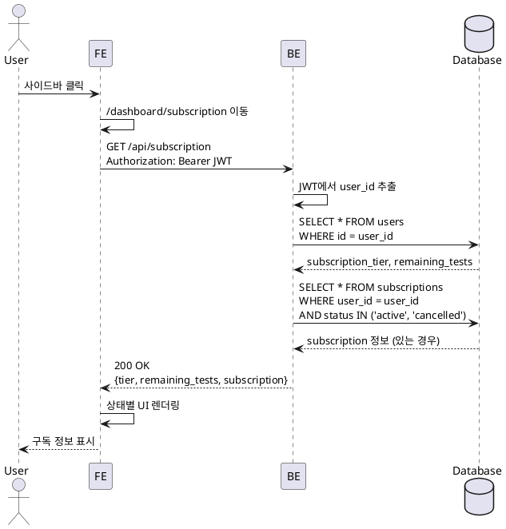
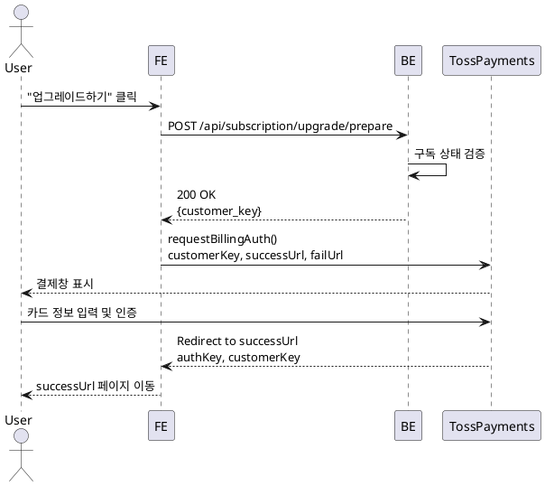
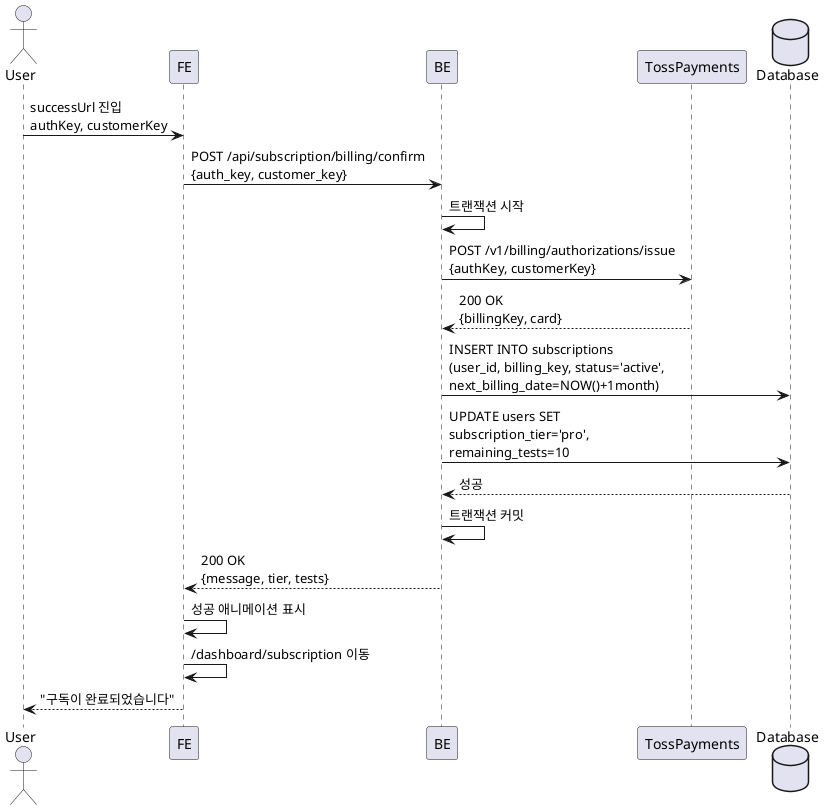
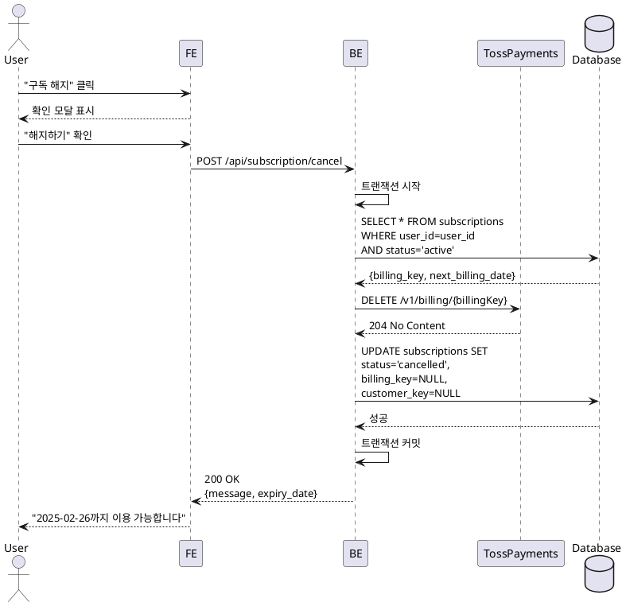
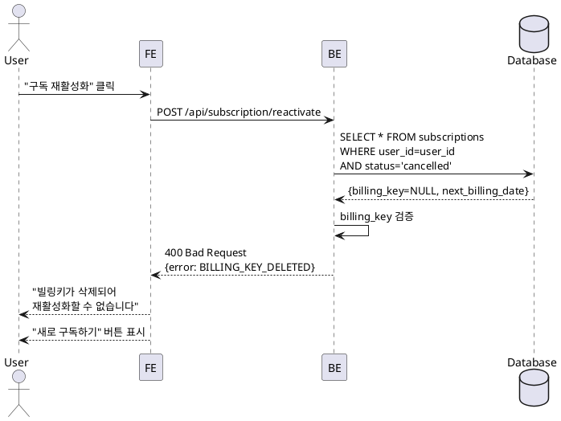

# 구독 관리 기능 상세 명세서

## 목차

1. [개요](#개요)
2. [SUB-VIEW: 구독 정보 조회](#sub-view-구독-정보-조회)
3. [SUB-UPGRADE: Pro 구독 신청](#sub-upgrade-pro-구독-신청)
4. [SUB-PAYMENT: 결제 완료 처리](#sub-payment-결제-완료-처리)
5. [SUB-CANCEL: 구독 해지](#sub-cancel-구독-해지)
6. [SUB-REACTIVATE: 해지 취소](#sub-reactivate-해지-취소)
7. [구독 상태 전이 다이어그램](#구독-상태-전이-다이어그램)
8. [시퀀스 다이어그램](#시퀀스-다이어그램)
9. [DB 스키마 영향](#db-스키마-영향)
10. [트랜잭션 보장 전략](#트랜잭션-보장-전략)

---

## 개요

### 목적
사용자의 구독 상태를 관리하고, Pro 요금제 업그레이드 및 해지를 처리하는 기능군입니다. 토스 페이먼츠 빌링키 방식의 정기결제를 지원합니다.

### 핵심 요구사항
- 무료 회원: 가입 시 3회 검사 제공 (gemini-2.5-flash)
- Pro 회원: 월 10회 검사 제공 (gemini-2.5-pro), 월 정기결제
- 구독 해지 시: 다음 결제일까지 서비스 유지, 빌링키 즉시 삭제
- 해지 취소: 다음 결제일 이전까지만 가능

### 구독 등급 정책

| 항목 | Free | Pro |
|------|------|-----|
| 월 검사 횟수 | 최초 3회 (소진 후 재충전 없음) | 10회 (매달 충전) |
| AI 모델 | gemini-2.5-flash | gemini-2.5-pro |
| 월 요금 | 0원 | 9,900원 |
| 결제 방식 | - | 빌링키 정기결제 |

---

## SUB-VIEW: 구독 정보 조회

### 기능 개요
사용자의 현재 구독 상태, 잔여 검사 횟수, 결제 정보를 조회하여 구독 관리 페이지에 표시합니다.

### Primary Actor
로그인된 사용자

### Precondition
- 사용자가 로그인 상태
- 구독 관리 페이지(`/dashboard/subscription`)에 접근

### Trigger
구독 관리 페이지 진입

### Main Scenario

1. 사용자가 사이드바의 사용자 정보 영역을 클릭
2. 시스템이 `/dashboard/subscription` 페이지로 라우팅
3. 페이지 컴포넌트가 마운트되며 구독 정보 조회 API 호출
4. 백엔드가 Clerk JWT에서 user_id 추출
5. `users` 테이블에서 `subscription_tier`, `remaining_tests` 조회
6. `subscriptions` 테이블에서 활성 구독 정보 조회 (있는 경우)
7. 구독 상태별 데이터 반환:
   - **Free**: 요금제, 잔여 횟수만 표시
   - **Pro (active)**: 요금제, 잔여 횟수, 다음 결제일, 카드 정보, 해지 버튼 표시
   - **Pro (cancelled)**: 요금제, 잔여 횟수, 만료일, 해지 취소 버튼 표시
8. 프론트엔드가 상태에 맞는 UI 렌더링

### Edge Cases

| 케이스 | 처리 방법 |
|--------|-----------|
| 인증 실패 | 로그인 페이지로 리다이렉트 |
| DB 조회 실패 | 에러 메시지 표시, 재시도 버튼 제공 |
| 구독 정보 불일치 | 로그 기록 후 users 테이블 우선 표시 |

### API 엔드포인트

#### GET /api/subscription

**Request Headers**
```
Authorization: Bearer <clerk_jwt>
```

**Response (200 OK) - Free User**
```json
{
  "subscription_tier": "free",
  "remaining_tests": 2,
  "subscription": null
}
```

**Response (200 OK) - Pro Active**
```json
{
  "subscription_tier": "pro",
  "remaining_tests": 7,
  "subscription": {
    "status": "active",
    "next_billing_date": "2025-02-26",
    "card_company": "신한카드",
    "card_number": "433012******1234"
  }
}
```

**Response (200 OK) - Pro Cancelled**
```json
{
  "subscription_tier": "pro",
  "remaining_tests": 5,
  "subscription": {
    "status": "cancelled",
    "next_billing_date": "2025-02-26",
    "card_company": "신한카드",
    "card_number": "433012******1234",
    "message": "2025-02-26까지 이용 가능"
  }
}
```

### UI 컴포넌트 구성

```
/dashboard/subscription
├─ SubscriptionHeader
│  ├─ CurrentPlanCard (현재 요금제, 잔여 횟수)
│  └─ BillingInfoCard (결제 정보, Pro만 표시)
├─ UpgradeSection (Free 사용자만 표시)
│  ├─ ProPlanFeatures
│  └─ UpgradeButton
└─ CancellationSection (Pro 사용자만 표시)
   ├─ CancelButton (active 상태)
   └─ ReactivateButton (cancelled 상태)
```

### Business Rules

1. **표시 우선순위**: users 테이블의 tier/tests가 항상 source of truth
2. **카드 정보 보안**: 마스킹된 카드번호만 표시 (뒤 4자리 제외)
3. **만료일 강조**: cancelled 상태에서 만료일까지 D-day 표시

---

## SUB-UPGRADE: Pro 구독 신청

### 기능 개요
무료 사용자가 Pro 요금제로 업그레이드하기 위해 토스 페이먼츠 결제창을 호출하고 빌링키를 발급받습니다.

### Primary Actor
무료 요금제 사용자

### Precondition
- 사용자가 로그인 상태
- 현재 구독 등급이 'free'
- 활성 구독이 존재하지 않음

### Trigger
"지금 업그레이드하기" 버튼 클릭

### Main Scenario

1. 사용자가 구독 관리 페이지에서 "지금 업그레이드하기" 클릭
2. 프론트엔드가 현재 구독 상태 확인 (이미 Pro인지 검증)
3. 토스 페이먼츠 SDK 초기화
4. `customerKey` 생성 (user_id 기반 UUID)
5. 빌링키 발급 요청 파라미터 생성:
   - customerKey
   - successUrl: `/dashboard/subscription/success`
   - failUrl: `/dashboard/subscription/fail`
6. 토스 페이먼츠 결제창 호출 (`requestBillingAuth()`)
7. 사용자가 카드 정보 입력 및 인증 완료
8. 성공 시 `successUrl`로 리다이렉트 (authKey 포함)
9. 실패 시 `failUrl`로 리다이렉트 (code, message 포함)

### Edge Cases

| 케이스 | 처리 방법 |
|--------|-----------|
| 이미 Pro 구독 중 | 알림 모달 표시, 업그레이드 버튼 비활성화 |
| 결제창 이탈 | 별도 처리 없음, 다시 시도 가능 |
| 네트워크 오류 | 에러 메시지 표시, 재시도 안내 |
| SDK 로드 실패 | Fallback UI 표시, 고객센터 안내 |

### 결제 SDK 연동 상세

#### 토스 페이먼츠 SDK 초기화

```typescript
import { loadTossPayments } from '@tosspayments/payment-sdk';

const clientKey = process.env.NEXT_PUBLIC_TOSS_CLIENT_KEY;
const tossPayments = await loadTossPayments(clientKey);
```

#### 빌링키 발급 요청

```typescript
const customerKey = `${userId}-${Date.now()}`;

await tossPayments.requestBillingAuth('카드', {
  customerKey,
  customerName: user.name,
  customerEmail: user.email,
  successUrl: `${window.location.origin}/dashboard/subscription/success`,
  failUrl: `${window.location.origin}/dashboard/subscription/fail`,
});
```

### API 엔드포인트

#### POST /api/subscription/upgrade/prepare

**목적**: 업그레이드 가능 여부 검증 및 customerKey 생성

**Request Headers**
```
Authorization: Bearer <clerk_jwt>
```

**Response (200 OK)**
```json
{
  "customer_key": "user_xxx-1738012800000",
  "can_upgrade": true
}
```

**Response (403 Forbidden)**
```json
{
  "error": "ALREADY_SUBSCRIBED",
  "message": "이미 Pro 요금제를 이용 중입니다"
}
```

### UI 컴포넌트 구성

```
UpgradeSection
├─ ProPlanCard
│  ├─ PlanTitle: "Pro 요금제"
│  ├─ Price: "월 9,900원"
│  ├─ Features:
│  │  ├─ "월 10회 검사 가능"
│  │  ├─ "고급 AI 모델 (gemini-2.5-pro)"
│  │  └─ "검사 이력 무제한 저장"
│  └─ Warning: "⚠️ 구독 후 환불이 불가능합니다"
└─ UpgradeButton
   ├─ Loading State
   └─ onClick → requestBillingAuth()
```

### Business Rules

1. **중복 구독 방지**: subscriptions 테이블에 active/cancelled 상태 존재 시 차단
2. **customerKey 유니크**: user_id + timestamp 조합으로 생성
3. **테스트 모드 표시**: 개발 환경에서는 "테스트 결제" 경고 배너 표시
4. **리다이렉트 URL**: 절대 경로 사용, origin 검증 필수

---

## SUB-PAYMENT: 결제 완료 처리

### 기능 개요
토스 페이먼츠 빌링키 발급 성공 후, 백엔드에서 빌링키를 확정하고 구독을 활성화합니다.

### Primary Actor
시스템 (토스 페이먼츠 리다이렉트 콜백)

### Precondition
- 사용자가 토스 페이먼츠 결제창에서 카드 인증 완료
- `authKey`와 `customerKey`가 URL 파라미터로 전달됨

### Trigger
토스 페이먼츠 `successUrl`로 리다이렉트

### Main Scenario

1. 토스 페이먼츠가 `successUrl`로 리다이렉트 (authKey, customerKey 포함)
2. 프론트엔드가 URL 파라미터 파싱
3. `POST /api/subscription/billing/confirm` API 호출 (authKey, customerKey 전달)
4. 백엔드가 트랜잭션 시작
5. 토스 페이먼츠 빌링키 발급 확정 API 호출:
   ```
   POST https://api.tosspayments.com/v1/billing/authorizations/issue
   Body: { authKey, customerKey }
   Header: Authorization: Basic {secretKey}
   ```
6. 응답에서 `billingKey`, `card.company`, `card.number` 추출
7. `subscriptions` 테이블에 INSERT:
   - user_id, customer_key, billing_key
   - card_company, card_number (마스킹됨)
   - status: 'active'
   - next_billing_date: 현재 날짜 + 1개월
8. `users` 테이블 UPDATE:
   - subscription_tier: 'pro'
   - remaining_tests: 10
9. 트랜잭션 커밋
10. 성공 응답 반환
11. 프론트엔드가 구독 관리 페이지로 리다이렉트, 성공 토스트 메시지 표시

### Edge Cases

| 케이스 | 처리 방법 |
|--------|-----------|
| authKey 만료 | 에러 메시지 표시, 처음부터 재시도 안내 |
| 빌링키 발급 실패 | 토스 에러 메시지 표시, 재시도 버튼 |
| DB 저장 실패 | 트랜잭션 롤백, 빌링키 삭제 요청 (보상 트랜잭션) |
| 중복 요청 | 이미 처리된 customerKey 검증, 409 Conflict 반환 |
| 네트워크 타임아웃 | 재시도 로직 (최대 3회), 실패 시 고객센터 안내 |

### API 엔드포인트

#### POST /api/subscription/billing/confirm

**Request Headers**
```
Authorization: Bearer <clerk_jwt>
```

**Request Body**
```json
{
  "customer_key": "user_xxx-1738012800000",
  "auth_key": "toss-auth-key-xxxx"
}
```

**Response (200 OK)**
```json
{
  "message": "구독이 완료되었습니다",
  "subscription_tier": "pro",
  "remaining_tests": 10,
  "next_billing_date": "2025-02-26"
}
```

**Response (400 Bad Request)**
```json
{
  "error": "BILLING_AUTH_FAILED",
  "message": "빌링키 발급에 실패했습니다",
  "details": {
    "code": "INVALID_AUTH_KEY",
    "message": "인증키가 만료되었습니다"
  }
}
```

**Response (409 Conflict)**
```json
{
  "error": "DUPLICATE_REQUEST",
  "message": "이미 처리된 요청입니다"
}
```

### 결제 SDK 연동 상세

#### 빌링키 발급 확정 API

```typescript
const response = await fetch('https://api.tosspayments.com/v1/billing/authorizations/issue', {
  method: 'POST',
  headers: {
    'Authorization': `Basic ${Buffer.from(secretKey + ':').toString('base64')}`,
    'Content-Type': 'application/json',
  },
  body: JSON.stringify({
    authKey,
    customerKey,
  }),
});

const billingData = await response.json();
// billingData.billingKey
// billingData.card.company
// billingData.card.number
```

### UI 컴포넌트 구성

```
/dashboard/subscription/success
└─ PaymentSuccessPage
   ├─ LoadingSpinner (API 호출 중)
   ├─ SuccessAnimation (완료 시)
   │  ├─ CheckIcon
   │  └─ "Pro 구독이 완료되었습니다"
   └─ RedirectMessage
      └─ "잠시 후 구독 관리 페이지로 이동합니다..."

/dashboard/subscription/fail
└─ PaymentFailPage
   ├─ ErrorIcon
   ├─ ErrorMessage (토스에서 전달한 메시지)
   └─ RetryButton → 다시 업그레이드하기
```

### Business Rules

1. **멱등성 보장**: 동일 customerKey로 중복 요청 시 이미 생성된 구독 정보 반환
2. **트랜잭션 원자성**: subscriptions INSERT와 users UPDATE는 단일 트랜잭션
3. **빌링키 보안**: 빌링키는 절대 프론트엔드로 노출하지 않음
4. **결제일 설정**: 현재 날짜 + 1개월 (예: 1/26 구독 → 2/26 첫 결제)
5. **보상 트랜잭션**: DB 저장 실패 시 발급된 빌링키 삭제 API 호출

---

## SUB-CANCEL: 구독 해지

### 기능 개요
활성 구독을 해지하고, 다음 결제일까지 Pro 서비스를 유지하며, 빌링키를 즉시 삭제합니다.

### Primary Actor
Pro 구독 사용자

### Precondition
- 사용자가 Pro 구독 중 (subscription_tier: 'pro')
- 구독 상태가 'active'
- 빌링키가 존재함

### Trigger
"구독 해지" 버튼 클릭 및 확인 대화상자 승인

### Main Scenario

1. 사용자가 구독 관리 페이지에서 "구독 해지" 버튼 클릭
2. 확인 모달 표시:
   - "구독을 해지하시겠습니까?"
   - "다음 결제일(YYYY-MM-DD)까지 이용 가능합니다"
   - "해지 후에도 결제일 전까지 취소할 수 있습니다"
3. 사용자가 "해지하기" 확인
4. `POST /api/subscription/cancel` API 호출
5. 백엔드가 트랜잭션 시작
6. `subscriptions` 테이블에서 활성 구독 조회 (user_id, status='active')
7. 토스 페이먼츠 빌링키 삭제 API 호출:
   ```
   DELETE https://api.tosspayments.com/v1/billing/{billingKey}
   ```
8. `subscriptions` 테이블 UPDATE:
   - status: 'cancelled'
   - billing_key: NULL
   - customer_key: NULL
9. `users` 테이블은 유지 (tier, tests 변경 없음)
10. 트랜잭션 커밋
11. 성공 응답 반환 (만료일 포함)
12. 프론트엔드가 성공 메시지 표시 및 UI 업데이트

### Edge Cases

| 케이스 | 처리 방법 |
|--------|-----------|
| 활성 구독 없음 | 400 에러 반환, "해지할 구독이 없습니다" |
| 이미 해지됨 | 400 에러 반환, "이미 해지된 구독입니다" |
| 빌링키 삭제 실패 | 로그 기록, DB는 업데이트 (보안상 중요) |
| 사용자 취소 | 모달 닫기, 아무 동작 없음 |

### API 엔드포인트

#### POST /api/subscription/cancel

**Request Headers**
```
Authorization: Bearer <clerk_jwt>
```

**Response (200 OK)**
```json
{
  "message": "구독이 취소되었습니다. 다음 결제일까지 이용 가능합니다",
  "expiry_date": "2025-02-26"
}
```

**Response (400 Bad Request)**
```json
{
  "error": "NO_ACTIVE_SUBSCRIPTION",
  "message": "해지할 구독이 없습니다"
}
```

### 결제 SDK 연동 상세

#### 빌링키 삭제 API

```typescript
await fetch(`https://api.tosspayments.com/v1/billing/${billingKey}`, {
  method: 'DELETE',
  headers: {
    'Authorization': `Basic ${Buffer.from(secretKey + ':').toString('base64')}`,
  },
});
```

### UI 컴포넌트 구성

```
CancellationSection
├─ CancelButton
│  └─ onClick → showCancelModal()
└─ CancelConfirmModal
   ├─ Title: "구독을 해지하시겠습니까?"
   ├─ Message:
   │  ├─ "2025-02-26까지 이용 가능합니다"
   │  └─ "해지 후에도 취소할 수 있습니다"
   ├─ CancelButton (회색)
   └─ ConfirmButton (빨강) → API 호출
```

### Business Rules

1. **즉시 해지 금지**: 구독 상태만 변경, tier/tests는 만료일까지 유지
2. **빌링키 즉시 삭제**: 다음 결제 방지를 위해 해지와 동시에 삭제
3. **재구독 필요**: 빌링키 삭제로 인해 재활성화 불가, 새로 구독 필요
4. **해지 취소 가능**: next_billing_date 이전까지만 취소 가능 (하지만 빌링키는 이미 삭제됨)
5. **감사 로그**: 해지 시각, 사유(사용자 요청) 기록

---

## SUB-REACTIVATE: 해지 취소

### 기능 개요
해지된 구독을 다시 활성화합니다. (현재 구조에서는 빌링키가 삭제되므로 실질적으로 불가능)

### Primary Actor
해지 예정 상태의 Pro 사용자

### Precondition
- 구독 상태가 'cancelled'
- 현재 날짜가 next_billing_date 이전
- ~~빌링키가 존재함~~ (실제로는 해지 시 삭제됨)

### Trigger
"구독 재활성화" 버튼 클릭

### Main Scenario (이론적)

1. 사용자가 "구독 재활성화" 버튼 클릭
2. `POST /api/subscription/reactivate` API 호출
3. 백엔드가 구독 조회 (status='cancelled', next_billing_date > today)
4. billing_key 존재 여부 확인
5. **만약 billing_key가 NULL이면**: 에러 반환
6. **만약 billing_key가 존재하면**:
   - status: 'active'로 변경
   - 성공 응답 반환

### Edge Cases

| 케이스 | 처리 방법 |
|--------|-----------|
| 빌링키 삭제됨 (현재 정책) | 400 에러, "새로 구독을 신청해주세요" |
| 만료일 경과 | 400 에러, "구독 기간이 만료되었습니다" |
| 활성 구독 | 400 에러, "이미 활성 상태입니다" |

### API 엔드포인트

#### POST /api/subscription/reactivate

**Request Headers**
```
Authorization: Bearer <clerk_jwt>
```

**Response (400 Bad Request) - 빌링키 삭제됨**
```json
{
  "error": "BILLING_KEY_DELETED",
  "message": "빌링키가 삭제되어 재활성화할 수 없습니다. 새로 구독을 신청해주세요"
}
```

**Response (400 Bad Request) - 만료됨**
```json
{
  "error": "SUBSCRIPTION_EXPIRED",
  "message": "구독 기간이 만료되어 재활성화할 수 없습니다"
}
```

### UI 컴포넌트 구성

```
CancellationSection (cancelled 상태)
├─ ExpiredDateBadge: "2025-02-26까지 이용 가능"
├─ ReactivateButton (비활성화)
│  └─ Tooltip: "빌링키가 삭제되어 재활성화할 수 없습니다"
└─ NewSubscriptionButton
   └─ "새로 구독하기" → 업그레이드 플로우
```

### Business Rules

1. **재활성화 불가 정책**: 현재 구조에서는 해지 시 빌링키 삭제로 인해 실질적으로 불가능
2. **대안 제시**: UI에서 "새로 구독하기" 버튼 제공
3. **만료일 검증**: 날짜 비교는 서버 시각 기준 (timezone: UTC)

---

## 구독 상태 전이 다이어그램

```
                     [회원가입]
                         ↓
                   ┌─────────┐
                   │  Free   │
                   │ (3 tests)│
                   └─────────┘
                         ↓ [업그레이드]
                         ↓
                   ┌─────────┐
            ┌──────│   Pro   │←─────┐
            │      │ (active)│      │ [정기결제 성공]
            │      └─────────┘      │
            │            ↓           │
            │      [사용자 해지]     │
            │            ↓           │
            │      ┌─────────┐      │
            │      │   Pro   │      │
            │      │(cancelled)│     │
            │      └─────────┘      │
            │            ↓           │
            │      [만료일 도래]     │
            ↓            ↓           │
       [결제 실패]  ┌─────────┐     │
            │       │   Free  │     │
            └──────→│(expired)│     │
                    └─────────┘     │
                         ↓          │
                    [재구독]────────┘
```

### 상태 정의

| 상태 | subscription_tier | subscription.status | 설명 |
|------|-------------------|---------------------|------|
| 무료 (초기) | free | null | 가입 직후, subscriptions 레코드 없음 |
| Pro 활성 | pro | active | 정상 이용 중, 정기결제 예정 |
| Pro 해지 예정 | pro | cancelled | 해지했지만 만료일까지 이용 가능 |
| Pro 만료 | free | expired | 만료일 경과, 등급 다운 |
| 결제 실패 | free | expired | 정기결제 실패로 인한 강제 해지 |

### 상태 전이 조건

1. **Free → Pro (active)**: 빌링키 발급 성공
2. **Pro (active) → Pro (cancelled)**: 사용자 해지 요청
3. **Pro (cancelled) → Free (expired)**: 만료일 경과 (Cron)
4. **Pro (active) → Free (expired)**: 정기결제 실패 (Cron)
5. **Free (expired) → Pro (active)**: 재구독 (새 빌링키 발급)

---

## 시퀀스 다이어그램

### SUB-VIEW: 구독 정보 조회



### SUB-UPGRADE: Pro 구독 신청



### SUB-PAYMENT: 결제 완료 처리



### SUB-CANCEL: 구독 해지



### SUB-REACTIVATE: 해지 취소



---

## DB 스키마 영향

### users 테이블

**영향 받는 컬럼**:
- `subscription_tier`: 'free' ↔ 'pro' 전환
- `remaining_tests`: 구독 시 10으로 초기화, 매달 충전

**변경 시점**:
- 빌링키 발급 확정 시: tier='pro', tests=10
- 구독 만료 시: tier='free', tests=0
- 정기결제 성공 시: tests=10

### subscriptions 테이블

**영향 받는 컬럼**:
- `status`: 'active' → 'cancelled' → 'expired'
- `billing_key`: 해지 시 NULL
- `customer_key`: 해지 시 NULL
- `next_billing_date`: 매달 갱신 또는 만료 시 NULL

**레코드 라이프사이클**:
1. INSERT: 빌링키 발급 시 (status='active')
2. UPDATE (해지): status='cancelled', billing_key=NULL
3. UPDATE (만료): status='expired', next_billing_date=NULL
4. SOFT DELETE: 만료 후 일정 기간 후 삭제 (선택적)

### payments 테이블

**레코드 생성 시점**:
- 정기결제 성공 시 (status='SUCCESS')
- 정기결제 실패 시 (status='FAILED')
- 수동 결제 시 (status='SUCCESS')

**주요 컬럼**:
- `order_id`: 유니크, 중복 결제 방지
- `payment_key`: 토스에서 발급
- `amount`: 9900 (고정)

---

## 트랜잭션 보장 전략

### 1. 빌링키 발급 트랜잭션 (SUB-PAYMENT)

**목표**: subscriptions INSERT + users UPDATE 원자성 보장

```typescript
await supabase.rpc('create_subscription_with_user_update', {
  p_user_id: userId,
  p_billing_key: billingKey,
  p_customer_key: customerKey,
  p_card_company: cardCompany,
  p_card_number: cardNumber,
});
```

**DB 함수 (PostgreSQL)**:
```sql
CREATE OR REPLACE FUNCTION create_subscription_with_user_update(
  p_user_id TEXT,
  p_billing_key TEXT,
  p_customer_key TEXT,
  p_card_company TEXT,
  p_card_number TEXT
) RETURNS VOID AS $$
BEGIN
  -- 1. subscriptions INSERT
  INSERT INTO subscriptions (
    user_id, billing_key, customer_key,
    card_company, card_number,
    status, next_billing_date
  ) VALUES (
    p_user_id, p_billing_key, p_customer_key,
    p_card_company, p_card_number,
    'active', CURRENT_DATE + INTERVAL '1 month'
  );

  -- 2. users UPDATE
  UPDATE users
  SET subscription_tier = 'pro',
      remaining_tests = 10,
      updated_at = NOW()
  WHERE id = p_user_id;

  -- 3. 트랜잭션 자동 커밋 (에러 시 자동 롤백)
END;
$$ LANGUAGE plpgsql;
```

### 2. 구독 해지 트랜잭션 (SUB-CANCEL)

**목표**: 토스 빌링키 삭제 + DB 업데이트

**전략**: Saga 패턴
1. 토스 빌링키 삭제 (외부 API)
2. 성공 시 DB 업데이트
3. DB 업데이트 실패 시 보상 트랜잭션 없음 (빌링키는 삭제된 상태 유지)

**이유**: 빌링키 삭제는 보안상 중요하므로 DB 실패해도 되돌리지 않음

```typescript
try {
  // 1. 토스 빌링키 삭제
  await deleteTossBillingKey(billingKey);

  // 2. DB 업데이트
  await supabase
    .from('subscriptions')
    .update({
      status: 'cancelled',
      billing_key: null,
      customer_key: null,
    })
    .eq('user_id', userId);
} catch (error) {
  if (error.source === 'database') {
    // DB 실패해도 빌링키는 삭제됨 (의도된 동작)
    logger.error('Subscription cancelled but DB update failed', { userId });
  }
  throw error;
}
```

### 3. 정기결제 트랜잭션 (CRON-BILLING)

**목표**: 결제 성공 시 payments 기록 + subscriptions 갱신 + users 충전

**전략**: 배치 트랜잭션 (각 구독별 독립적 처리)

```typescript
for (const subscription of subscriptions) {
  await supabase.rpc('process_subscription_billing', {
    p_subscription_id: subscription.id,
    p_billing_key: subscription.billing_key,
    p_amount: 9900,
  });
}
```

**DB 함수**:
```sql
CREATE OR REPLACE FUNCTION process_subscription_billing(
  p_subscription_id UUID,
  p_billing_key TEXT,
  p_amount INTEGER
) RETURNS JSONB AS $$
DECLARE
  v_user_id TEXT;
  v_payment_result JSONB;
BEGIN
  -- 1. 사용자 조회
  SELECT user_id INTO v_user_id
  FROM subscriptions
  WHERE id = p_subscription_id;

  -- 2. 외부 결제는 애플리케이션에서 처리 (RPC 호출 전)
  -- 여기서는 성공 가정

  -- 3. payments INSERT
  INSERT INTO payments (
    user_id, subscription_id, amount,
    status, paid_at
  ) VALUES (
    v_user_id, p_subscription_id, p_amount,
    'SUCCESS', NOW()
  );

  -- 4. subscriptions UPDATE
  UPDATE subscriptions
  SET next_billing_date = next_billing_date + INTERVAL '1 month'
  WHERE id = p_subscription_id;

  -- 5. users UPDATE
  UPDATE users
  SET remaining_tests = 10
  WHERE id = v_user_id;

  RETURN jsonb_build_object('status', 'success');
END;
$$ LANGUAGE plpgsql;
```

### 4. 멱등성 보장

#### 4.1 빌링키 발급 (customerKey 중복 방지)

```sql
-- subscriptions 테이블에 UNIQUE 제약
ALTER TABLE subscriptions
ADD CONSTRAINT uq_customer_key UNIQUE (customer_key);

-- 애플리케이션 레벨 체크
const existing = await supabase
  .from('subscriptions')
  .select('id')
  .eq('customer_key', customerKey)
  .single();

if (existing) {
  return { message: 'Already processed', subscription: existing };
}
```

#### 4.2 정기결제 Cron (날짜 기반 중복 방지)

```typescript
// 오늘 날짜 결제 처리 여부 확인
const today = new Date().toISOString().split('T')[0];
const processed = await supabase
  .from('payments')
  .select('id')
  .gte('paid_at', today)
  .eq('status', 'SUCCESS')
  .limit(1);

if (processed.data.length > 0) {
  return { error: 'ALREADY_PROCESSED' };
}
```

### 5. 에러 처리 및 롤백 전략

| 시나리오 | 전략 |
|---------|------|
| 토스 API 타임아웃 | 재시도 3회, 실패 시 사용자에게 안내 |
| DB 연결 실패 | 자동 재연결, 실패 시 에러 반환 |
| 트랜잭션 중 오류 | PostgreSQL 자동 롤백 |
| 빌링키 발급 후 DB 실패 | 보상 트랜잭션: 빌링키 삭제 API 호출 |
| 정기결제 실패 | payments 실패 기록, 구독 즉시 해지 |

### 6. 동시성 제어

#### 6.1 잔여 횟수 차감 (Optimistic Locking)

```sql
UPDATE users
SET remaining_tests = remaining_tests - 1,
    updated_at = NOW()
WHERE id = p_user_id
  AND remaining_tests > 0;  -- 조건부 업데이트

-- 영향받은 행 수 확인
GET DIAGNOSTICS rows_affected = ROW_COUNT;
IF rows_affected = 0 THEN
  RAISE EXCEPTION 'NO_TESTS_REMAINING';
END IF;
```

#### 6.2 구독 해지 (Row Lock)

```sql
SELECT * FROM subscriptions
WHERE user_id = p_user_id
  AND status = 'active'
FOR UPDATE;  -- 행 잠금
```

---

## 요약

### 핵심 플로우

1. **SUB-VIEW**: users + subscriptions 조회 → 상태별 UI 렌더링
2. **SUB-UPGRADE**: 토스 SDK 빌링키 발급 요청 → successUrl 리다이렉트
3. **SUB-PAYMENT**: 빌링키 확정 API → DB 트랜잭션 (subscriptions INSERT + users UPDATE)
4. **SUB-CANCEL**: 빌링키 삭제 API → DB 업데이트 (status='cancelled', billing_key=NULL)
5. **SUB-REACTIVATE**: 현재 정책상 불가능 (빌링키 삭제됨)

### 주요 고려사항

- **트랜잭션 원자성**: PostgreSQL 함수로 복합 업데이트 처리
- **멱등성**: customerKey UNIQUE, 날짜 기반 중복 방지
- **보안**: 빌링키는 백엔드에서만 접근, 프론트엔드 노출 금지
- **사용자 경험**: 해지 후 만료일까지 서비스 유지, 명확한 안내 메시지

### API 엔드포인트 목록

- `GET /api/subscription` - 구독 정보 조회
- `POST /api/subscription/upgrade/prepare` - 업그레이드 준비
- `POST /api/subscription/billing/confirm` - 빌링키 확정
- `POST /api/subscription/cancel` - 구독 해지
- `POST /api/subscription/reactivate` - 해지 취소 (실질적 불가)
