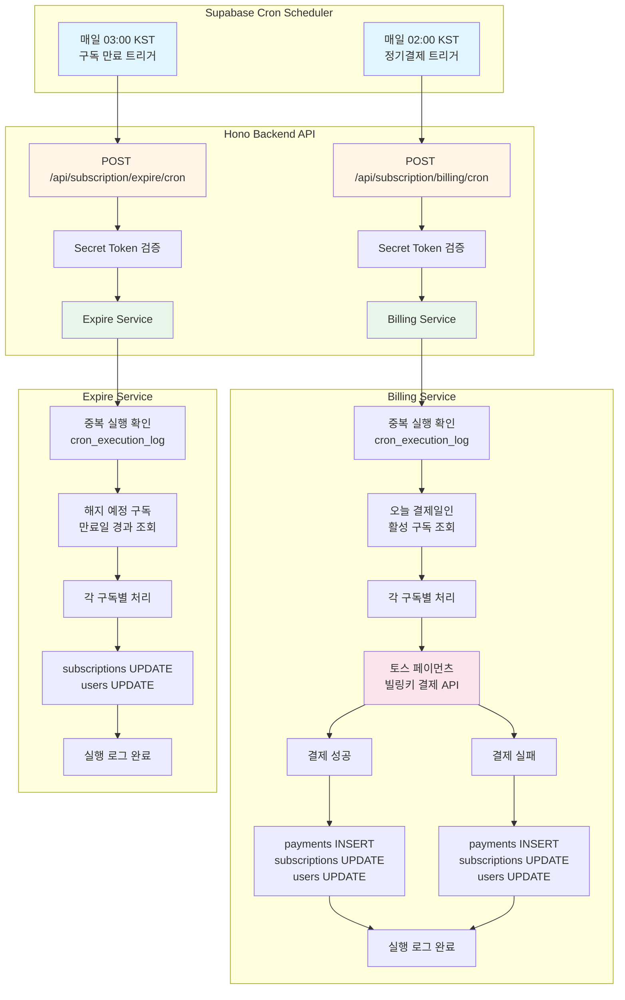
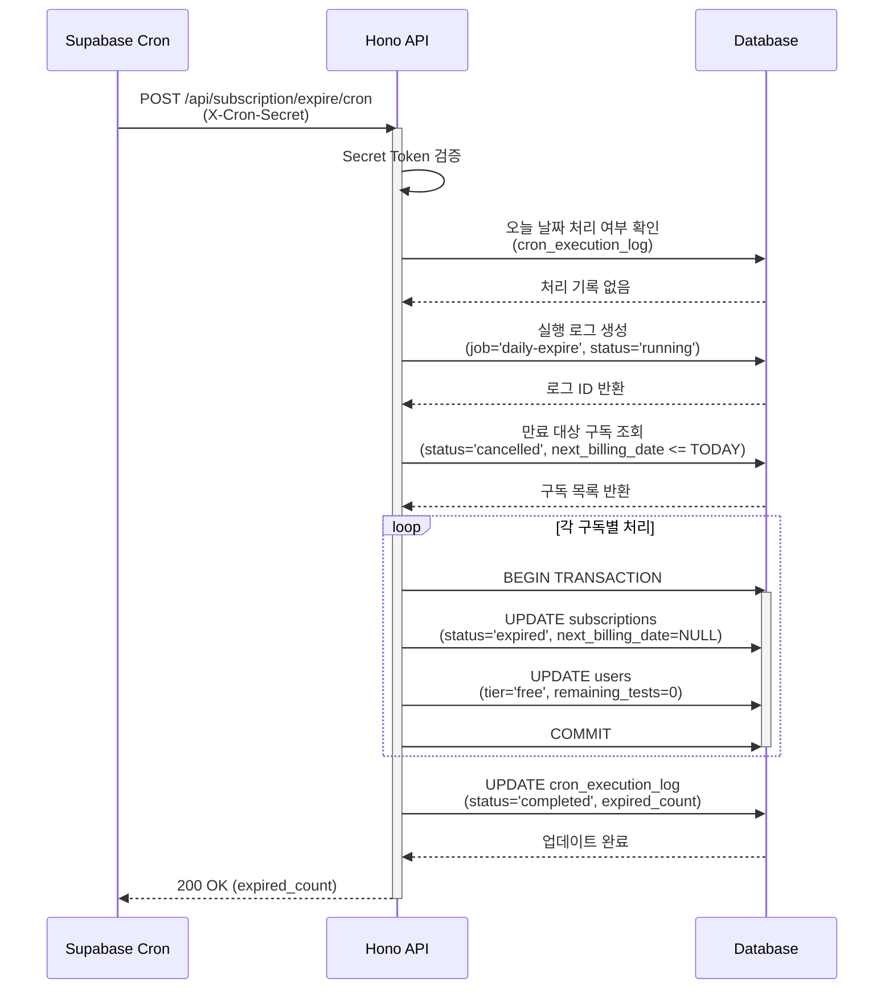

# 자동화 기능 구현 계획서 (정기결제 Cron, 구독 만료 처리)

## 개요

본 문서는 `docs/005/spec.md`에 명시된 자동화 기능(정기결제 자동화, 구독 만료 처리)을 구현하기 위한 모듈화 설계 계획입니다.

### 목표

1. **정기결제 자동화**: Supabase Cron을 이용해 매일 02:00에 결제일이 도래한 Pro 구독 사용자에 대해 토스 페이먼츠 빌링키 정기결제 API를 호출하고 결과를 처리
2. **구독 만료 처리**: 해지 예정 상태(`cancelled`)에서 만료일이 경과한 구독을 무료 등급으로 전환
3. **중복 실행 방지**: 멱등성 보장을 위한 실행 로그 관리
4. **에러 처리**: 결제 실패 시 구독 해지 및 사용자 등급 다운그레이드

### 모듈 위치 및 역할

| 모듈 | 위치 | 역할 |
|------|------|------|
| Cron 라우터 | `src/features/subscription/backend/route.ts` | Cron API 엔드포인트 정의 (인증, 요청 파라미터 검증) |
| Cron 서비스 | `src/features/subscription/backend/cronService.ts` | 정기결제 및 구독 만료 비즈니스 로직 |
| 토스 페이먼츠 클라이언트 | `src/features/subscription/backend/tossPayments.ts` | 토스 페이먼츠 API 호출 (빌링키 결제) |
| Cron 에러 코드 | `src/features/subscription/backend/cronError.ts` | Cron 작업 관련 에러 코드 정의 |
| Cron 스키마 | `src/features/subscription/backend/cronSchema.ts` | Cron 요청/응답 Zod 스키마 |
| Migration: Cron 실행 로그 | `supabase/migrations/20250126000004_create_cron_execution_log.sql` | 중복 실행 방지를 위한 실행 로그 테이블 |
| Migration: Supabase Cron 설정 | `supabase/migrations/20250126000005_setup_cron_jobs.sql` | Supabase pg_cron 스케줄 설정 |

---

## Diagram

### 시스템 아키텍처



### 정기결제 프로세스 시퀀스

```mermaid
sequenceDiagram
    participant Cron as Supabase Cron
    participant API as Hono API
    participant DB as Database
    participant Toss as 토스 페이먼츠

    Cron->>API: POST /api/subscription/billing/cron<br/>(X-Cron-Secret)
    activate API

    API->>API: Secret Token 검증
    API->>DB: 오늘 날짜 처리 여부 확인<br/>(cron_execution_log)
    DB-->>API: 처리 기록 없음

    API->>DB: 실행 로그 생성<br/>(status='running')
    DB-->>API: 로그 ID 반환

    API->>DB: 오늘 결제일인 활성 구독 조회<br/>(status='active', next_billing_date=TODAY)
    DB-->>API: 구독 목록 반환

    loop 각 구독별 처리
        API->>API: 주문번호 생성

        API->>Toss: POST /v1/billing/{billingKey}<br/>(amount, orderId, customerKey)
        activate Toss

        alt 결제 성공
            Toss-->>API: 200 OK (paymentKey)
            deactivate Toss

            API->>DB: BEGIN TRANSACTION
            activate DB
            API->>DB: INSERT payments<br/>(status='SUCCESS', payment_key)
            API->>DB: UPDATE subscriptions<br/>(next_billing_date +1개월)
            API->>DB: UPDATE users<br/>(remaining_tests=10)
            API->>DB: COMMIT
            deactivate DB

        else 결제 실패
            Toss-->>API: 400/500 Error<br/>(error_code, message)
            deactivate Toss

            API->>DB: BEGIN TRANSACTION
            activate DB
            API->>DB: INSERT payments<br/>(status='FAILED', error_code)
            API->>DB: UPDATE subscriptions<br/>(status='expired', billing_key=NULL)
            API->>DB: UPDATE users<br/>(tier='free', tests=0)
            API->>DB: COMMIT
            deactivate DB
        end
    end

    API->>DB: UPDATE cron_execution_log<br/>(status='completed', counts)
    DB-->>API: 업데이트 완료

    API-->>Cron: 200 OK (results)
    deactivate API
```

### 구독 만료 프로세스 시퀀스



---

## Implementation Plan

### 1. Database Layer

#### 1.1 Migration: Cron 실행 로그 테이블

**파일**: `supabase/migrations/20250126000004_create_cron_execution_log.sql`

**목적**: 중복 실행 방지 및 실행 이력 관리

**스키마**:
```sql
CREATE TABLE IF NOT EXISTS cron_execution_log (
  id UUID PRIMARY KEY DEFAULT gen_random_uuid(),
  job_name TEXT NOT NULL,
  execution_date DATE NOT NULL,
  status TEXT NOT NULL CHECK (status IN ('running', 'completed', 'failed')),
  processed_count INTEGER DEFAULT 0,
  success_count INTEGER DEFAULT 0,
  failure_count INTEGER DEFAULT 0,
  error_message TEXT,
  execution_time_ms INTEGER,
  created_at TIMESTAMP WITH TIME ZONE DEFAULT NOW(),
  completed_at TIMESTAMP WITH TIME ZONE,
  UNIQUE(job_name, execution_date)
);
```

**테스트 시나리오**:
- TC-1: 같은 날짜에 동일 job_name으로 INSERT 시도 시 UNIQUE 제약 위반 확인
- TC-2: status 컬럼에 'invalid' 값 INSERT 시 CHECK 제약 위반 확인

#### 1.2 Migration: Supabase Cron 설정

**파일**: `supabase/migrations/20250126000005_setup_cron_jobs.sql`

**목적**: pg_cron 확장을 이용한 정기 작업 스케줄링

**내용**:
```sql
-- pg_cron 및 pg_net 확장 활성화
CREATE EXTENSION IF NOT EXISTS pg_cron;
CREATE EXTENSION IF NOT EXISTS pg_net;

-- 정기결제 Cron Job (매일 02:00 KST = UTC 17:00 전날)
SELECT cron.schedule(
  'recurring-payment-trigger',
  '0 17 * * *', -- UTC 17:00 = KST 익일 02:00
  $$
  SELECT net.http_post(
    url := 'https://your-domain.com/api/subscription/billing/cron',
    headers := jsonb_build_object(
      'Content-Type', 'application/json',
      'X-Cron-Secret', 'your-cron-secret-token-here'
    ),
    body := jsonb_build_object('timestamp', now()),
    timeout_milliseconds := 30000
  ) AS request_id;
  $$
);

-- 구독 만료 처리 Cron Job (매일 03:00 KST = UTC 18:00 전날)
SELECT cron.schedule(
  'subscription-expire-trigger',
  '0 18 * * *', -- UTC 18:00 = KST 익일 03:00
  $$
  SELECT net.http_post(
    url := 'https://your-domain.com/api/subscription/expire/cron',
    headers := jsonb_build_object(
      'Content-Type', 'application/json',
      'X-Cron-Secret', 'your-cron-secret-token-here'
    ),
    body := jsonb_build_object('timestamp', now()),
    timeout_milliseconds := 30000
  ) AS request_id;
  $$
);
```

**주의사항**:
- `your-domain.com`을 실제 배포 도메인으로 변경
- `your-cron-secret-token-here`를 환경변수 `CRON_SECRET_TOKEN`과 동일한 값으로 변경
- 타임존: Supabase Cron은 UTC 기준이므로 한국 시간(KST = UTC+9) 고려

---

### 2. Backend Layer

#### 2.1 토스 페이먼츠 클라이언트

**파일**: `src/features/subscription/backend/tossPayments.ts`

**역할**: 토스 페이먼츠 빌링키 결제 API 호출

**구현**:
```typescript
/**
 * 토스 페이먼츠 빌링키 결제 API 클라이언트
 */

const TOSS_API_BASE = 'https://api.tosspayments.com';

export type TossPaymentResult = {
  paymentKey: string;
  orderId: string;
  status: string;
  approvedAt: string;
};

export type TossPaymentError = {
  code: string;
  message: string;
};

/**
 * 빌링키를 이용한 정기결제 승인
 *
 * @param billingKey - 토스 빌링키
 * @param customerKey - 토스 customerKey
 * @param amount - 결제 금액 (원)
 * @param orderId - 주문 번호 (고유값)
 * @param orderName - 주문명
 * @returns 결제 성공 시 paymentKey 포함 결과, 실패 시 에러 throw
 */
export const chargeBilling = async (
  billingKey: string,
  customerKey: string,
  amount: number,
  orderId: string,
  orderName: string,
): Promise<TossPaymentResult> => {
  const secretKey = process.env.TOSS_SECRET_KEY;
  if (!secretKey) {
    throw new Error('TOSS_SECRET_KEY is not configured');
  }

  const auth = Buffer.from(`${secretKey}:`).toString('base64');

  const response = await fetch(`${TOSS_API_BASE}/v1/billing/${billingKey}`, {
    method: 'POST',
    headers: {
      Authorization: `Basic ${auth}`,
      'Content-Type': 'application/json',
    },
    body: JSON.stringify({
      customerKey,
      amount,
      orderId,
      orderName,
    }),
  });

  const data = await response.json();

  if (!response.ok) {
    const error = data as TossPaymentError;
    throw new Error(`토스 결제 실패 [${error.code}]: ${error.message}`);
  }

  return data as TossPaymentResult;
};
```

**단위 테스트**:
- TC-1: 유효한 빌링키로 결제 시도 시 성공 응답 확인
- TC-2: 만료된 빌링키로 결제 시도 시 에러 throw 확인
- TC-3: TOSS_SECRET_KEY 미설정 시 에러 throw 확인

#### 2.2 Cron 에러 코드

**파일**: `src/features/subscription/backend/cronError.ts`

**역할**: Cron 작업 관련 에러 코드 정의

**구현**:
```typescript
export const cronErrorCodes = {
  unauthorized: 'CRON_UNAUTHORIZED',
  alreadyProcessed: 'CRON_ALREADY_PROCESSED',
  executionFailed: 'CRON_EXECUTION_FAILED',
  billingFetchError: 'BILLING_FETCH_ERROR',
  billingUpdateError: 'BILLING_UPDATE_ERROR',
  expireFetchError: 'EXPIRE_FETCH_ERROR',
  expireUpdateError: 'EXPIRE_UPDATE_ERROR',
} as const;

type CronErrorValue = (typeof cronErrorCodes)[keyof typeof cronErrorCodes];

export type CronServiceError = CronErrorValue;
```

#### 2.3 Cron 스키마

**파일**: `src/features/subscription/backend/cronSchema.ts`

**역할**: Cron 요청/응답 Zod 스키마 정의

**구현**:
```typescript
import { z } from 'zod';

/**
 * Cron 요청 스키마
 */
export const CronRequestSchema = z.object({
  timestamp: z.string().datetime(),
});

export type CronRequest = z.infer<typeof CronRequestSchema>;

/**
 * 정기결제 Cron 결과 스키마
 */
export const BillingResultSchema = z.object({
  userId: z.string(),
  subscriptionId: z.string().uuid(),
  status: z.enum(['success', 'failed']),
  paymentId: z.string().uuid().optional(),
  nextBillingDate: z.string().optional(),
  errorCode: z.string().optional(),
  errorMessage: z.string().optional(),
});

export type BillingResult = z.infer<typeof BillingResultSchema>;

/**
 * 정기결제 Cron 응답 스키마
 */
export const BillingCronResponseSchema = z.object({
  success: z.boolean(),
  message: z.string(),
  processedCount: z.number(),
  successCount: z.number(),
  failureCount: z.number(),
  results: z.array(BillingResultSchema),
  executionTimeMs: z.number(),
});

export type BillingCronResponse = z.infer<typeof BillingCronResponseSchema>;

/**
 * 구독 만료 Cron 결과 스키마
 */
export const ExpireResultSchema = z.object({
  userId: z.string(),
  subscriptionId: z.string().uuid(),
  expiredDate: z.string(),
  newTier: z.enum(['free']),
  newRemainingTests: z.number(),
});

export type ExpireResult = z.infer<typeof ExpireResultSchema>;

/**
 * 구독 만료 Cron 응답 스키마
 */
export const ExpireCronResponseSchema = z.object({
  success: z.boolean(),
  message: z.string(),
  expiredCount: z.number(),
  results: z.array(ExpireResultSchema),
  executionTimeMs: z.number(),
});

export type ExpireCronResponse = z.infer<typeof ExpireCronResponseSchema>;
```

#### 2.4 Cron 서비스

**파일**: `src/features/subscription/backend/cronService.ts`

**역할**: 정기결제 및 구독 만료 비즈니스 로직

**구현**:
```typescript
import type { SupabaseClient } from '@supabase/supabase-js';
import { chargeBilling } from './tossPayments';
import type { BillingResult, ExpireResult } from './cronSchema';
import {
  failure,
  success,
  type HandlerResult,
} from '@/backend/http/response';
import { cronErrorCodes, type CronServiceError } from './cronError';

const PRO_SUBSCRIPTION_AMOUNT = 9900; // Pro 요금제 금액 (원)
const PRO_MONTHLY_TESTS = 10; // Pro 요금제 월 검사 횟수

/**
 * 중복 실행 방지: 오늘 날짜에 이미 실행된 작업인지 확인
 */
const checkDuplicateExecution = async (
  client: SupabaseClient,
  jobName: string,
): Promise<{ isDuplicate: boolean; logId: string | null }> => {
  const today = new Date().toISOString().split('T')[0];

  const { data: existingLog } = await client
    .from('cron_execution_log')
    .select('id, status')
    .eq('job_name', jobName)
    .eq('execution_date', today)
    .maybeSingle();

  if (existingLog) {
    return { isDuplicate: true, logId: existingLog.id };
  }

  // 실행 로그 생성
  const { data: newLog, error } = await client
    .from('cron_execution_log')
    .insert({
      job_name: jobName,
      execution_date: today,
      status: 'running',
    })
    .select('id')
    .single();

  if (error) {
    throw new Error(`실행 로그 생성 실패: ${error.message}`);
  }

  return { isDuplicate: false, logId: newLog.id };
};

/**
 * 실행 로그 완료 처리
 */
const completeExecutionLog = async (
  client: SupabaseClient,
  logId: string,
  status: 'completed' | 'failed',
  counts: {
    processedCount?: number;
    successCount?: number;
    failureCount?: number;
  },
  executionTimeMs: number,
  errorMessage?: string,
): Promise<void> => {
  await client
    .from('cron_execution_log')
    .update({
      status,
      processed_count: counts.processedCount ?? 0,
      success_count: counts.successCount ?? 0,
      failure_count: counts.failureCount ?? 0,
      execution_time_ms: executionTimeMs,
      error_message: errorMessage,
      completed_at: new Date().toISOString(),
    })
    .eq('id', logId);
};

/**
 * 정기결제 자동화 서비스
 *
 * 오늘이 결제일인 활성 구독에 대해 토스 페이먼츠 빌링키 결제를 수행하고,
 * 결제 성공 시 구독 연장 및 횟수 초기화,
 * 결제 실패 시 구독 해지 및 등급 다운그레이드
 */
export const processBillingCron = async (
  client: SupabaseClient,
): Promise<
  HandlerResult<
    {
      processedCount: number;
      successCount: number;
      failureCount: number;
      results: BillingResult[];
      executionTimeMs: number;
    },
    CronServiceError,
    unknown
  >
> => {
  const startTime = Date.now();
  const jobName = 'recurring-payment-trigger';

  // 중복 실행 확인
  const { isDuplicate, logId } = await checkDuplicateExecution(
    client,
    jobName,
  );

  if (isDuplicate || !logId) {
    return failure(
      409,
      cronErrorCodes.alreadyProcessed,
      '오늘 날짜의 정기결제가 이미 처리되었습니다.',
    );
  }

  try {
    const today = new Date().toISOString().split('T')[0];

    // 오늘이 결제일인 활성 구독 조회
    const { data: subscriptions, error: fetchError } = await client
      .from('subscriptions')
      .select('id, user_id, billing_key, customer_key, next_billing_date')
      .eq('status', 'active')
      .eq('next_billing_date', today);

    if (fetchError) {
      throw new Error(`구독 조회 실패: ${fetchError.message}`);
    }

    const results: BillingResult[] = [];
    let successCount = 0;
    let failureCount = 0;

    for (const sub of subscriptions || []) {
      const orderId = `AUTO_${Date.now()}_${sub.user_id}`;

      try {
        // 토스 페이먼츠 빌링키 결제 시도
        const payment = await chargeBilling(
          sub.billing_key,
          sub.customer_key,
          PRO_SUBSCRIPTION_AMOUNT,
          orderId,
          'Pro 요금제 월 구독',
        );

        // 결제 성공: payments, subscriptions, users 테이블 업데이트
        const nextBillingDate = new Date(sub.next_billing_date);
        nextBillingDate.setMonth(nextBillingDate.getMonth() + 1);
        const nextBillingDateStr = nextBillingDate
          .toISOString()
          .split('T')[0];

        const { data: paymentRecord, error: paymentError } = await client
          .from('payments')
          .insert({
            user_id: sub.user_id,
            subscription_id: sub.id,
            payment_key: payment.paymentKey,
            order_id: orderId,
            amount: PRO_SUBSCRIPTION_AMOUNT,
            status: 'SUCCESS',
            method: 'cron_auto_billing',
            paid_at: new Date().toISOString(),
          })
          .select('id')
          .single();

        if (paymentError) {
          throw new Error(`결제 기록 저장 실패: ${paymentError.message}`);
        }

        await client
          .from('subscriptions')
          .update({ next_billing_date: nextBillingDateStr })
          .eq('id', sub.id);

        await client
          .from('users')
          .update({ remaining_tests: PRO_MONTHLY_TESTS })
          .eq('id', sub.user_id);

        results.push({
          userId: sub.user_id,
          subscriptionId: sub.id,
          status: 'success',
          paymentId: paymentRecord.id,
          nextBillingDate: nextBillingDateStr,
        });

        successCount++;
      } catch (error: any) {
        // 결제 실패: 구독 해지 및 사용자 다운그레이드
        await client.from('payments').insert({
          user_id: sub.user_id,
          subscription_id: sub.id,
          order_id: orderId,
          amount: PRO_SUBSCRIPTION_AMOUNT,
          status: 'FAILED',
          method: 'cron_auto_billing',
          error_code: error.code || 'UNKNOWN',
          error_message: error.message,
        });

        await client
          .from('subscriptions')
          .update({
            status: 'expired',
            billing_key: null,
            customer_key: null,
            next_billing_date: null,
          })
          .eq('id', sub.id);

        await client
          .from('users')
          .update({
            subscription_tier: 'free',
            remaining_tests: 0,
          })
          .eq('id', sub.user_id);

        results.push({
          userId: sub.user_id,
          subscriptionId: sub.id,
          status: 'failed',
          errorCode: error.code || 'UNKNOWN',
          errorMessage: error.message,
        });

        failureCount++;
      }
    }

    const executionTimeMs = Date.now() - startTime;

    // 실행 로그 완료 처리
    await completeExecutionLog(
      client,
      logId,
      'completed',
      {
        processedCount: (subscriptions || []).length,
        successCount,
        failureCount,
      },
      executionTimeMs,
    );

    return success({
      processedCount: (subscriptions || []).length,
      successCount,
      failureCount,
      results,
      executionTimeMs,
    });
  } catch (error: any) {
    const executionTimeMs = Date.now() - startTime;

    // 실행 로그 실패 처리
    await completeExecutionLog(
      client,
      logId,
      'failed',
      {},
      executionTimeMs,
      error.message,
    );

    return failure(
      500,
      cronErrorCodes.executionFailed,
      `정기결제 실행 실패: ${error.message}`,
    );
  }
};

/**
 * 구독 만료 자동화 서비스
 *
 * 해지 예정(cancelled) 상태에서 만료일이 경과한 구독을 expired로 변경하고,
 * 사용자를 무료 등급으로 전환
 */
export const processExpireCron = async (
  client: SupabaseClient,
): Promise<
  HandlerResult<
    {
      expiredCount: number;
      results: ExpireResult[];
      executionTimeMs: number;
    },
    CronServiceError,
    unknown
  >
> => {
  const startTime = Date.now();
  const jobName = 'subscription-expire-trigger';

  // 중복 실행 확인
  const { isDuplicate, logId } = await checkDuplicateExecution(
    client,
    jobName,
  );

  if (isDuplicate || !logId) {
    return failure(
      409,
      cronErrorCodes.alreadyProcessed,
      '오늘 날짜의 구독 만료 처리가 이미 완료되었습니다.',
    );
  }

  try {
    const today = new Date().toISOString().split('T')[0];

    // 해지 예정 상태에서 만료일이 경과한 구독 조회
    const { data: subscriptions, error: fetchError } = await client
      .from('subscriptions')
      .select('id, user_id, next_billing_date')
      .eq('status', 'cancelled')
      .lte('next_billing_date', today);

    if (fetchError) {
      throw new Error(`만료 대상 조회 실패: ${fetchError.message}`);
    }

    const results: ExpireResult[] = [];

    for (const sub of subscriptions || []) {
      // subscriptions 테이블 만료 처리
      await client
        .from('subscriptions')
        .update({
          status: 'expired',
          next_billing_date: null,
        })
        .eq('id', sub.id);

      // users 테이블 다운그레이드
      await client
        .from('users')
        .update({
          subscription_tier: 'free',
          remaining_tests: 0,
        })
        .eq('id', sub.user_id);

      results.push({
        userId: sub.user_id,
        subscriptionId: sub.id,
        expiredDate: sub.next_billing_date,
        newTier: 'free',
        newRemainingTests: 0,
      });
    }

    const executionTimeMs = Date.now() - startTime;

    // 실행 로그 완료 처리
    await completeExecutionLog(
      client,
      logId,
      'completed',
      {
        processedCount: (subscriptions || []).length,
      },
      executionTimeMs,
    );

    return success({
      expiredCount: (subscriptions || []).length,
      results,
      executionTimeMs,
    });
  } catch (error: any) {
    const executionTimeMs = Date.now() - startTime;

    // 실행 로그 실패 처리
    await completeExecutionLog(
      client,
      logId,
      'failed',
      {},
      executionTimeMs,
      error.message,
    );

    return failure(
      500,
      cronErrorCodes.executionFailed,
      `구독 만료 처리 실패: ${error.message}`,
    );
  }
};
```

**단위 테스트**:
- TC-1: 정기결제 성공 시 subscriptions, users, payments 업데이트 확인
- TC-2: 정기결제 실패 시 구독 해지 및 등급 다운그레이드 확인
- TC-3: 중복 실행 시 ALREADY_PROCESSED 에러 반환 확인
- TC-4: 구독 만료 처리 시 만료일 경과한 구독만 처리 확인

#### 2.5 Cron 라우터

**파일**: `src/features/subscription/backend/route.ts` (기존 파일에 추가)

**역할**: Cron API 엔드포인트 정의 및 인증

**구현**:
```typescript
import type { Hono } from 'hono';
import {
  getLogger,
  getSupabase,
  type AppEnv,
} from '@/backend/hono/context';
import { failure, respond } from '@/backend/http/response';
import { CronRequestSchema } from './cronSchema';
import { processBillingCron, processExpireCron } from './cronService';
import { cronErrorCodes } from './cronError';

/**
 * 구독 관련 라우터 등록
 *
 * (기존 구독 관련 API와 함께 정의)
 */
export const registerSubscriptionRoutes = (app: Hono<AppEnv>) => {
  // ... (기존 구독 API)

  /**
   * 정기결제 Cron 엔드포인트
   *
   * POST /api/subscription/billing/cron
   * Header: X-Cron-Secret
   * Body: { timestamp: "2025-01-26T02:00:00Z" }
   */
  app.post('/subscription/billing/cron', async (c) => {
    const logger = getLogger(c);
    const supabase = getSupabase(c);

    // Secret Token 검증
    const cronSecret = c.req.header('X-Cron-Secret');
    const expectedSecret = process.env.CRON_SECRET_TOKEN;

    if (!cronSecret || cronSecret !== expectedSecret) {
      logger.error('Cron 인증 실패: Invalid secret token');
      return respond(
        c,
        failure(401, cronErrorCodes.unauthorized, '인증 실패'),
      );
    }

    // 요청 본문 검증
    const body = await c.req.json();
    const parsedBody = CronRequestSchema.safeParse(body);

    if (!parsedBody.success) {
      return respond(
        c,
        failure(
          400,
          cronErrorCodes.executionFailed,
          '요청 본문이 유효하지 않습니다.',
          parsedBody.error.format(),
        ),
      );
    }

    logger.log('정기결제 Cron 시작', { timestamp: parsedBody.data.timestamp });

    // 정기결제 서비스 실행
    const result = await processBillingCron(supabase);

    if (!result.ok) {
      logger.error('정기결제 Cron 실패', result.error);
      return respond(c, result);
    }

    logger.log('정기결제 Cron 완료', {
      processedCount: result.data.processedCount,
      successCount: result.data.successCount,
      failureCount: result.data.failureCount,
      executionTimeMs: result.data.executionTimeMs,
    });

    return respond(c, result);
  });

  /**
   * 구독 만료 Cron 엔드포인트
   *
   * POST /api/subscription/expire/cron
   * Header: X-Cron-Secret
   * Body: { timestamp: "2025-01-26T03:00:00Z" }
   */
  app.post('/subscription/expire/cron', async (c) => {
    const logger = getLogger(c);
    const supabase = getSupabase(c);

    // Secret Token 검증
    const cronSecret = c.req.header('X-Cron-Secret');
    const expectedSecret = process.env.CRON_SECRET_TOKEN;

    if (!cronSecret || cronSecret !== expectedSecret) {
      logger.error('Cron 인증 실패: Invalid secret token');
      return respond(
        c,
        failure(401, cronErrorCodes.unauthorized, '인증 실패'),
      );
    }

    // 요청 본문 검증
    const body = await c.req.json();
    const parsedBody = CronRequestSchema.safeParse(body);

    if (!parsedBody.success) {
      return respond(
        c,
        failure(
          400,
          cronErrorCodes.executionFailed,
          '요청 본문이 유효하지 않습니다.',
          parsedBody.error.format(),
        ),
      );
    }

    logger.log('구독 만료 Cron 시작', { timestamp: parsedBody.data.timestamp });

    // 구독 만료 서비스 실행
    const result = await processExpireCron(supabase);

    if (!result.ok) {
      logger.error('구독 만료 Cron 실패', result.error);
      return respond(c, result);
    }

    logger.log('구독 만료 Cron 완료', {
      expiredCount: result.data.expiredCount,
      executionTimeMs: result.data.executionTimeMs,
    });

    return respond(c, result);
  });
};
```

**QA Sheet**:

| 테스트 항목 | 시나리오 | 예상 결과 |
|------------|---------|----------|
| TC-1 | 유효한 Secret Token으로 정기결제 Cron 호출 | 200 OK, 결제 처리 결과 반환 |
| TC-2 | 잘못된 Secret Token으로 Cron 호출 | 401 Unauthorized |
| TC-3 | Secret Token 없이 Cron 호출 | 401 Unauthorized |
| TC-4 | 오늘 날짜에 이미 실행된 Cron 재호출 | 409 Conflict, ALREADY_PROCESSED |
| TC-5 | 결제일이 오늘인 활성 구독이 없을 때 | 200 OK, processedCount: 0 |
| TC-6 | 결제 성공 시 subscriptions, users, payments 업데이트 확인 | DB 업데이트 확인 |
| TC-7 | 결제 실패 시 구독 해지 및 등급 다운그레이드 확인 | DB 업데이트 확인 |
| TC-8 | 구독 만료 Cron 호출 시 만료일 경과한 구독만 처리 | 대상 구독만 만료 처리 |

#### 2.6 Hono App에 라우터 등록

**파일**: `src/backend/hono/app.ts` (기존 파일 수정)

**수정 내용**:
```typescript
import { Hono } from 'hono';
import { errorBoundary } from '@/backend/middleware/error';
import { withAppContext } from '@/backend/middleware/context';
import { withSupabase } from '@/backend/middleware/supabase';
import { registerExampleRoutes } from '@/features/example/backend/route';
import { registerSubscriptionRoutes } from '@/features/subscription/backend/route'; // 추가
import type { AppEnv } from '@/backend/hono/context';

let singletonApp: Hono<AppEnv> | null = null;

export const createHonoApp = () => {
  if (singletonApp) {
    return singletonApp;
  }

  const app = new Hono<AppEnv>();

  app.use('*', errorBoundary());
  app.use('*', withAppContext());
  app.use('*', withSupabase());

  registerExampleRoutes(app);
  registerSubscriptionRoutes(app); // 추가

  singletonApp = app;

  return app;
};
```

---

### 3. 환경 변수 설정

**파일**: `.env.local` (또는 `.env`)

**추가 필요한 환경 변수**:
```env
# 토스 페이먼츠 Secret Key
TOSS_SECRET_KEY=test_sk_xxxxxxxxxxxxxxxxxxxxxxxxxxxx

# Supabase Cron Secret Token (랜덤 생성 권장)
CRON_SECRET_TOKEN=your-random-secret-token-here
```

**주의사항**:
- `CRON_SECRET_TOKEN`은 충분히 복잡한 랜덤 문자열로 설정 (최소 32자 권장)
- Supabase Cron SQL에서도 동일한 값 사용

---

### 4. 배포 체크리스트

#### 4.1 개발 환경

- [ ] `supabase/migrations/20250126000004_create_cron_execution_log.sql` 실행
- [ ] `supabase/migrations/20250126000005_setup_cron_jobs.sql` 실행 (URL과 Secret Token 수정 후)
- [ ] `.env.local`에 `TOSS_SECRET_KEY`, `CRON_SECRET_TOKEN` 설정
- [ ] `src/features/subscription/backend/` 모듈 생성
- [ ] `src/backend/hono/app.ts`에 라우터 등록
- [ ] Postman/cURL로 Cron API 수동 테스트

#### 4.2 프로덕션 환경

- [ ] 환경변수 `TOSS_SECRET_KEY` (live 키로 변경)
- [ ] 환경변수 `CRON_SECRET_TOKEN` 설정
- [ ] Supabase Cron URL을 프로덕션 도메인으로 변경
- [ ] Supabase pg_cron, pg_net 확장 활성화 확인
- [ ] Cron Job 스케줄 확인 (cron.schedule 실행 여부)
- [ ] 정기결제 로그 모니터링 설정 (Slack/Email 알림)

---

### 5. 테스트 가이드

#### 5.1 로컬 테스트

**Step 1**: Supabase에서 테스트용 구독 데이터 생성
```sql
-- 오늘이 결제일인 활성 구독 생성
INSERT INTO subscriptions (user_id, customer_key, billing_key, status, next_billing_date)
VALUES ('user_test_123', 'test-customer-key', 'test-billing-key', 'active', CURRENT_DATE);
```

**Step 2**: Cron API 수동 호출
```bash
curl -X POST http://localhost:3000/api/subscription/billing/cron \
  -H "Content-Type: application/json" \
  -H "X-Cron-Secret: your-cron-secret-token-here" \
  -d '{"timestamp": "2025-01-26T02:00:00Z"}'
```

**Step 3**: 결과 확인
- `payments` 테이블에 결제 기록 생성 확인
- `subscriptions` 테이블의 `next_billing_date` 업데이트 확인
- `users` 테이블의 `remaining_tests` 업데이트 확인
- `cron_execution_log` 테이블에 실행 로그 생성 확인

#### 5.2 프로덕션 테스트

**Step 1**: Supabase Cron Job 실행 확인
```sql
-- Cron Job 목록 조회
SELECT * FROM cron.job;

-- Cron Job 실행 이력 조회
SELECT * FROM cron.job_run_details ORDER BY start_time DESC LIMIT 10;
```

**Step 2**: 수동으로 즉시 실행 (테스트 목적)
```sql
-- 정기결제 Cron Job 즉시 실행
SELECT cron.unschedule('recurring-payment-trigger');
SELECT net.http_post(
  url := 'https://your-domain.com/api/subscription/billing/cron',
  headers := jsonb_build_object(
    'Content-Type', 'application/json',
    'X-Cron-Secret', 'your-cron-secret-token-here'
  ),
  body := jsonb_build_object('timestamp', now())
) AS request_id;

-- 다시 스케줄 재등록
SELECT cron.schedule(
  'recurring-payment-trigger',
  '0 17 * * *',
  $$ ... $$
);
```

**Step 3**: 로그 모니터링
- `cron_execution_log` 테이블에서 실행 결과 확인
- `payments` 테이블에서 결제 성공/실패 비율 확인
- Hono 로그에서 에러 메시지 확인

---

### 6. 예상 질문 및 답변

#### Q1: 토스 페이먼츠 빌링키가 만료되면 어떻게 되나요?
A: 정기결제 시도 시 토스 API에서 `EXPIRED_BILLING_KEY` 에러가 반환되며, 이 경우 결제 실패로 처리되어 구독이 자동으로 해지됩니다. 사용자는 재구독 시 새로운 빌링키를 발급받아야 합니다.

#### Q2: Cron Job이 실패하면 자동으로 재시도하나요?
A: Supabase Cron은 기본적으로 재시도하지 않습니다. 실패 시 `cron_execution_log`에 실패 기록이 남으며, 다음 날 다시 실행됩니다. 누락된 결제는 수동 처리가 필요합니다.

#### Q3: 정기결제가 여러 건일 때 일부만 실패하면 어떻게 되나요?
A: 각 구독별로 독립적으로 처리되므로, 일부 실패가 전체 프로세스를 중단하지 않습니다. 성공한 구독은 정상적으로 연장되고, 실패한 구독만 해지됩니다.

#### Q4: Cron Job이 중복 실행되면 어떻게 되나요?
A: `cron_execution_log` 테이블의 UNIQUE 제약(`job_name`, `execution_date`)으로 중복 실행을 방지합니다. 같은 날짜에 재실행 시 `ALREADY_PROCESSED` 에러가 반환됩니다.

#### Q5: 타임존 설정이 잘못되면 어떻게 되나요?
A: Supabase Cron은 UTC 기준이므로, 한국 시간(KST = UTC+9)을 고려해야 합니다. 예를 들어, 한국 시간 02:00는 UTC 전날 17:00입니다. 타임존을 잘못 설정하면 의도한 시간보다 9시간 차이가 납니다.

---

### 7. 개선 가능 사항

#### 7.1 단기 개선 사항

- **알림 시스템**: 정기결제 실패 시 사용자에게 이메일/SMS 알림 발송
- **재시도 로직**: 결제 실패 시 일정 시간 후 재시도 (예: 1시간 후 1회 재시도)
- **대시보드**: 관리자용 Cron 실행 이력 및 결제 통계 대시보드 구축

#### 7.2 장기 개선 사항

- **배치 처리 최적화**: 구독 건수가 많아질 경우 병렬 처리 또는 큐 시스템 도입
- **멱등성 강화**: 토스 페이먼츠 `orderId` 기반 중복 결제 방지 로직 추가
- **모니터링**: Sentry, DataDog 등 APM 도구를 이용한 실시간 모니터링

---

## 결론

본 계획서는 자동화 기능(정기결제 Cron, 구독 만료 처리)을 구현하기 위한 최소한의 모듈화 설계를 제시합니다.

- **Database Layer**: 중복 실행 방지를 위한 `cron_execution_log` 테이블 및 Supabase Cron 설정
- **Backend Layer**: 토스 페이먼츠 클라이언트, Cron 서비스, Cron 라우터
- **Testing**: 로컬 및 프로덕션 환경 테스트 가이드

AGENTS.md의 코드베이스 구조를 준수하며, 기존 패턴(success/failure/respond)을 재사용하여 일관성을 유지합니다.
