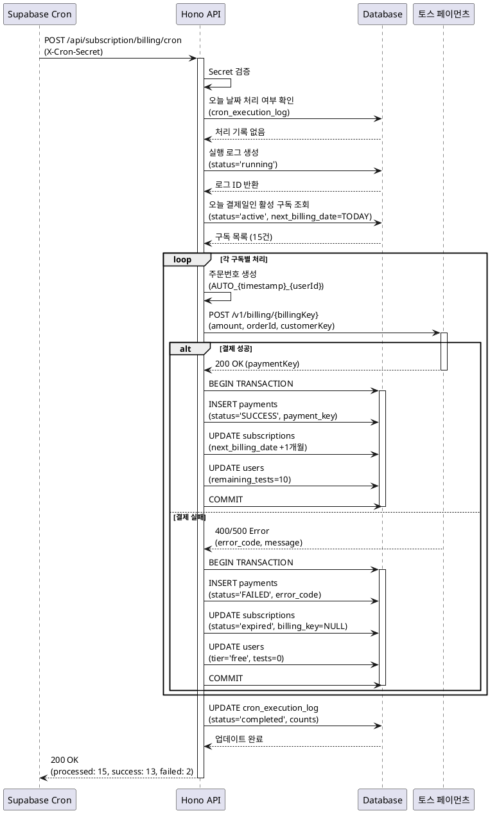
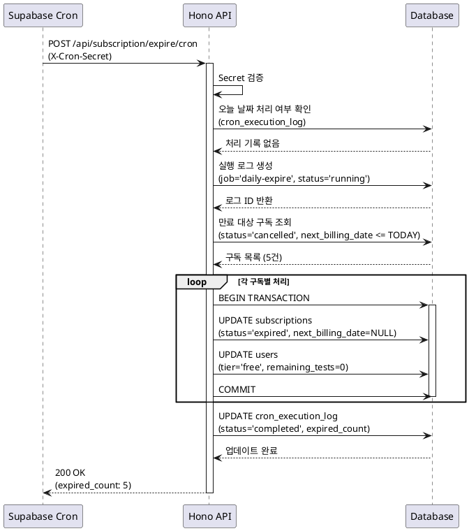

# 자동화 기능 상세 스펙 문서

## 개요

정기 결제 및 구독 만료 처리를 위한 자동화 시스템 상세 스펙입니다.
Supabase Cron을 통해 매일 특정 시간에 Hono 백엔드 API를 호출하여 처리합니다.

## 기능 목적

1. **정기 결제 자동화**: Pro 구독 사용자의 월 단위 자동 결제 및 서비스 연장
2. **구독 만료 처리**: 해지 예정 상태에서 만료일이 경과한 구독의 등급 다운그레이드

## 시스템 아키텍처

```
[Supabase Cron] (매일 02:00 KST)
    ↓
[Hono API] /api/subscription/billing/cron
    ↓
[결제일 도래 구독 탐색]
    ↓
[토스 페이먼츠 결제 API 호출]
    ↓
[결과 처리 및 DB 업데이트]
```

---

## 1. [CRON-BILLING] 정기 결제 자동화

### 기능 개요

매일 새벽 2시에 실행되며, 당일이 결제일인 활성 구독에 대해 자동으로 결제를 시도하고 결과를 처리합니다.

### Primary Actor

Supabase Cron Scheduler

### Precondition

- Supabase Cron이 정상 설정되어 있어야 함
- 토스 페이먼츠 API 키가 유효해야 함
- 결제일이 오늘인 활성 구독이 존재해야 함

### Trigger

- **스케줄**: 매일 02:00 (KST)
- **Supabase Cron SQL**:
  ```sql
  SELECT cron.schedule(
    'daily-billing',
    '0 2 * * *',
    $$
    SELECT net.http_post(
      url := 'https://your-domain.com/api/subscription/billing/cron',
      headers := '{"Content-Type": "application/json", "X-Cron-Secret": "your-secret-token"}'::jsonb,
      body := jsonb_build_object('timestamp', NOW())
    ) AS request_id;
    $$
  );
  ```

### API 엔드포인트

#### Request

```
POST /api/subscription/billing/cron
Content-Type: application/json
X-Cron-Secret: <CRON_SECRET_TOKEN>
```

**요청 본문**:
```json
{
  "timestamp": "2025-01-26T02:00:00Z"
}
```

#### Response (성공)

```json
{
  "success": true,
  "message": "정기 결제 처리 완료",
  "processed_count": 15,
  "success_count": 13,
  "failure_count": 2,
  "results": [
    {
      "user_id": "user_xxx",
      "subscription_id": "uuid-1",
      "status": "success",
      "payment_id": "uuid-p1",
      "next_billing_date": "2025-02-26"
    },
    {
      "user_id": "user_yyy",
      "subscription_id": "uuid-2",
      "status": "failed",
      "error_code": "INSUFFICIENT_BALANCE",
      "error_message": "카드 잔액 부족",
      "action": "구독 해지됨"
    }
  ],
  "execution_time_ms": 4523
}
```

#### Response (중복 실행 방지)

```json
{
  "success": false,
  "error": "ALREADY_PROCESSED",
  "message": "오늘 날짜의 정기 결제가 이미 처리되었습니다",
  "last_run_at": "2025-01-26T02:00:15Z"
}
```

### 상세 처리 단계

#### Step 1: 인증 검증
```typescript
// X-Cron-Secret 헤더 검증
const cronSecret = c.req.header('X-Cron-Secret');
if (!cronSecret || cronSecret !== config.CRON_SECRET) {
  return c.json({ error: 'UNAUTHORIZED' }, 401);
}
```

#### Step 2: 중복 실행 방지
```sql
-- 오늘 날짜에 이미 처리된 결제가 있는지 확인
SELECT COUNT(*) FROM payments
WHERE DATE(created_at) = CURRENT_DATE
  AND method = 'cron_auto_billing'
  AND status = 'SUCCESS';
```

만약 이미 처리된 기록이 있다면 `ALREADY_PROCESSED` 에러 반환

#### Step 3: 결제 대상 구독 조회
```sql
SELECT
  s.id AS subscription_id,
  s.user_id,
  s.billing_key,
  s.customer_key,
  s.next_billing_date,
  u.email,
  u.name
FROM subscriptions s
JOIN users u ON s.user_id = u.id
WHERE s.status = 'active'
  AND s.next_billing_date = CURRENT_DATE
  AND s.billing_key IS NOT NULL;
```

#### Step 4: 각 구독별 결제 시도

**4-1. 주문번호 생성**
```typescript
const orderId = `AUTO_${Date.now()}_${userId}`;
```

**4-2. 토스 페이먼츠 빌링키 결제 API 호출**
```typescript
const response = await fetch('https://api.tosspayments.com/v1/billing/{billingKey}', {
  method: 'POST',
  headers: {
    'Authorization': `Basic ${base64Encode(secretKey + ':')}`,
    'Content-Type': 'application/json'
  },
  body: JSON.stringify({
    customerKey: subscription.customer_key,
    amount: 9900, // Pro 요금제 금액
    orderId: orderId,
    orderName: '사주 분석 Pro 월 구독',
    customerEmail: user.email,
    customerName: user.name
  })
});
```

**4-3. 결제 성공 처리**
```sql
BEGIN;

-- payments 테이블에 결제 기록 저장
INSERT INTO payments (
  user_id,
  subscription_id,
  payment_key,
  order_id,
  amount,
  status,
  method,
  paid_at
) VALUES (
  $1, $2, $3, $4, 9900, 'SUCCESS', 'cron_auto_billing', NOW()
);

-- subscriptions 테이블 업데이트 (다음 결제일 연장)
UPDATE subscriptions
SET
  next_billing_date = next_billing_date + INTERVAL '1 month',
  updated_at = NOW()
WHERE id = $1;

-- users 테이블 업데이트 (잔여 횟수 초기화)
UPDATE users
SET
  remaining_tests = 10,
  updated_at = NOW()
WHERE id = $1;

COMMIT;
```

**4-4. 결제 실패 처리**
```sql
BEGIN;

-- payments 테이블에 실패 기록 저장
INSERT INTO payments (
  user_id,
  subscription_id,
  order_id,
  amount,
  status,
  method,
  error_code,
  error_message,
  created_at
) VALUES (
  $1, $2, $3, 9900, 'FAILED', 'cron_auto_billing', $4, $5, NOW()
);

-- subscriptions 테이블 상태 변경 (만료)
UPDATE subscriptions
SET
  status = 'expired',
  billing_key = NULL,
  customer_key = NULL,
  next_billing_date = NULL,
  updated_at = NOW()
WHERE id = $1;

-- users 테이블 다운그레이드
UPDATE users
SET
  subscription_tier = 'free',
  remaining_tests = 0,
  updated_at = NOW()
WHERE id = $1;

COMMIT;
```

#### Step 5: 결과 집계 및 로깅
```typescript
logger.info('정기 결제 cron 실행 완료', {
  total: processedCount,
  success: successCount,
  failed: failureCount,
  executionTime: endTime - startTime
});
```

### 정기 결제 프로세스 상세

#### 결제 금액
- **Pro 월 구독**: ₩9,900 (부가세 포함)

#### 결제 주기
- 매월 구독 시작일과 동일한 날짜
- 예: 1월 15일 구독 → 매월 15일 결제
- 31일 구독의 경우, 2월은 28일에 결제

#### 결제 재시도 로직
- **재시도 횟수**: 0회 (즉시 실패 처리)
- **이유**: 사용자가 수동으로 재구독 가능하도록 명확한 상태 제공

### Edge Cases 및 에러 처리

#### Case 1: 빌링키 만료
```typescript
if (error.code === 'EXPIRED_BILLING_KEY') {
  // 구독 즉시 해지
  await expireSubscription(subscriptionId);
  // 사용자에게 알림 (선택적)
  await sendNotification(userId, '카드 정보 만료로 구독이 해지되었습니다');
}
```

#### Case 2: 네트워크 타임아웃
```typescript
try {
  const response = await fetch(url, { timeout: 30000 }); // 30초
} catch (error) {
  if (error.name === 'TimeoutError') {
    // 실패로 처리하고 다음 사용자로 진행
    logger.error('결제 API 타임아웃', { userId, subscriptionId });
    return { status: 'failed', error: 'TIMEOUT' };
  }
}
```

#### Case 3: 카드 한도 초과 / 잔액 부족
```typescript
if (error.code === 'INSUFFICIENT_BALANCE' || error.code === 'EXCEED_LIMIT') {
  // 구독 해지 및 사용자 다운그레이드
  await expireSubscription(subscriptionId);
  await downgradeUser(userId);
}
```

#### Case 4: 중복 실행
- **방지 방법**: 매일 첫 실행 시 `cron_execution_log` 테이블에 날짜별 실행 기록 저장
- **확인 로직**:
  ```sql
  INSERT INTO cron_execution_log (job_name, execution_date, status)
  VALUES ('daily-billing', CURRENT_DATE, 'running')
  ON CONFLICT (job_name, execution_date) DO NOTHING
  RETURNING id;
  ```
- 삽입 성공 시에만 실행, 실패 시 즉시 종료

#### Case 5: 데이터베이스 트랜잭션 실패
```typescript
try {
  await supabase.rpc('process_payment_transaction', { ... });
} catch (error) {
  // 자동 롤백
  logger.error('트랜잭션 실패, 롤백됨', { userId, error });
  // 다음 사용자로 진행 (전체 프로세스는 중단하지 않음)
}
```

### DB 스키마 영향

#### 주요 테이블

**1. subscriptions**
- 조회 필드: `status`, `next_billing_date`, `billing_key`, `customer_key`
- 업데이트 필드: `next_billing_date`, `status`, `billing_key`, `customer_key`

**2. payments**
- 삽입 필드: 전체 (새 결제 기록)
- 조회 필드: `created_at`, `method`, `status` (중복 실행 확인용)

**3. users**
- 업데이트 필드: `remaining_tests`, `subscription_tier`

**4. cron_execution_log** (신규 테이블 필요)
```sql
CREATE TABLE IF NOT EXISTS cron_execution_log (
  id UUID PRIMARY KEY DEFAULT gen_random_uuid(),
  job_name TEXT NOT NULL,
  execution_date DATE NOT NULL,
  status TEXT NOT NULL CHECK (status IN ('running', 'completed', 'failed')),
  processed_count INTEGER DEFAULT 0,
  success_count INTEGER DEFAULT 0,
  failure_count INTEGER DEFAULT 0,
  error_message TEXT,
  execution_time_ms INTEGER,
  created_at TIMESTAMP WITH TIME ZONE DEFAULT NOW(),
  completed_at TIMESTAMP WITH TIME ZONE,
  UNIQUE(job_name, execution_date)
);

CREATE INDEX idx_cron_execution_log_date ON cron_execution_log(execution_date);
```

### 중복 실행 방지 전략

#### 전략 1: 날짜 기반 Idempotency Key
```sql
-- cron_execution_log 테이블에 UNIQUE 제약으로 중복 방지
INSERT INTO cron_execution_log (job_name, execution_date, status)
VALUES ('daily-billing', CURRENT_DATE, 'running')
ON CONFLICT (job_name, execution_date) DO NOTHING
RETURNING id;
```

#### 전략 2: Supabase Cron 중복 실행 방지
- Supabase Cron은 기본적으로 동일 스케줄 중복 실행 방지
- 하지만 API 레벨에서도 추가 검증 필수

#### 전략 3: 처리 중 상태 확인
```sql
SELECT status FROM cron_execution_log
WHERE job_name = 'daily-billing'
  AND execution_date = CURRENT_DATE
  AND status = 'running';
```
- `running` 상태가 있으면 이미 실행 중이므로 대기 또는 종료

### 실패 시 재시도 로직

#### 개별 결제 실패
- **재시도**: 없음
- **처리**: 즉시 구독 해지 및 사용자 다운그레이드
- **이유**: 월 1회 결제이므로 재시도보다 명확한 해지가 나음

#### Cron Job 전체 실패
- **재시도**: Supabase Cron 레벨에서 자동 재시도 없음
- **대안**: 다음 날 다시 실행 (누락된 결제는 수동 처리 필요)
- **모니터링**: 실패 시 알림 발송 (Slack, Email 등)

### Business Rules

1. **결제 시도는 1회만**: 실패 시 즉시 구독 해지
2. **트랜잭션 보장**: 결제-구독-사용자 업데이트는 하나의 트랜잭션
3. **부분 실패 허용**: 일부 사용자 결제 실패가 전체 프로세스를 중단하지 않음
4. **로깅 필수**: 모든 결제 시도 및 결과는 payments 테이블에 기록
5. **멱등성 보장**: 같은 날짜에 여러 번 실행되어도 한 번만 처리

---

## 2. [CRON-EXPIRE] 구독 만료 처리

### 기능 개요

해지 예정 상태(`status='cancelled'`)에서 만료일이 경과한 구독을 무료 등급으로 전환합니다.

### Primary Actor

Supabase Cron Scheduler

### Precondition

- 해지 예정 상태의 구독이 존재해야 함
- 만료일이 오늘 또는 과거여야 함

### Trigger

- **스케줄**: 매일 03:00 (KST) - 정기결제 이후 실행
- **Supabase Cron SQL**:
  ```sql
  SELECT cron.schedule(
    'daily-expire',
    '0 3 * * *',
    $$
    SELECT net.http_post(
      url := 'https://your-domain.com/api/subscription/expire/cron',
      headers := '{"Content-Type": "application/json", "X-Cron-Secret": "your-secret-token"}'::jsonb,
      body := jsonb_build_object('timestamp', NOW())
    ) AS request_id;
    $$
  );
  ```

### API 엔드포인트

#### Request

```
POST /api/subscription/expire/cron
Content-Type: application/json
X-Cron-Secret: <CRON_SECRET_TOKEN>
```

**요청 본문**:
```json
{
  "timestamp": "2025-01-26T03:00:00Z"
}
```

#### Response (성공)

```json
{
  "success": true,
  "message": "구독 만료 처리 완료",
  "expired_count": 5,
  "results": [
    {
      "user_id": "user_aaa",
      "subscription_id": "uuid-s1",
      "expired_date": "2025-01-26",
      "new_tier": "free",
      "new_remaining_tests": 0
    }
  ],
  "execution_time_ms": 234
}
```

### 상세 처리 단계

#### Step 1: 인증 검증
```typescript
const cronSecret = c.req.header('X-Cron-Secret');
if (!cronSecret || cronSecret !== config.CRON_SECRET) {
  return c.json({ error: 'UNAUTHORIZED' }, 401);
}
```

#### Step 2: 만료 대상 구독 조회
```sql
SELECT
  s.id AS subscription_id,
  s.user_id,
  s.next_billing_date,
  u.subscription_tier,
  u.remaining_tests
FROM subscriptions s
JOIN users u ON s.user_id = u.id
WHERE s.status = 'cancelled'
  AND s.next_billing_date <= CURRENT_DATE;
```

#### Step 3: 각 구독 만료 처리
```sql
BEGIN;

-- subscriptions 테이블 상태 변경
UPDATE subscriptions
SET
  status = 'expired',
  next_billing_date = NULL,
  updated_at = NOW()
WHERE id = $1;

-- users 테이블 다운그레이드
UPDATE users
SET
  subscription_tier = 'free',
  remaining_tests = 0,
  updated_at = NOW()
WHERE id = $1;

COMMIT;
```

#### Step 4: 결과 집계 및 로깅
```typescript
logger.info('구독 만료 처리 완료', {
  expiredCount,
  executionTime
});
```

### Edge Cases 및 에러 처리

#### Case 1: 이미 만료된 구독
- **처리**: 중복 처리 방지를 위해 `status='cancelled'` 조건으로 필터링
- **결과**: 이미 `expired` 상태인 구독은 조회되지 않음

#### Case 2: 만료일이 아직 도래하지 않음
- **처리**: `next_billing_date <= CURRENT_DATE` 조건으로 필터링
- **결과**: 미래 날짜의 구독은 처리되지 않음

#### Case 3: 사용자가 해지 취소한 경우
- **상태**: `status='active'`로 이미 변경됨
- **결과**: 조회 조건에서 제외되어 처리되지 않음

### DB 스키마 영향

#### 주요 테이블

**1. subscriptions**
- 조회 필드: `status`, `next_billing_date`
- 업데이트 필드: `status`, `next_billing_date`

**2. users**
- 업데이트 필드: `subscription_tier`, `remaining_tests`

### 중복 실행 방지 전략

- **멱등성**: `status='cancelled'` 조건으로 이미 처리된 구독은 제외
- **실행 로그**: `cron_execution_log` 테이블에 날짜별 실행 기록

### 실패 시 재시도 로직

- **재시도**: 다음 날 자동 재시도 (만료일 조건이 여전히 충족됨)
- **영향**: 1일 늦게 만료되어도 서비스 영향 최소

### Business Rules

1. **만료 처리는 즉시**: 만료일 당일에 처리
2. **잔여 횟수 초기화**: 무료 등급으로 전환 시 0회로 설정
3. **구독 데이터 유지**: 구독 레코드는 삭제하지 않고 상태만 변경
4. **멱등성 보장**: 여러 번 실행되어도 안전

---

## 3. Sequence Diagram

### CRON-BILLING: 정기 결제 프로세스



### CRON-EXPIRE: 구독 만료 프로세스



---

## 4. 모니터링 및 알림

### 로그 레벨
- **INFO**: 정상 실행 완료
- **WARN**: 일부 결제 실패 (전체 프로세스는 성공)
- **ERROR**: Cron Job 실행 실패, 인증 실패

### 알림 조건
1. **Cron Job 실행 실패**: 즉시 알림
2. **결제 실패율 50% 초과**: 알림 (토스 페이먼츠 장애 의심)
3. **API 타임아웃 발생**: 알림

### 대시보드 메트릭
- 일별 처리된 구독 수
- 결제 성공/실패 비율
- 평균 실행 시간
- 에러 발생 현황

---

## 5. 테스트 시나리오

### CRON-BILLING 테스트

#### TC-1: 정상 결제
- **Given**: 오늘이 결제일인 활성 구독 존재
- **When**: Cron 실행
- **Then**: 결제 성공, 구독 연장, 횟수 초기화

#### TC-2: 결제 실패 (카드 잔액 부족)
- **Given**: 잔액 부족한 카드로 등록된 구독
- **When**: Cron 실행
- **Then**: 결제 실패, 구독 해지, 등급 다운

#### TC-3: 중복 실행
- **Given**: 오늘 이미 실행된 기록 존재
- **When**: Cron 재실행
- **Then**: `ALREADY_PROCESSED` 에러 반환

#### TC-4: 결제일 아닌 구독
- **Given**: 내일이 결제일인 구독
- **When**: Cron 실행
- **Then**: 조회 조건에서 제외, 처리되지 않음

### CRON-EXPIRE 테스트

#### TC-1: 정상 만료
- **Given**: 해지 예정 구독, 만료일 도래
- **When**: Cron 실행
- **Then**: 구독 만료, 등급 다운, 횟수 0

#### TC-2: 만료일 미도래
- **Given**: 해지 예정 구독, 만료일 내일
- **When**: Cron 실행
- **Then**: 조회 조건에서 제외, 처리되지 않음

#### TC-3: 이미 만료된 구독
- **Given**: 이미 `expired` 상태인 구독
- **When**: Cron 실행
- **Then**: 조회 조건에서 제외, 중복 처리 없음

---

## 6. 배포 체크리스트

- [ ] Supabase Cron 설정 완료
- [ ] `CRON_SECRET` 환경변수 설정
- [ ] 토스 페이먼츠 API 키 설정
- [ ] `cron_execution_log` 테이블 생성
- [ ] API 엔드포인트 배포 및 테스트
- [ ] 모니터링 대시보드 구축
- [ ] 알림 설정 (Slack/Email)
- [ ] 타임존 확인 (KST)
- [ ] 로그 수집 설정

---

## 7. 참고 사항

### Supabase Cron 제약사항
- 최소 실행 주기: 1분
- 최대 실행 시간: 10분 (권장)
- HTTP 요청 타임아웃: 30초

### 토스 페이먼츠 빌링키 결제 제약
- 결제 금액 제한: ₩100 ~ ₩10,000,000
- API Rate Limit: 초당 100회
- 타임아웃: 30초

### 데이터 보관 정책
- `payments` 레코드: 영구 보관
- `cron_execution_log`: 6개월 보관 후 삭제
- 만료된 구독 레코드: 영구 보관 (통계 목적)
