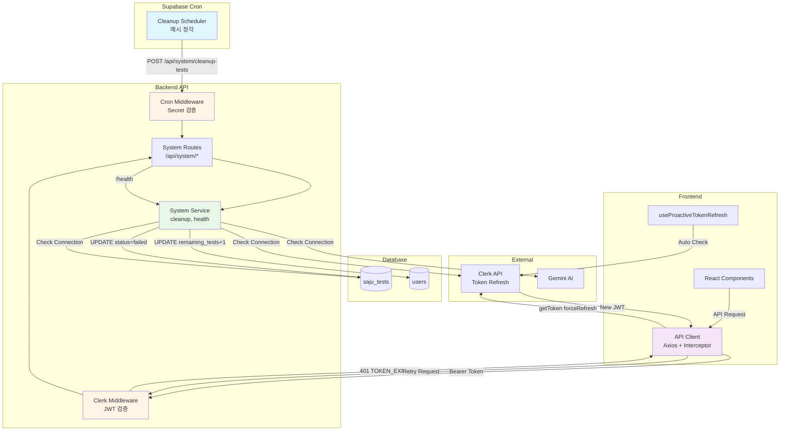

# 시스템 관리 기능 구현 계획

## 개요

시스템 관리 기능은 사주 분석 웹앱의 안정적인 운영을 위한 백그라운드 작업 및 세션 관리를 담당합니다. 이 문서는 미완료 검사 정리, 세션 관리, 헬스 체크 기능의 구체적인 구현 계획을 제시합니다.

**구현 목표**:
- 미완료 검사 자동 정리를 통한 사용자 검사 횟수 복구
- Clerk JWT 기반 세션 자동 갱신으로 사용자 경험 개선
- 시스템 헬스 체크를 통한 안정성 모니터링

---

## 모듈 개요

### 1. 백엔드 모듈

| 모듈명 | 위치 | 설명 |
|--------|------|------|
| System Routes | `src/features/system/backend/route.ts` | 시스템 관리 API 엔드포인트 |
| System Service | `src/features/system/backend/service.ts` | 비즈니스 로직 (정리, 헬스 체크) |
| System Schema | `src/features/system/backend/schema.ts` | 요청/응답 스키마 정의 |
| System Error | `src/features/system/backend/error.ts` | 에러 코드 정의 |

### 2. 미들웨어 모듈

| 모듈명 | 위치 | 설명 |
|--------|------|------|
| Clerk Auth Middleware | `src/backend/middleware/clerk.ts` | Clerk JWT 검증 및 userId 추출 |
| Cron Auth Middleware | `src/backend/middleware/cron.ts` | Cron Secret 검증 |

### 3. 클라이언트 모듈

| 모듈명 | 위치 | 설명 |
|--------|------|------|
| API Client | `src/lib/remote/api-client.ts` | Axios 인터셉터 (토큰 갱신) |
| Proactive Token Refresh Hook | `src/hooks/useProactiveTokenRefresh.ts` | 프로액티브 토큰 갱신 |

### 4. 데이터베이스

| 모듈명 | 위치 | 설명 |
|--------|------|------|
| Cleanup Cron Migration | `supabase/migrations/NNNN_create_cleanup_cron.sql` | Supabase Cron 설정 |

---

## Architecture Diagram



---

## Implementation Plan

### Phase 1: 미들웨어 구현

#### 1.1 Clerk 인증 미들웨어

**파일**: `src/backend/middleware/clerk.ts`

**목적**: Hono에서 Clerk JWT 검증 및 userId 추출

**주요 기능**:
- `@hono/clerk-auth`를 사용한 JWT 검증
- `requireAuth()` 미들웨어로 인증 필수 라우트 보호
- Context에 `userId` 주입

**구현 상세**:
```typescript
import { clerkMiddleware, getAuth } from '@hono/clerk-auth'
import type { MiddlewareHandler } from 'hono'
import type { AppEnv } from '@/backend/hono/context'

export const withClerk = (): MiddlewareHandler<AppEnv> => {
  return clerkMiddleware()
}

export const requireAuth = (): MiddlewareHandler<AppEnv> => {
  return async (c, next) => {
    const auth = getAuth(c)

    if (!auth?.userId) {
      return c.json(
        {
          error: 'UNAUTHORIZED',
          message: '로그인이 필요합니다.'
        },
        401
      )
    }

    c.set('userId', auth.userId)
    await next()
  }
}
```

**의존성**:
- 패키지: `@hono/clerk-auth` 설치 필요
- Context 타입 확장: `AppVariables`에 `userId?: string` 추가

**테스트 시나리오**:
- JWT 토큰 없이 보호 라우트 접근 → 401
- 유효한 JWT 토큰으로 요청 → userId 정상 추출
- 만료된 JWT 토큰 → 401 with `TOKEN_EXPIRED`

---

#### 1.2 Cron 인증 미들웨어

**파일**: `src/backend/middleware/cron.ts`

**목적**: Supabase Cron 요청 검증

**주요 기능**:
- `X-Cron-Secret` 헤더 검증
- 환경 변수 `CRON_SECRET`과 비교

**구현 상세**:
```typescript
import type { MiddlewareHandler } from 'hono'
import type { AppEnv } from '@/backend/hono/context'
import { getConfig } from '@/backend/hono/context'

export const requireCronAuth = (): MiddlewareHandler<AppEnv> => {
  return async (c, next) => {
    const cronSecret = c.req.header('X-Cron-Secret')
    const config = getConfig(c)

    if (!cronSecret || cronSecret !== config.cronSecret) {
      return c.json(
        {
          error: 'UNAUTHORIZED',
          message: 'Invalid cron secret'
        },
        401
      )
    }

    await next()
  }
}
```

**의존성**:
- `AppConfig` 타입에 `cronSecret: string` 추가
- 환경 변수: `CRON_SECRET` 설정

**테스트 시나리오**:
- Secret 없이 요청 → 401
- 잘못된 Secret → 401
- 올바른 Secret → 통과

---

### Phase 2: 시스템 서비스 로직

#### 2.1 미완료 검사 정리 서비스

**파일**: `src/features/system/backend/service.ts`

**함수**: `cleanupStalledTests()`

**로직**:
1. 30분 이상 `processing` 상태인 검사 조회
2. 트랜잭션 시작
3. 검사 상태 `failed`로 변경, `error_message` 기록
4. 사용자 `remaining_tests` +1 복구
5. 트랜잭션 커밋
6. 정리 결과 반환 (정리된 검사 수, user_id 목록)

**구현 상세**:
```typescript
import type { SupabaseClient } from '@supabase/supabase-js'
import { success, failure, type HandlerResult } from '@/backend/http/response'

type CleanupResult = {
  cleanedCount: number
  usersAffected: string[]
}

export const cleanupStalledTests = async (
  client: SupabaseClient,
  timeoutMinutes: number = 30
): Promise<HandlerResult<CleanupResult, string>> => {
  const cutoffTime = new Date()
  cutoffTime.setMinutes(cutoffTime.getMinutes() - timeoutMinutes)

  const { data: stalledTests, error: fetchError } = await client
    .from('saju_tests')
    .select('id, user_id')
    .eq('status', 'processing')
    .lt('created_at', cutoffTime.toISOString())

  if (fetchError) {
    return failure(500, 'FETCH_ERROR', 'Failed to fetch stalled tests', fetchError)
  }

  if (!stalledTests || stalledTests.length === 0) {
    return success({ cleanedCount: 0, usersAffected: [] })
  }

  const testIds = stalledTests.map((t) => t.id)
  const uniqueUserIds = [...new Set(stalledTests.map((t) => t.user_id))]

  const { error: updateTestsError } = await client
    .from('saju_tests')
    .update({
      status: 'failed',
      error_message: '시스템 타임아웃으로 자동 정리됨'
    })
    .in('id', testIds)

  if (updateTestsError) {
    return failure(500, 'UPDATE_ERROR', 'Failed to update tests', updateTestsError)
  }

  const { error: updateUsersError } = await client.rpc(
    'increment_remaining_tests',
    { user_ids: uniqueUserIds, increment_by: 1 }
  )

  if (updateUsersError) {
    return failure(500, 'UPDATE_ERROR', 'Failed to restore user tests', updateUsersError)
  }

  return success({
    cleanedCount: stalledTests.length,
    usersAffected: uniqueUserIds
  })
}
```

**DB 함수 필요**: `increment_remaining_tests` (migration에서 생성)

**Unit Test 시나리오**:
- 정리 대상 0건 → `cleanedCount: 0`
- 정리 대상 5건 (3명 사용자) → `cleanedCount: 5`, `usersAffected.length: 3`
- DB 에러 발생 → `FETCH_ERROR` 또는 `UPDATE_ERROR`

---

#### 2.2 헬스 체크 서비스

**파일**: `src/features/system/backend/service.ts`

**함수**: `checkSystemHealth()`

**로직**:
1. Supabase 연결 확인 (간단한 SELECT 쿼리)
2. Clerk API 연결 확인 (optional)
3. Gemini API 연결 확인 (optional)
4. 모든 서비스 상태 반환

**구현 상세**:
```typescript
type HealthStatus = 'healthy' | 'unhealthy'

type HealthCheckResult = {
  status: HealthStatus
  timestamp: string
  version: string
  services: {
    database: 'connected' | 'error'
    clerk?: 'reachable' | 'error'
    gemini?: 'reachable' | 'error'
  }
}

export const checkSystemHealth = async (
  client: SupabaseClient
): Promise<HandlerResult<HealthCheckResult, string>> => {
  const services: HealthCheckResult['services'] = {
    database: 'connected'
  }

  const { error: dbError } = await client
    .from('users')
    .select('id')
    .limit(1)
    .maybeSingle()

  if (dbError) {
    services.database = 'error'
  }

  const allHealthy = Object.values(services).every((s) => s === 'connected' || s === 'reachable')
  const status: HealthStatus = allHealthy ? 'healthy' : 'unhealthy'

  const result: HealthCheckResult = {
    status,
    timestamp: new Date().toISOString(),
    version: '1.0.0',
    services
  }

  return success(result, status === 'healthy' ? 200 : 503)
}
```

**Unit Test 시나리오**:
- 모든 서비스 정상 → `status: 'healthy'`, 200
- DB 연결 실패 → `status: 'unhealthy'`, 503

---

### Phase 3: 시스템 API 라우트

#### 3.1 라우터 등록

**파일**: `src/features/system/backend/route.ts`

**엔드포인트**:
- `POST /api/system/cleanup-tests` (Cron 인증 필요)
- `GET /api/system/health` (인증 불필요)

**구현 상세**:
```typescript
import type { Hono } from 'hono'
import { requireCronAuth } from '@/backend/middleware/cron'
import { respond } from '@/backend/http/response'
import { getLogger, getSupabase, type AppEnv } from '@/backend/hono/context'
import { cleanupStalledTests, checkSystemHealth } from './service'

export const registerSystemRoutes = (app: Hono<AppEnv>) => {
  app.post('/system/cleanup-tests', requireCronAuth(), async (c) => {
    const supabase = getSupabase(c)
    const logger = getLogger(c)

    const result = await cleanupStalledTests(supabase, 30)

    if (result.ok) {
      logger.info('Cleanup completed', {
        cleanedCount: result.data.cleanedCount,
        usersAffected: result.data.usersAffected
      })
    } else {
      logger.error('Cleanup failed', result.error)
    }

    return respond(c, result)
  })

  app.get('/system/health', async (c) => {
    const supabase = getSupabase(c)
    const result = await checkSystemHealth(supabase)

    return respond(c, result)
  })
}
```

**Hono App 등록**:
`src/backend/hono/app.ts`에 추가:
```typescript
import { registerSystemRoutes } from '@/features/system/backend/route'

// ...
registerSystemRoutes(app)
```

**QA Sheet**:
| Test Case | Method | Endpoint | Headers | Expected Response |
|-----------|--------|----------|---------|-------------------|
| Cleanup without secret | POST | /system/cleanup-tests | - | 401 UNAUTHORIZED |
| Cleanup with wrong secret | POST | /system/cleanup-tests | X-Cron-Secret: wrong | 401 UNAUTHORIZED |
| Cleanup with correct secret | POST | /system/cleanup-tests | X-Cron-Secret: correct | 200 + cleanup result |
| Health check | GET | /system/health | - | 200/503 + health status |

---

### Phase 4: 클라이언트 측 세션 관리

#### 4.1 API Client with Token Refresh

**파일**: `src/lib/remote/api-client.ts`

**목적**: Axios 인터셉터로 401 에러 시 자동 토큰 갱신

**구현 상세**:
```typescript
import { useAuth } from '@clerk/nextjs'
import axios from 'axios'

export const useApiClient = () => {
  const { getToken } = useAuth()

  const client = axios.create({
    baseURL: '/api'
  })

  client.interceptors.request.use(async (config) => {
    const token = await getToken()
    if (token) {
      config.headers.Authorization = `Bearer ${token}`
    }
    return config
  })

  client.interceptors.response.use(
    (response) => response,
    async (error) => {
      const originalRequest = error.config

      if (
        error.response?.status === 401 &&
        error.response?.data?.error === 'TOKEN_EXPIRED' &&
        !originalRequest._retry
      ) {
        originalRequest._retry = true

        try {
          const newToken = await getToken({ forceRefresh: true })

          if (newToken) {
            originalRequest.headers.Authorization = `Bearer ${newToken}`
            return client(originalRequest)
          }
        } catch (refreshError) {
          console.error('Token refresh failed:', refreshError)
          window.location.href = '/sign-in?error=session_expired'
          return Promise.reject(refreshError)
        }
      }

      return Promise.reject(error)
    }
  )

  return client
}
```

**QA Sheet**:
| Scenario | Initial Token | Expected Behavior |
|----------|---------------|-------------------|
| Valid token | Valid JWT | Request succeeds |
| Expired token | Expired JWT | Auto refresh → Retry → Success |
| Expired session | Expired JWT (Clerk session expired) | Refresh fails → Redirect to /sign-in |
| Multiple concurrent requests | Expired JWT | First refreshes, others wait → All retry with new token |

---

#### 4.2 프로액티브 토큰 갱신 Hook

**파일**: `src/hooks/useProactiveTokenRefresh.ts`

**목적**: 토큰 만료 5분 전 자동 갱신

**구현 상세**:
```typescript
import { useAuth } from '@clerk/nextjs'
import { useEffect } from 'react'

export const useProactiveTokenRefresh = () => {
  const { getToken, isSignedIn } = useAuth()

  useEffect(() => {
    if (!isSignedIn) return

    const interval = setInterval(async () => {
      const token = await getToken()

      if (!token) return

      try {
        const payload = JSON.parse(atob(token.split('.')[1]))
        const expiresAt = payload.exp * 1000
        const now = Date.now()
        const timeUntilExpiry = expiresAt - now

        if (timeUntilExpiry < 5 * 60 * 1000) {
          console.log('Proactively refreshing token...')
          await getToken({ forceRefresh: true })
        }
      } catch (error) {
        console.error('Token refresh check failed:', error)
      }
    }, 5 * 60 * 1000)

    return () => clearInterval(interval)
  }, [isSignedIn, getToken])
}
```

**사용 위치**: `src/app/layout.tsx`의 Client Component에서 호출

**QA Sheet**:
| Scenario | Token Expiry | Expected Behavior |
|----------|--------------|-------------------|
| Token expires in 10min | > 5min | No action |
| Token expires in 3min | < 5min | Auto refresh triggered |
| User not signed in | N/A | Hook does nothing |

---

### Phase 5: 데이터베이스 설정

#### 5.1 Supabase Cron 설정

**파일**: `supabase/migrations/NNNN_create_cleanup_cron.sql`

**목적**: 매시 정각 미완료 검사 정리 API 호출

**구현 상세**:
```sql
-- Supabase pg_cron 확장 활성화
CREATE EXTENSION IF NOT EXISTS pg_cron;

-- Cleanup 스케줄 등록
SELECT cron.schedule(
  'cleanup-stalled-tests',
  '0 * * * *',  -- 매시 정각
  $$
  SELECT
    net.http_post(
      url := 'https://yourdomain.com/api/system/cleanup-tests',
      headers := jsonb_build_object(
        'Content-Type', 'application/json',
        'X-Cron-Secret', current_setting('app.settings.cron_secret')
      )
    ) AS request_id;
  $$
);

-- Cron Secret을 Supabase Vault에 저장 (선택적)
-- 또는 환경 변수로 관리
```

**Supabase 설정 필요**:
- `pg_cron` 확장 활성화
- `pg_net` 확장 활성화 (HTTP 요청용)
- Vault 또는 설정에 `app.settings.cron_secret` 저장

**프로덕션 URL 업데이트**: 배포 후 `https://yourdomain.com` 변경 필요

---

#### 5.2 DB Helper 함수

**파일**: `supabase/migrations/NNNN_create_increment_function.sql`

**목적**: 여러 사용자의 `remaining_tests` 일괄 증가

**구현 상세**:
```sql
-- 사용자 검사 횟수 일괄 증가 함수
CREATE OR REPLACE FUNCTION increment_remaining_tests(
  user_ids TEXT[],
  increment_by INTEGER DEFAULT 1
)
RETURNS VOID AS $$
BEGIN
  UPDATE users
  SET remaining_tests = remaining_tests + increment_by
  WHERE id = ANY(user_ids);
END;
$$ LANGUAGE plpgsql;
```

**사용 예시**:
```sql
SELECT increment_remaining_tests(
  ARRAY['user_abc', 'user_def'],
  1
);
```

---

### Phase 6: Context 및 Config 확장

#### 6.1 AppVariables 확장

**파일**: `src/backend/hono/context.ts`

**변경 사항**:
```typescript
export type AppVariables = {
  supabase: SupabaseClient
  logger: AppLogger
  config: AppConfig
  userId?: string  // Clerk User ID 추가
}
```

**Getter 추가**:
```typescript
export const getUserId = (c: AppContext) => {
  const userId = c.get('userId')
  if (!userId) {
    throw new Error('userId is not set in context')
  }
  return userId
}
```

---

#### 6.2 AppConfig 확장

**파일**: `src/backend/config/index.ts`

**변경 사항**:
```typescript
import { z } from 'zod'

const ConfigSchema = z.object({
  supabaseUrl: z.string().url(),
  supabaseServiceRoleKey: z.string(),
  clerkSecretKey: z.string(),
  cronSecret: z.string()
})

export type AppConfig = z.infer<typeof ConfigSchema>

export const loadConfig = (): AppConfig => {
  const parsed = ConfigSchema.safeParse({
    supabaseUrl: process.env.NEXT_PUBLIC_SUPABASE_URL,
    supabaseServiceRoleKey: process.env.SUPABASE_SERVICE_ROLE_KEY,
    clerkSecretKey: process.env.CLERK_SECRET_KEY,
    cronSecret: process.env.CRON_SECRET
  })

  if (!parsed.success) {
    throw new Error('Invalid config: ' + JSON.stringify(parsed.error.format()))
  }

  return parsed.data
}
```

**환경 변수 추가** (`.env.local`):
```env
CLERK_SECRET_KEY=sk_test_xxxxxxxxxxxxx
CRON_SECRET=your-random-secret-token-here
```

---

### Phase 7: 스키마 및 에러 정의

#### 7.1 System Schema

**파일**: `src/features/system/backend/schema.ts`

**구현**:
```typescript
import { z } from 'zod'

export const CleanupResponseSchema = z.object({
  cleanedCount: z.number(),
  usersAffected: z.array(z.string())
})

export const HealthCheckResponseSchema = z.object({
  status: z.enum(['healthy', 'unhealthy']),
  timestamp: z.string(),
  version: z.string(),
  services: z.object({
    database: z.enum(['connected', 'error']),
    clerk: z.enum(['reachable', 'error']).optional(),
    gemini: z.enum(['reachable', 'error']).optional()
  })
})

export type CleanupResponse = z.infer<typeof CleanupResponseSchema>
export type HealthCheckResponse = z.infer<typeof HealthCheckResponseSchema>
```

---

#### 7.2 System Error

**파일**: `src/features/system/backend/error.ts`

**구현**:
```typescript
export const systemErrorCodes = {
  fetchError: 'FETCH_ERROR',
  updateError: 'UPDATE_ERROR',
  unauthorized: 'UNAUTHORIZED'
} as const

export type SystemServiceError = typeof systemErrorCodes[keyof typeof systemErrorCodes]
```

---

## 배포 체크리스트

### 환경 변수
- [ ] `CLERK_SECRET_KEY` 설정 (Vercel 환경 변수)
- [ ] `CRON_SECRET` 설정 (Vercel + Supabase Vault)
- [ ] `NEXT_PUBLIC_CLERK_PUBLISHABLE_KEY` 설정

### 패키지 설치
- [ ] `npm install @hono/clerk-auth`
- [ ] `npm install @clerk/nextjs` (이미 설치되어 있을 것)

### Supabase 설정
- [ ] `pg_cron` 확장 활성화
- [ ] `pg_net` 확장 활성화
- [ ] Cron Secret을 Vault 또는 설정에 저장
- [ ] Migration 파일 실행 (cleanup cron, helper function)
- [ ] 프로덕션 URL로 Cron job 업데이트

### Hono App 등록
- [ ] `src/backend/hono/app.ts`에 `withClerk()` 미들웨어 추가
- [ ] `registerSystemRoutes(app)` 등록

### 클라이언트 설정
- [ ] `src/lib/remote/api-client.ts` 생성 및 인터셉터 적용
- [ ] `src/hooks/useProactiveTokenRefresh.ts` 생성
- [ ] Root Layout에서 `useProactiveTokenRefresh()` 호출

### 테스트
- [ ] `/api/system/health` 엔드포인트 접근 → 200 응답
- [ ] Cron Secret 없이 `/api/system/cleanup-tests` 호출 → 401
- [ ] Cron Secret으로 `/api/system/cleanup-tests` 호출 → 200
- [ ] 만료된 JWT로 API 요청 → 자동 갱신 → 재시도 성공
- [ ] Supabase Cron이 매시 정각 실행되는지 로그 확인

---

## 향후 개선 사항

1. **정리 작업 개선**:
   - 정리 대상 사용자에게 이메일 알림 발송 (선택적)
   - 정리 이력 테이블 생성 (`cleanup_logs`)
   - 타임아웃 시간을 구독 등급별로 차등 적용 (Pro: 60분, Free: 30분)

2. **세션 관리 개선**:
   - Refresh Token 로테이션 (Clerk 자동 처리)
   - 멀티 디바이스 세션 관리 (Clerk Session 목록 조회)
   - 동시 접속 제한 옵션 (선택적)

3. **모니터링**:
   - Sentry 연동으로 에러 추적
   - Grafana 대시보드로 메트릭 시각화
   - 정리 작업 실패 시 Slack 알림

4. **헬스 체크 확장**:
   - Clerk API 연결 확인 추가
   - Gemini API 연결 확인 추가
   - DB 연결 풀 상태 모니터링

---

## 참고 자료

### Clerk 관련
- [Clerk + Hono 인증 가이드](https://honobyexample.com/posts/clerk-backend)
- [@hono/clerk-auth 공식 문서](https://github.com/honojs/middleware/tree/main/packages/clerk-auth)
- `docs/external/clerk.md` - Clerk 연동 가이드 (JWT 검증, 세션 갱신 방법 포함)

### Supabase Cron
- [Supabase pg_cron 문서](https://supabase.com/docs/guides/database/extensions/pg_cron)
- [Supabase pg_net 문서](https://supabase.com/docs/guides/database/extensions/pg_net)

### 기존 코드베이스
- `src/features/example/backend/*` - 라우터/서비스 패턴 참고
- `src/backend/http/response.ts` - 응답 헬퍼 패턴
- `src/backend/middleware/*` - 미들웨어 구조 참고

---

**문서 버전**: 1.0
**작성일**: 2025-10-26
**작성자**: Senior Developer Agent
