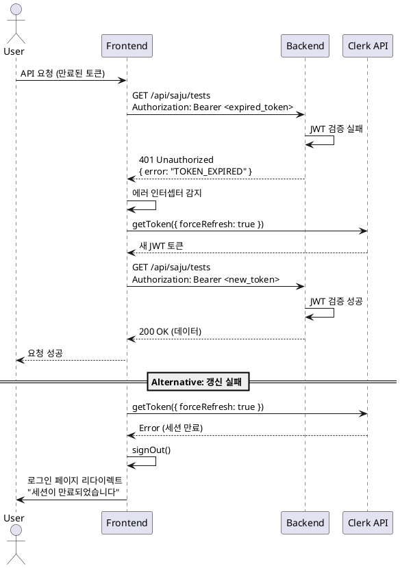

# 시스템 관리 기능 상세 스펙

## 개요

시스템 관리 기능은 사주 분석 웹앱의 안정적인 운영을 위한 백그라운드 작업 및 세션 관리를 담당합니다. 미완료 검사 정리와 세션 관리 두 가지 주요 기능으로 구성됩니다.

---

## 1. 미완료 검사 정리 (SYS-CLEANUP)

### 1.1 기능 개요

AI 분석 중 네트워크 오류, 타임아웃, 서버 재시작 등으로 인해 `processing` 상태로 남아있는 검사 레코드를 자동으로 정리하고, 차감된 사용자 검사 횟수를 복구하는 기능입니다.

### 1.2 목적

- 장애 상황에서 사용자 검사 횟수 부당 차감 방지
- 데이터베이스 무결성 유지
- 시스템 리소스 최적화

### 1.3 Use Case

**Primary Actor**: 시스템 (백그라운드 작업)

**Precondition**:
- 사용자가 검사를 시작했으나 AI 분석이 정상 완료되지 않음
- 검사 레코드가 `processing` 상태로 일정 시간 이상 경과

**Trigger**:
- Supabase Cron 스케줄러 (매시 정각 실행)
- 또는 수동 API 호출

**Main Scenario**:

1. 스케줄러가 정리 API 엔드포인트 호출
2. API는 요청 인증 확인 (X-Cron-Secret 헤더 검증)
3. 정리 대상 검사 조회:
   - `status = 'processing'`
   - `created_at < NOW() - INTERVAL '30 minutes'`
4. 각 정리 대상에 대해:
   - 검사 레코드 상태를 `failed`로 변경
   - `error_message`에 "시스템 타임아웃으로 자동 정리됨" 기록
   - 해당 사용자의 `remaining_tests` +1 복구
5. 정리 결과 로깅 (정리된 검사 수, user_id 목록)
6. 성공 응답 반환

**Edge Cases**:

- 정리 대상이 0건인 경우: 정상 응답, 로그에 "No tests to cleanup" 기록
- 동일 검사가 중복 정리 시도: 트랜잭션으로 방지
- 사용자 검사 횟수 복구 실패: 해당 사용자만 건너뛰고 계속 진행, 에러 로깅
- Cron Secret 불일치: 401 Unauthorized 반환

**Business Rules**:

- 타임아웃 기준: 30분 (환경변수로 설정 가능)
- 정리 주기: 매시 정각 (예: 01:00, 02:00, ...)
- 복구되는 검사 횟수: 1회 (검사 레코드당)
- 정리된 검사는 `failed` 상태로 변경되어 이력에 남음

---

### 1.4 API 엔드포인트

#### POST /api/system/cleanup-tests

**인증**: X-Cron-Secret 헤더 필수

**요청 헤더**:
```
X-Cron-Secret: <환경변수_CRON_SECRET>
```

**요청 본문**: 없음

**응답 (200 OK)**:
```json
{
  "message": "Cleanup completed",
  "cleaned_count": 5,
  "users_affected": ["user_abc123", "user_def456"]
}
```

**응답 (401 Unauthorized)**:
```json
{
  "error": "UNAUTHORIZED",
  "message": "Invalid cron secret"
}
```

**응답 (500 Internal Server Error)**:
```json
{
  "error": "CLEANUP_FAILED",
  "message": "Failed to cleanup tests",
  "details": "..."
}
```

---

### 1.5 DB 스키마 영향

**영향 받는 테이블**:

1. **saju_tests**
   - UPDATE: `status = 'failed'`, `error_message = '시스템 타임아웃으로 자동 정리됨'`
   - WHERE: `status = 'processing' AND created_at < NOW() - INTERVAL '30 minutes'`

2. **users**
   - UPDATE: `remaining_tests = remaining_tests + 1`
   - WHERE: `id IN (정리된 검사의 user_id 목록)`

**트랜잭션 처리**:
```sql
BEGIN;

-- 1. 정리 대상 검사 조회
WITH cleanup_targets AS (
  SELECT id, user_id
  FROM saju_tests
  WHERE status = 'processing'
    AND created_at < NOW() - INTERVAL '30 minutes'
  FOR UPDATE
)
-- 2. 검사 레코드 상태 변경
UPDATE saju_tests
SET
  status = 'failed',
  error_message = '시스템 타임아웃으로 자동 정리됨',
  updated_at = NOW()
WHERE id IN (SELECT id FROM cleanup_targets)
RETURNING user_id;

-- 3. 사용자 검사 횟수 복구
UPDATE users
SET
  remaining_tests = remaining_tests + 1,
  updated_at = NOW()
WHERE id IN (SELECT DISTINCT user_id FROM cleanup_targets);

COMMIT;
```

---

### 1.6 상세 처리 단계

**Step 1: 스케줄러 트리거**
- Supabase Cron 설정: `0 * * * *` (매시 정각)
- HTTP POST 요청 to `/api/system/cleanup-tests`
- 헤더에 `X-Cron-Secret` 포함

**Step 2: 인증 확인**
```typescript
const cronSecret = c.req.header('X-Cron-Secret');
if (cronSecret !== c.get('config').CRON_SECRET) {
  return c.json({ error: 'UNAUTHORIZED', message: 'Invalid cron secret' }, 401);
}
```

**Step 3: 정리 대상 조회 및 처리**
```typescript
const timeoutMinutes = 30;
const cleanupResult = await cleanupStalledTests(supabase, timeoutMinutes);
```

**Step 4: 로깅**
```typescript
logger.info('Cleanup job completed', {
  cleaned_count: cleanupResult.count,
  users_affected: cleanupResult.userIds,
  timestamp: new Date().toISOString()
});
```

**Step 5: 응답 반환**
```typescript
return c.json({
  message: 'Cleanup completed',
  cleaned_count: cleanupResult.count,
  users_affected: cleanupResult.userIds
}, 200);
```

---

### 1.7 백그라운드 작업 스케줄링

**Supabase Cron 설정**:

```sql
-- supabase/migrations/NNNN_create_cleanup_cron.sql

SELECT cron.schedule(
  'cleanup-stalled-tests',  -- job name
  '0 * * * *',             -- cron pattern: 매시 정각
  $$
  SELECT
    net.http_post(
      url := 'https://yourdomain.com/api/system/cleanup-tests',
      headers := jsonb_build_object(
        'Content-Type', 'application/json',
        'X-Cron-Secret', current_setting('app.cron_secret')
      )
    ) AS request_id;
  $$
);
```

**환경변수 설정** (`supabase/config.toml`):
```toml
[secrets]
app.cron_secret = "your-secret-token-here"
```

---

### 1.8 에러 처리

| 에러 상황 | 처리 방법 | 사용자 영향 |
|-----------|-----------|-------------|
| Cron Secret 불일치 | 401 반환, 로깅 | 없음 |
| DB 연결 실패 | 500 반환, 재시도 (다음 시간) | 없음 |
| 트랜잭션 실패 | 롤백, 로깅 | 일시적 복구 지연 |
| 일부 검사 복구 실패 | 성공한 것만 커밋, 실패 로깅 | 일부 사용자 복구 지연 |

---

## 2. 세션 관리 (SYS-SESSION)

### 2.1 기능 개요

Clerk JWT 토큰 만료 시 자동 갱신 및 세션 복구를 처리하여 사용자가 불필요한 재로그인 없이 서비스를 지속 이용할 수 있도록 지원합니다.

### 2.2 목적

- 사용자 경험 개선 (자동 세션 갱신)
- 인증 오류로 인한 작업 중단 최소화
- 보안과 편의성의 균형 유지

### 2.3 Use Case

**Primary Actor**: 사용자 (브라우저)

**Precondition**:
- 사용자가 로그인되어 있음
- Clerk JWT 토큰이 만료되었거나 곧 만료될 예정

**Trigger**:
- API 요청 시 401 Unauthorized 응답 수신
- 또는 클라이언트 측 토큰 만료 감지 (프로액티브 갱신)

**Main Scenario**:

1. 사용자가 API 요청 (예: 검사 이력 조회)
2. 백엔드에서 JWT 검증 실패 (만료)
3. 401 응답 with `{ error: 'TOKEN_EXPIRED' }`
4. 클라이언트 React Query 에러 핸들러 감지
5. Clerk `getToken({ forceRefresh: true })` 호출
6. 새 JWT 토큰 발급 성공
7. 원래 요청 재시도 (새 토큰 사용)
8. 성공 응답 반환

**Alternative Scenario (갱신 실패)**:

1-4. (동일)
5. Clerk 토큰 갱신 실패 (세션 만료)
6. 로그아웃 처리 (`clerk.signOut()`)
7. 로그인 페이지로 리다이렉트
8. 토스트 메시지: "세션이 만료되었습니다. 다시 로그인해주세요."

**Edge Cases**:

- 갱신 중 네트워크 오류: 재시도 후 실패 시 로그아웃
- 동시 다중 요청 시 토큰 갱신: 첫 번째 갱신만 수행, 나머지는 대기
- 갱신 후 원래 요청 재시도 실패: 에러 메시지 표시, 재시도 버튼 제공

**Business Rules**:

- 토큰 자동 갱신 시도: 최대 1회
- 갱신 실패 시 즉시 로그아웃
- 민감한 작업 (결제, 구독 해지) 중 세션 만료 시 사용자 확인 필요
- 토큰 만료 5분 전 프로액티브 갱신 (옵션)

---

### 2.4 클라이언트 측 구현

**React Query 에러 핸들러**:

```typescript
// src/lib/remote/api-client.ts

import { useAuth } from '@clerk/nextjs';
import axios from 'axios';

const useApiClient = () => {
  const { getToken } = useAuth();

  const client = axios.create({
    baseURL: '/api',
  });

  // 요청 인터셉터: JWT 토큰 자동 첨부
  client.interceptors.request.use(async (config) => {
    const token = await getToken();
    if (token) {
      config.headers.Authorization = `Bearer ${token}`;
    }
    return config;
  });

  // 응답 인터셉터: 토큰 만료 시 갱신 및 재시도
  client.interceptors.response.use(
    (response) => response,
    async (error) => {
      const originalRequest = error.config;

      // 401 에러 && 토큰 만료 && 아직 재시도 안 함
      if (
        error.response?.status === 401 &&
        error.response?.data?.error === 'TOKEN_EXPIRED' &&
        !originalRequest._retry
      ) {
        originalRequest._retry = true;

        try {
          // 토큰 강제 갱신
          const newToken = await getToken({ forceRefresh: true });

          if (newToken) {
            // 새 토큰으로 헤더 업데이트
            originalRequest.headers.Authorization = `Bearer ${newToken}`;

            // 원래 요청 재시도
            return client(originalRequest);
          }
        } catch (refreshError) {
          // 갱신 실패 → 로그아웃
          console.error('Token refresh failed:', refreshError);
          window.location.href = '/sign-in?error=session_expired';
          return Promise.reject(refreshError);
        }
      }

      return Promise.reject(error);
    }
  );

  return client;
};
```

---

### 2.5 백엔드 측 구현

**JWT 검증 미들웨어**:

```typescript
// src/backend/middleware/auth.ts

import { MiddlewareHandler } from 'hono';
import { verify } from '@clerk/backend';

export const withClerk = (): MiddlewareHandler => {
  return async (c, next) => {
    const authHeader = c.req.header('Authorization');

    if (!authHeader?.startsWith('Bearer ')) {
      return c.json({ error: 'UNAUTHORIZED', message: 'Missing token' }, 401);
    }

    const token = authHeader.substring(7);

    try {
      const payload = await verify(token, {
        secretKey: c.get('config').CLERK_SECRET_KEY,
      });

      // 토큰 유효: user_id 컨텍스트에 저장
      c.set('userId', payload.sub);
      await next();

    } catch (error) {
      // 토큰 만료 또는 유효하지 않음
      if (error.code === 'ERR_JWT_EXPIRED') {
        return c.json({
          error: 'TOKEN_EXPIRED',
          message: 'Please refresh your token'
        }, 401);
      }

      return c.json({
        error: 'INVALID_TOKEN',
        message: 'Invalid authentication token'
      }, 401);
    }
  };
};
```

---

### 2.6 세션 갱신 프로세스

**Sequence Diagram**:



---

### 2.7 프로액티브 토큰 갱신 (선택적)

**목적**: 토큰 만료 전에 미리 갱신하여 API 요청 실패 방지

**구현**:

```typescript
// src/hooks/useProactiveTokenRefresh.ts

import { useAuth } from '@clerk/nextjs';
import { useEffect } from 'react';

export const useProactiveTokenRefresh = () => {
  const { getToken, isSignedIn } = useAuth();

  useEffect(() => {
    if (!isSignedIn) return;

    // 5분마다 토큰 만료 시간 확인
    const interval = setInterval(async () => {
      const token = await getToken();

      if (!token) return;

      // JWT 디코딩하여 만료 시간 확인
      const payload = JSON.parse(atob(token.split('.')[1]));
      const expiresAt = payload.exp * 1000; // ms 단위
      const now = Date.now();
      const timeUntilExpiry = expiresAt - now;

      // 5분 이내 만료 예정 → 갱신
      if (timeUntilExpiry < 5 * 60 * 1000) {
        console.log('Proactively refreshing token...');
        await getToken({ forceRefresh: true });
      }
    }, 5 * 60 * 1000); // 5분마다 체크

    return () => clearInterval(interval);
  }, [isSignedIn, getToken]);
};
```

**사용**:

```typescript
// src/app/layout.tsx

'use client';

import { useProactiveTokenRefresh } from '@/hooks/useProactiveTokenRefresh';

export default function RootLayout({ children }) {
  useProactiveTokenRefresh();

  return <html>{children}</html>;
}
```

---

### 2.8 에러 처리

| 에러 상황 | 클라이언트 처리 | 사용자 경험 |
|-----------|-----------------|-------------|
| 토큰 만료 (갱신 성공) | 자동 재시도 | 투명 (사용자 모름) |
| 토큰 만료 (갱신 실패) | 로그아웃 + 리다이렉트 | 로그인 페이지 이동 |
| 네트워크 오류 (갱신 중) | 재시도 1회 → 실패 시 로그아웃 | 에러 토스트 표시 |
| 민감 작업 중 세션 만료 | 확인 다이얼로그 → 로그인 후 재시도 | "세션이 만료되었습니다. 로그인 후 다시 시도해주세요." |

---

## 3. 시스템 관리 API 엔드포인트 종합

### 3.1 엔드포인트 목록

| 메서드 | 경로 | 인증 | 설명 |
|--------|------|------|------|
| POST | `/api/system/cleanup-tests` | X-Cron-Secret | 미완료 검사 정리 |
| GET | `/api/system/health` | 없음 | 시스템 헬스 체크 |

---

### 3.2 헬스 체크 엔드포인트 (추가)

#### GET /api/system/health

**인증**: 없음

**목적**: 서비스 상태 모니터링

**응답 (200 OK)**:
```json
{
  "status": "healthy",
  "timestamp": "2025-01-26T10:00:00Z",
  "version": "1.0.0",
  "services": {
    "database": "connected",
    "clerk": "reachable",
    "gemini": "reachable"
  }
}
```

**응답 (503 Service Unavailable)**:
```json
{
  "status": "unhealthy",
  "timestamp": "2025-01-26T10:00:00Z",
  "services": {
    "database": "error",
    "clerk": "reachable",
    "gemini": "timeout"
  }
}
```

---

## 4. 모니터링 및 로깅

### 4.1 로그 포맷

**정리 작업 성공**:
```
[INFO] 2025-01-26T10:00:00Z cleanup-tests: Cleaned 5 stalled tests for users [user_abc, user_def]
```

**정리 작업 실패**:
```
[ERROR] 2025-01-26T10:00:00Z cleanup-tests: Failed to cleanup tests - DB connection timeout
```

**세션 갱신**:
```
[INFO] 2025-01-26T10:05:00Z auth: Token refreshed for user user_abc123
```

---

### 4.2 메트릭 수집 (선택적)

- 시간당 정리된 검사 수
- 시간당 토큰 갱신 횟수
- 세션 만료로 인한 로그아웃 수
- 정리 작업 실행 시간

---

## 5. 보안 고려사항

1. **Cron Secret 보호**:
   - 환경변수로 관리
   - 절대 클라이언트에 노출 금지
   - 주기적 로테이션 권장

2. **JWT 토큰 보안**:
   - HTTPS 필수
   - 짧은 만료 시간 (Clerk 기본: 1시간)
   - 리프레시 토큰은 httpOnly 쿠키로 관리

3. **로그 민감 정보**:
   - 토큰 값 로깅 금지
   - user_id만 기록 (이메일, 이름 제외)

---

## 6. 테스트 시나리오

### 6.1 미완료 검사 정리

**Test Case 1: 정상 정리**
- Given: 35분 전에 시작된 processing 검사 3건
- When: Cleanup cron 실행
- Then: 3건 모두 failed로 변경, 사용자 검사 횟수 +3 복구

**Test Case 2: 타임아웃 이내 검사**
- Given: 15분 전에 시작된 processing 검사 2건
- When: Cleanup cron 실행
- Then: 정리되지 않음 (타임아웃 30분 미만)

**Test Case 3: 중복 실행**
- Given: 이미 정리된 검사
- When: Cleanup cron 재실행
- Then: 중복 처리되지 않음

---

### 6.2 세션 관리

**Test Case 1: 자동 갱신 성공**
- Given: 만료된 JWT 토큰
- When: API 요청
- Then: 401 → 토큰 갱신 → 재시도 → 200 성공

**Test Case 2: 갱신 실패**
- Given: 만료된 세션 (Clerk에서도 만료)
- When: API 요청
- Then: 401 → 갱신 실패 → 로그아웃 → 로그인 페이지

**Test Case 3: 동시 다중 요청**
- Given: 만료된 토큰, 동시 API 요청 5개
- When: 첫 번째 요청이 토큰 갱신
- Then: 나머지 4개는 새 토큰으로 자동 재시도

---

## 7. 배포 체크리스트

- [ ] `CRON_SECRET` 환경변수 설정
- [ ] Supabase Cron job 등록
- [ ] Cleanup API 엔드포인트 배포
- [ ] Clerk JWT 검증 활성화
- [ ] 클라이언트 axios 인터셉터 적용
- [ ] 로그 모니터링 설정
- [ ] 헬스 체크 엔드포인트 테스트
- [ ] 타임아웃 설정 확인 (30분)

---

## 8. 향후 개선 사항

1. **정리 작업 개선**:
   - 정리 대상 사용자에게 알림 발송 (선택적)
   - 정리 이력 테이블 생성 (감사 로그)
   - 타임아웃 시간을 구독 등급별로 차등 적용

2. **세션 관리 개선**:
   - 리프레시 토큰 로테이션
   - 멀티 디바이스 세션 관리
   - 동시 접속 제한 (옵션)

3. **모니터링**:
   - Sentry 연동으로 에러 추적
   - Grafana 대시보드로 메트릭 시각화
   - 알림 설정 (정리 실패 시 Slack 알림 등)
